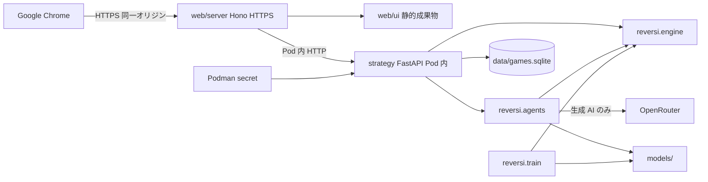

# アーキテクチャ

| 項目 | 内容 |
| --- | --- |
| 文書識別 | reversi-ai-architecture |
| 対象ソフトウェア | Reversi Agents |
| 版 | 0.1.43 |
| 状態 | 現行（設計。要求ではない） |
| 日付 | 2026-09-22 |
| 入力 | [`docs/srs.md`](srs.md) 0.1.25、[`docs/tech-stack.md`](tech-stack.md) 0.2.20 |

本文書は**配置と層**の設計正本である。ソフトウェア要求の正本は [`docs/srs.md`](srs.md) であり、本文書は shall を追加・変更・撤回しない。言語・ライブラリ・コンテナの選定は [`docs/tech-stack.md`](tech-stack.md) を正とする。ディレクトリ名は tech-stack 2.3 と一致させ、ファイル単位の置き場と目的は本文書を正とする。

パスは初版の目標配置である。まだリポジトリに無いものは実装時に作る。言語名のディレクトリ（例: `python/`）は置かない。

## 1 実行時の配置

ブラウザが話す相手は TypeScript。着手と学習の中身は Python。SRS の論理図（1.3.2）は置き換えない。



| プロセス | 公開 | 目的 |
| --- | --- | --- |
| `web` コンテナ（Hono） | ホスト `127.0.0.1` のみ HTTPS | UI 配信、Origin 照合、SSE、戦略プロセスへ中継 |
| `strategy` コンテナ（FastAPI） | Pod 内のみ。ホストへ出さない | 規則、全エージェントの着手、進行中 1 局、終局の永続化、OpenRouter。torch は入れない |
| 学習（`podman-compose run --rm train`） | 待ち受けしない。`up` の常時起動対象外 | 学習用イメージ（`train` グループを焼く）。ML / LightGBM / RL / NN の書き出し |

同時対局は 1。進行中の局は戦略プロセスのメモリ上。終局だけ SQLite へ書く。

## 2 層と依存の向き

矢印は import してよい向き。逆向きと循環は禁止する。

```
web/ui ──HTTP──► web/server ──HTTP──► reversi.api ──► reversi.agents ──► reversi.engine
                                      reversi.train ──► reversi.engine
                                      reversi.train ──► reversi.agents（自己対局に必要な範囲）
```

| 契約 | 検査 |
| --- | --- |
| `web/ui` は `web/server` を import しない。逆も禁止 | dependency-cruiser |
| `reversi.api` → `reversi.agents` → `reversi.engine` の一方向 | import-linter |
| 対局経路（`api` / `agents` / `engine`）は `reversi.train` を import しない | import-linter |
| `reversi.engine` は `reversi.encode` を import しない | import-linter |
| ブラウザは戦略プロセスに直接接続しない | 配備（compose）。検査は Origin と待ち受け |

`reversi.encode` は対局規則ではない入力符号化である。`agents` と `train` が共有し、`engine` は読まない。符号化は黒・白・空の 3 平面 × 8×8 の 0/1 である。座標はエンジンと同じ（`[rank][file]`、a1 が `[0][0]`）。手番は盤の入力に含めない。数値目標は置かない。

## 3 リポジトリの tree

コメントは、そのパスの**目的**である。製品コードの詳細な**機能**は [4](#4-モジュールの機能) に書く。

```
reversi-ai/
├── README.md                          # 製品の入口。運用コマンドの正本。CI バッジを置く
├── AGENTS.md                          # エージェント作業ルール（要求正本・編集禁止）
├── CONTRIBUTING.md                    # Issue / PR / ブランチ / コミット規約。試験・lint・E2E の正本
├── LICENSE
├── compose.yaml                       # Podman Compose。同一 Pod に web と strategy。学習は train
├── compose.dev.yaml                   # 開発用オーバーレイ。bind mount と reload だけを足す
├── package.json                       # ウェブアプリ（UI + Hono）の依存とスクリプト
├── pnpm-lock.yaml
├── biome.json                         # TS/JSON/CSS の書式と認知的複雑度ゲート
├── .dependency-cruiser.cjs            # web/ui と web/server の相互 import 禁止
├── lefthook.yml                       # コミット前: Biome, gitleaks, osv-scanner, 層検査
├── .gitignore                         # data/, .venv, node_modules, .env を除外
│
├── docs/
│   ├── srs.md                         # ソフトウェア要求の正本（shall）
│   ├── tech-stack.md                  # 言語・ライブラリ・コンテナの選定
│   ├── ARCHITECTURE.md                # 本ファイル。配置と層
│   ├── jev-decisions.md               # 生成 AI (Jev) が使う Decisions Choice の形
│   ├── openapi.yml                    # 対局 API の契約（OpenAPI 3.1）
│   ├── catalog/
│   │   ├── random_uniform.md          # ランダム (一様) の着手解説
│   │   ├── most_flips.md              # ルールベース (最多取り) の着手解説
│   │   ├── positional.md              # ルールベース (位置評価) の着手解説
│   │   ├── minimax.md                 # ルールベース (ミニマックス) の着手解説
│   │   ├── alphabeta.md               # ルールベース (αβ) の着手解説
│   │   ├── opening.md                 # ルールベース (定石) の着手解説
│   │   ├── ml.md                      # 機械学習 (棋譜) の着手解説
│   │   ├── lgbm.md                    # 機械学習 (LightGBM) の着手解説
│   │   ├── rl.md                      # 強化学習 (自己対局) の着手解説
│   │   ├── nn.md                      # ニューラルネットワーク (棋譜) の着手解説
│   │   └── jev.md                     # 生成 AI (Jev) の着手解説
│   ├── benchmarks/
│   │   ├── round-robin.json           # 総当たり基準結果。最新の数値の正本
│   │   ├── round-robin.md             # 最新の GitHub 閲覧用。JSON から生成
│   │   ├── history.md                 # 勝ち点・順位の推移。archive と現行 JSON から生成
│   │   ├── render.py                  # round-robin.md と history.md を書く
│   │   ├── round_robin.py             # 起動済み対局 API で総当たりし JSON を書く。CI では走らせない
│   │   ├── jev-stage1.json            # Jev 段階 1（4 構成切り分け）の成績スナップショット
│   │   ├── jev_stage1.py              # 4 構成を同じ相手と対局させて JSON を書く。CI では走らせない
│   │   ├── jev-stage2.json            # Jev 段階 2（局面単位オフライン評価）の記録
│   │   ├── jev_stage2.py              # 対局ログ局面を αβ 正解で 3 方式計測する。CI では走らせない
│   │   ├── jev-stage3.json            # Jev 段階 3（プロンプト 1 変更ずつのオフライン評価）の記録
│   │   ├── jev_stage3.py              # 変更を 1 つずつ入れて平均損失を比べる。CI では走らせない
│   │   ├── jev-stage4.json            # Jev 段階 4（絞り込みパラメータのオフライン格子）の記録
│   │   ├── jev_stage4.py              # shortlist / margin / threshold を振る。CI では走らせない
│   │   ├── jev-stage5.json            # Jev 段階 5（対局による最終確認）の記録
│   │   ├── jev_stage5.py              # 基準線と指名設定を対で対局する。CI では走らせない
│   │   ├── jev-experiment.md          # 段階 1–5 の知見。人手。JSON から生成しない
│   │   ├── alphabeta-eval.json        # αβ 対ミニマックス（深さ 4）の先後入れ替え評価
│   │   ├── alphabeta_eval.py          # 同じ開始局面の組で対局し JSON を書く。CI では走らせない
│   │   ├── alphabeta-eval.md          # 途中打ち切りの知見。人手。JSON から生成しない
│   │   ├── rl-openings.json           # RL 改善の固定開始局面集合。seed で再現する
│   │   ├── rl_eval.py                 # 開始局面と先後入れ替え評価を書く。CI では走らせない
│   │   ├── rl-stage0.json             # 現行 models/rl.json の段階 0 基準線
│   │   ├── rl-stage0.md               # 基準線と総当たりとの傾向。人手。JSON から生成しない
│   │   └── archive/                   # 過去の総当たり正本（現行と同じ形）
│   └── source-of-truth/
│       ├── 01-seed.md                 # シード。AI は編集禁止
│       └── jev-prompt-guide.md        # Jev の state / questions の書き方。AI は編集禁止
│
├── web/                               # 利用者向けウェブアプリ。ブラウザが話す相手
│   ├── Containerfile                  # UI をビルドし Hono で HTTPS 提供
│   ├── ui/                            # React。カタログ画面と盤面画面
│   │   ├── index.html                 # SPA の文書。文言は日本語
│   │   ├── vite.config.ts             # 開発サーバ。本番は Hono が静的配信
│   │   ├── tsconfig.json
│   │   └── src/
│   │       ├── main.tsx               # エントリ。React をマウント
│   │       ├── App.tsx                # 経路: / と /game
│   │       ├── api.ts                 # 同一オリジンの fetch / EventSource
│   │       ├── types.ts               # 画面が扱う対局状態・カタログの型
│   │       ├── catalog.ts             # カテゴリ併記・カード選中・対戦要約
│   │       ├── pages/
│   │       │   ├── CatalogPage.tsx    # セグメント・石ボタン・カード選択と開始
│   │       │   └── GamePage.tsx       # 盤中心の横並び。手番、終局、カタログへ戻る
│   │       └── components/
│   │           ├── Board.tsx          # 盤・座標・合法手と直前着手の印
│   │           └── CatalogList.tsx    # 個体カード。表示名と説明文、クリックで選ぶ
│   └── server/                        # Hono。利用者向けオリジン
│       ├── tsconfig.json
│       └── src/
│           ├── index.ts               # HTTPS 待ち受け。証明書は mkcert
│           ├── app.ts                 # 経路と静的ファイル
│           ├── origin.ts              # Origin 不一致の状態変更を 403
│           ├── schemas.ts             # 中継 JSON の Zod。Python の Pydantic と形を揃える
│           ├── strategy.ts            # Pod 内の FastAPI へ HTTP 中継。部分適用しない
│           └── sse.ts                 # エージェント対エージェントの盤面更新
│
├── strategy/                          # 戦略プロセス。着手と学習
│   ├── Containerfile                  # 対局 (strategy) と学習 (train) のターゲット。prompts/ を載せる
│   ├── pyproject.toml                 # パッケージ reversi、Ruff、import-linter
│   ├── uv.lock
│   ├── src/reversi/
│   │   ├── __init__.py
│   │   ├── encode.py                  # 盤の入力符号化。ML / RL / NN と学習が共有
│   │   ├── engine/                    # 対局規則の正。ビットボードは使わない
│   │   │   ├── __init__.py
│   │   │   ├── board.py               # 8×8 の石状態と座標（a1 は黒から見て左下）
│   │   │   ├── rules.py               # 合法手・裏返し・パス・終局
│   │   │   └── score.py               # 公式スコアと勝敗
│   │   ├── agents/                    # カタログ個体の着手。train を import しない
│   │   │   ├── __init__.py
│   │   │   ├── catalog.py             # 個体 ID・表示名・説明・カテゴリの登録
│   │   │   ├── extra_genai.py         # data/config.toml から生成 AI 個体を足す
│   │   │   ├── position_table.py      # FUN-025 の点数表。ミニマックス・定石外れ・Jev の着手後葉が共有
│   │   │   ├── random_uniform.py      # ランダム (一様)
│   │   │   ├── most_flips.py          # ルールベース (最多取り)
│   │   │   ├── positional.py          # ルールベース (位置評価)
│   │   │   ├── minimax.py             # ルールベース (ミニマックス) 深さ 4
│   │   │   ├── alphabeta.py           # ルールベース (αβ) 深さ 4。Move Ordering。Transposition Table（Zobrist ハッシュ）。終盤でも深さを延長しない。葉は Mobility・Corner・X/C・Frontier・石差。W は空きマス（Game Phase）
│   │   │   ├── opening.py             # ルールベース (定石) 虎・牛・鼠
│   │   │   ├── ml.py                  # 機械学習 (棋譜)。係数 JSON の積和のみ
│   │   │   ├── lgbm.py                # 機械学習 (LightGBM)。ネイティブテキストを読む
│   │   │   ├── rl.py                  # 強化学習 (自己対局)。線形重み。NN も OpenRouter も使わない
│   │   │   ├── rl_search.py           # 強化学習 (自己対局＋読み)。葉は線形 v の深さ 4 αβ。NN も OpenRouter も使わない
│   │   │   ├── nn.py                  # ニューラルネットワーク (棋譜)。ONNX CPU
│   │   │   ├── prompt.py              # prompts/ の Markdown と JSON を読む
│   │   │   ├── jev.py                 # 生成 AI (Jev)。優先の答えと着手後評価を合成
│   │   │   └── chat_completions.py    # 追加の生成 AI。Chat Completions の構造化出力
│   │   ├── api/                       # 内部 FastAPI。ブラウザからは到達させない
│   │   │   ├── __init__.py
│   │   │   ├── app.py                 # アプリ組み立てと待ち受け
│   │   │   ├── errors.py              # RFC 9457 の Problem と違法着手の 409
│   │   │   ├── schemas.py             # 中継 JSON の Pydantic
│   │   │   ├── routes.py              # カタログ取得、対局開始、着手、状態
│   │   │   ├── session.py             # 進行中 1 局（メモリ）
│   │   │   ├── persist.py             # 終局を SQLite へ書く
│   │   │   └── openrouter_key.py      # /run/secrets/openrouter-api-key を読む
│   │   └── train/                     # 学習。対局経路からは import しない
│   │       ├── __init__.py
│   │       ├── wthor.py               # .wtb を読む。8×8 以外は捨てる
│   │       ├── examples.py            # WTHOR と永続化対局から教師あり学習例を集める
│   │       ├── ml.py                  # scikit-learn → models/ml.json
│   │       ├── lgbm.py                # LightGBM → models/lgbm.txt
│   │       ├── rl.py                  # NumPy 線形 TD → models/rl.json
│   │       └── nn.py                  # PyTorch CPU → models/nn.onnx
│   └── tests/                         # pytest。規則とエージェントの正
│       ├── test_engine.py
│       ├── test_agents.py
│       ├── test_encode.py
│       ├── test_wthor.py
│       ├── test_api.py                # カタログと 1 局の開始・着手・違法拒否
│       ├── test_persist.py
│       └── test_layers.py             # ML / LightGBM / RL が NN ランタイムを import しないこと
│
├── models/                            # 学習成果物。原本棋譜は置かない。Git 管理する
│   ├── ml.json                        # ML 対局時の係数
│   ├── lgbm.txt                       # LightGBM 対局時のネイティブテキスト
│   ├── rl.json                        # RL 対局時の重み
│   └── nn.onnx                        # NN 対局時の順伝播
│
├── prompts/                           # 生成 AI の固定指示。戦略プロセスが対局時に読む
│   ├── jev.json                       # 生成 AI (Jev) の語彙・バケット・selection と Choice の instructions
│   └── chat-completions.md            # 追加の生成 AI の Chat Completions 指示（構造化出力）
│
├── e2e/                               # Playwright。対象はマシン上の Google Chrome
│   ├── playwright.config.ts
│   ├── catalog.spec.ts                # カタログ → 盤面、日本語 UI
│   └── game.spec.ts                   # 手番表示、合法手の印
│
└── data/                              # 運用者ローカル。Git 管理外
    ├── games.sqlite                   # 終局棋譜（SRS-DAT-004 の項目）
    ├── config.toml                    # 追加する生成 AI のモデル名・呼称・パラメータ
    ├── wthor/                         # WTHOR 原本。読み取り専用。再配布しない
    └── certs/                         # mkcert の PEM。Hono へファイルとして渡す
```

次は製品の実行には載らないが、同じリポジトリにある。

```
reversi-ai/
├── .github/
│   ├── CODEOWNERS                     # shall・検査閾値・エージェント規則のレビュー必須
│   ├── pull_request_template.md
│   └── ISSUE_TEMPLATE/
├── .vscode/                           # Biome / Ruff の推奨
└── .cursor/                           # エージェント向けフックとルール
```

`web/server` の単体試験（Origin 拒否、中継が部分適用しないこと）は `web/server/src/` に Vitest で併置する（例: `origin.test.ts`、`strategy.test.ts`）。

## 4 モジュールの機能

### 4.1 `web/ui`

カタログ画面（`/`）と盤面画面（`/game`）の 2 経路。状態は画面ローカル（`useState` / `useReducer`）。OpenRouter の鍵も WTHOR 原本も持たない。表示は Hono が返した対局状態と、カタログの表示名・説明文に限る。`dangerouslySetInnerHTML` を置かない。見た目のライブラリは入れない。色・半径・余白は CSS 変数に集約する。

| ファイル | 機能 |
| --- | --- |
| `CatalogPage.tsx` | 対局モードはセグメント、利用者対エージェントの石色は石ボタン。個体はカードをクリックして選ぶ。エージェント対エージェントは黒スロットと白スロットを先に選びカードで埋める。対戦要約と開始はスクロールしても使える位置。`<select>` は置かない |
| `CatalogList.tsx` | 表示名 heading と説明文のカード。カテゴリを小さく併記してグルーピングする。選中は枠とチェック。`aria-pressed` |
| `catalog.ts` | カテゴリの日本語、グルーピング、対戦要約 |
| `GamePage.tsx` | Chrome 前提の横並び。左に大きな盤、右に石アイコン・表示名・公式石数と手番文。人間手番はマス指定を POST する。パスは盤の近く。終局は勝敗バナーとカタログへ戻る。エージェント対エージェントは SSE を購読する |
| `Board.tsx` | 8×8 を CSS Grid で描く。a1 は黒から見て左下。利用者手番に合法手の印、直前着手の印。石は CSS の radial-gradient と影 |
| `moveInterval.ts` | 着手間隔（秒）の入力。未設定は 1 秒。開始 API へ渡す値に使う |
| `api.ts` | `GET /api/catalog`、`POST /api/games`、`POST /api/games/:id/moves`、`GET /api/games/:id/events` |

### 4.2 `web/server`

利用者向けの唯一のオリジン。盤の合法手計算は持たない。人間の着手指定は戦略プロセスへ渡し、違法なら盤面を変えず再指定できる応答をそのまま返す。

| ファイル | 機能 |
| --- | --- |
| `index.ts` | コンテナ内は `0.0.0.0` で HTTPS。ホストへ出す口は compose の `127.0.0.1` だけ。平文 HTTP を既定にしない |
| `origin.ts` | 状態変更 POST の `Origin` が自オリジンと一致しなければ 403 |
| `strategy.ts` | FastAPI 呼出し。失敗時は部分適用せず、継続不能を UI へ返す |
| `sse.ts` | 戦略プロセスが進めた盤面を Server-Sent Events で流す |
| `schemas.ts` | 対局状態・着手・カタログ項目の形。`strategy` の Pydantic と揃える |

公開する経路（設計。要求ではない）:

| 経路 | 役割 |
| --- | --- |
| `GET /`, `GET /game` | SPA |
| `GET /api/catalog` | カタログ一覧 |
| `POST /api/games` | 対局開始 |
| `POST /api/games/:id/moves` | 人間の着手 |
| `GET /api/games/:id/events` | 盤面の SSE |

### 4.3 `strategy` — `reversi.engine`

対局の正しさの正本。対局と学習（自己対局・WTHOR 再生）が同じ関数を呼ぶ。8×8 の配列（または同等の明示的な 64 マス）。ビットボードは使わない。

代数表記の a1 は黒から見て左下である。列 a–h は左から右、行 1–8 は黒側から白側。内部配列は `board[rank-1][file-a]`（`[0][0]` が a1）。

合法手は相手石を 1 個以上挟む空マスだけである。挟んだ石をすべて裏返し、連鎖的な追加の裏返しは起きない。合法手が無い側にだけパスが適用される。双方が着手不能なら、64 マスが埋まっていなくても終局する。

公式スコアは石数が多い側の勝ちである。引き分けは 32–32。勝ちが決まったとき空マスは勝者に加算する。

| ファイル | 機能 |
| --- | --- |
| `board.py` | 石の色、空マス、座標変換、初期配置（白 d4・e5、黒 e4・d5、黒先手） |
| `rules.py` | 合法手、挟み裏返し（連鎖しない）、パス、双方着手不能で終局 |
| `score.py` | 勝者への空マス加算、引き分け 32–32 |

### 4.4 `strategy` — `reversi.agents`

選択単位は個体でありカテゴリではない。カタログ個体は 1 ファイル 1 方針とする。いずれも合法手の中からちょうど 1 手を返す（合法手が無ければ着手しない）。ルールベースの同点は a1…h8 の座標順。

| ファイル | カタログ表示名 | 機能 |
| --- | --- | --- |
| `catalog.py` | （登録） | 個体 ID・カテゴリ・表示名・説明文。追加の生成 AI をここで合成する |
| `random_uniform.py` | ランダム (一様) | 合法手の一様乱択。対局中に WTHOR も学習済みモデルも参照しない |
| `most_flips.py` | ルールベース (最多取り) | 裏返す相手石が最大の手 |
| `positional.py` | ルールベース (位置評価) | 着手直後の自石点数合計が最大の手 |
| `minimax.py` | ルールベース (ミニマックス) | 深さ 4。葉は位置評価表の差。アルファベータは同一の葉評価になる範囲で可 |
| `alphabeta.py` | ルールベース (αβ) | 深さ 4 の Negamax 形式の αβ。探索前に合法手を Move Ordering（角、相手手数、安全な辺、通常、C、X。角が空なら X / C は後ろ）。同じ局面へ別手順で到達したときは Transposition Table（Zobrist ハッシュ。キーは盤面+手番。値は評価値・残り深さ・Bound）で再探索を省く。表は 1 着手の根探索が終わったら捨て、対局をまたいで残さない。大きさは制限しない（dict）。同じキーなら上書きする。Zobrist 乱数は `alphabeta.py` に固定シードで置く。対局エンジンは 8×8 配列のままである。葉は Mobility 差・Corner 差・X/C・Frontier 差・石数差の一次結合。石数の重みは空きマス数（Game Phase）で変える。空きマスが少なくても終局まで延長せず、葉は常にこのヒューリスティックである。ルールベース (ミニマックス) にも終盤完全読みを入れない。根の同点は a1…h8 であり探索順ではタイブレークしない。対局中に深さを変えない。ミニマックス個体と同じ探索深さにし、アルゴリズムと葉評価の差が見えるようにする |
| `opening.py` | ルールベース (定石) | 虎・牛・鼠の 3 列と 8 対称。外れは位置評価 |
| `ml.py` | 機械学習 (棋譜) | `models/ml.json` の積和。onnxruntime / PyTorch を import しない |
| `lgbm.py` | 機械学習 (LightGBM) | `models/lgbm.txt` を LightGBM ネイティブ形式で読む。onnxruntime / PyTorch / joblib / pickle を import しない |
| `rl.py` | 強化学習 (自己対局) | `models/rl.json`。着手直後の線形 v だけで選ぶ（1 手読み）。NN 推論も OpenRouter も使わない |
| `rl_search.py` | 強化学習 (自己対局＋読み) | 同じ `models/rl.json` の線形 v を葉にした深さ 4 の αβ。白番は v を符号反転する。葉の外に閾値や定数ボーナスは足さない。探索の Move Ordering と Transposition Table は `alphabeta.py` と共有し、カタログの αβ 個体の葉（Mobility・Corner・X/C・Frontier・石差）は置き換えない。終盤完全読みはしない。新しい重みは学習しない。NN 推論も OpenRouter も使わない |
| `nn.py` | ニューラルネットワーク (棋譜) | `models/nn.onnx` を onnxruntime CPU で順伝播し、合法手へマスク |
| `prompt.py` | （指示ファイル） | `prompts/` の Markdown と JSON を対局時に読む。欠落は継続不能 |
| `jev.py` | 生成 AI (Jev) | `typesafe/jev-1.13` の Decisions API。1 着手 1 呼出しで優先の原子質問を送り、typed answers とコードの着手後評価を合成する。指示は `prompts/jev.json`。合法手の外を採用しない。合法手が 1 つのときは Decisions を呼ばない。検証用に第 1 版定数・コードだけ・全合法手 Choice・絞り込みの 4 構成を切り替えられる。カタログ表示名は増やさない。カタログの既定は優先合成であり、コード最善（`v2_jev0`）や合法手 Choice にはしない |
| `chat_completions.py` | 生成 AI (〈呼称〉) | 運用者が与えたテキスト生成モデル ID。固定の system は `prompts/chat-completions.md`。応答は JSON Schema を Pydantic で検証する |

カテゴリ `random` は「ランダム」である。`position_table.py` は FUN-025 の点数表だけを持つ。`extra_genai.py` は `data/config.toml` を読む（対局者向けウィザードは置かない）。Jev は同一 `state` に対する 2 問以上の原子質問（Noul / Score / Choice）を 1 HTTP 呼出しで送り、どの目標を優先するか（角・モビリティ・位置・石取り・段階）だけを答える。合法手の点数は `jev.py` が着手を適用したあとの盤から付ける（位置評価表の差、モビリティ、石差、角の差。切片は着手後 1 手であり、相手の応手は探索しない。合法手内の min-max で 0 と 1 に引き伸ばす）。カタログのミニマックス個体の `choose_move` には委譲しない。探索を深くしてミニマックス個体に寄せない。`jev.py` が typed answers とこの着手後評価を `prompts/jev.json` の重みで合成して、合法手からちょうど 1 つ選ぶ。同点は a1…h8。打つマスの 1 手特徴（そのマスが角か、裏返し枚数か、直後に角を渡すか）だけを既定の点数にしない。着手後に何が起きるか・何枚裏返るか・どのマスが最善かをモデルに問わない。1 本の「最善手はどれ」Choice を既定にしない。合法手数に比例して質問や Choice のキーを増やさない。反転数やリスト長は Jev に数えさせない。盤の読み方（`board[0][0]` が a1）は質問文ではなく `state` に置く。固定の質問文と重みは `prompts/jev.json` に置き、`strategy/src` には埋め込まない。JSON を変えてイメージを作り直すか、開発時の bind（`./prompts:/prompts`）を更新すると、次の着手呼出しからその指示を使う。合法手が 1 つのときは Decisions を呼ばない。失敗時にコード評価だけで指す代替経路は置かない。検証用に第 1 版定数・コードだけ・全合法手 Choice・絞り込みの 4 構成を切り替えられる。切替は検証用に限り、カタログの `choose_move` の既定にはしない。カタログの既定は優先合成であり、段階 5 で不採用としたコード最善（`v2_jev0`）には戻さない。Chat Completions の指示は散文なので `prompts/chat-completions.md` のままである。`prompts/` に JSON と Markdown が混在してよい。日本語の注釈は本節に置き、質問ファイルは JSONC にしない。原子質問と検証用 Choice のフィールドの形は [`docs/jev-decisions.md`](jev-decisions.md)。プロンプトの書き方（字義どおり、数え上げをコードへ移す、state を絞る）は [`docs/source-of-truth/jev-prompt-guide.md`](source-of-truth/jev-prompt-guide.md) を読む。AI は編集しない。

### 4.5 `strategy` — `reversi.api`

Pod 内 HTTP。TLS は Hono が担う。

| ファイル | 機能 |
| --- | --- |
| `app.py` | アプリ組み立てと待ち受け。F006 ではカタログ・対局開始・着手の経路もここ |
| `errors.py` | RFC 9457 の Problem と違法着手の 409 |
| `schemas.py` | 中継 JSON の Pydantic。`docs/openapi.yml` の `components` と同じ形 |
| `routes.py` | カタログ、対局開始、着手適用、状態取得。エージェント対エージェントは開始後に終局まで進める |
| `session.py` | 進行中 1 局。同時対局は 1。エージェント対エージェントは開始 API の `move_interval_seconds`（省略時は待たない）を下限として、1 手を盤に適用してから次を適用する |
| `persist.py` | 終局時に対局モード、黒と白の主体、着手列、終局面、公式スコア、勝敗を書く。個人識別子の列は作らない |
| `openrouter_key.py` | secret ファイルだけを読む。環境変数へコピーしない |

### 4.6 `strategy` — `reversi.train`

対局サービスとは別プロセスで走らせる。対局時エンジンを自己対局と棋譜再生に使う。

| ファイル | 機能 |
| --- | --- |
| `wthor.py` | `.wtb` を読む。ヘッダの盤サイズが 0 または 8 のファイルだけを 8×8 として扱う。再生できないレコードは捨てる。WTHOR はパスを持たないので、合法手が無い側ではエンジンのパスを挿入する。原本を HTTP で出さない |
| `examples.py` | WTHOR と永続化対局から、Ridge と LightGBM が共有する教師あり学習例を集める |
| `ml.py` | sklearn で学習し、対局用の係数 JSON を書く |
| `lgbm.py` | LightGBM で学習し、対局用のネイティブテキストを書く |
| `rl.py` | 自己対局の線形 TD。WTHOR を使わない |
| `nn.py` | PyTorch CPU で学習し ONNX へ出す |

学習済みの小さい成果物は `models/` に含め、再学習なしで初版カタログが揃うようにする。再生は対局エンジンと同じ関数を呼ぶ。

## 5 プロセス間の JSON

対局 API の契約の正本は [`docs/openapi.yml`](openapi.yml)（OpenAPI 3.1）である。Hono はブラウザ向け `/api/*`、戦略 FastAPI はパス項目の `/decide` を待ち受ける。二つのサーバの経路は同ファイルで混ぜない。

TypeScript 側は Zod（`web/server/src/schemas.ts`）、Python 側は Pydantic（`strategy/src/reversi/api/schemas.py`）で実行時の形を検証する。どちらも `docs/openapi.yml` の `components` と同じ形にする。フィールド名、列挙、null の位置を契約から広げたり、片方だけ別名にしたりしない。共有パッケージは初版では置かない。規則の実装は `strategy/` に一つだけ置く。

ブラウザへ OpenAPI 文書（Swagger UI / ReDoc / `/openapi.json` など）を公開することは要求ではない。実装が生成文書を出してもよいが、差分があれば `docs/openapi.yml` を正とする。

含める項目の目安（要求ではなく中継の設計）:

- カタログ: 個体 ID、カテゴリ、表示名、説明文
- 対局状態: 盤 64 マス、手番、合法手、直前着手、終局、公式スコア、勝敗
- 着手指定: 座標（違法なら適用せず、再指定可能）
- 対局開始: 任意の `move_interval_seconds`（エージェント対エージェントの適用間隔。省略時は待たない）
- 障害: 外部モデル失敗時は部分盤面を返さず、継続不能を表す

## 6 データと秘密

| 置き場 | 中身 | Git |
| --- | --- | --- |
| `models/*.json`, `models/lgbm.txt`, `models/nn.onnx` | 対局時に読む学習成果物 | 含める |
| `prompts/*.md`, `prompts/*.json` | 生成 AI の固定指示。戦略イメージへ COPY し、Compose では bind | 含める |
| `data/games.sqlite` | 終局棋譜。`.wtb` ではない | 含めない |
| `data/wthor/` | WTHOR 原本 | 含めない。再配布しない |
| `data/config.toml` | 追加生成 AI のモデル名・呼称・パラメータ | 含めない |
| `data/certs/` | mkcert の証明書 | 含めない |
| Podman secret `openrouter-api-key` | OpenRouter の API キー | リポジトリにも `.env` にも置かない |

戦略コンテナだけが secret を `/run/secrets/openrouter-api-key` として読む。Hono のコンテナには渡さない。

## 7 置かないもの

tech-stack 第 5 節に加え、配置として次を置かない。

- `python/`、`frontend/`、`backend/` など言語名や曖昧な層名
- ブラウザから `strategy` への直接接続用ポート
- アカウント表、セッション Cookie 用ストア
- ルートの pnpm workspace（初版はルート `package.json` がウェブアプリ）
- 対局・学習の正として、ホストの `pnpm dev` や `python -m reversi.api` を置くこと
- ルートの Makefile / Justfile で起動を包むこと

## 8 起動とコマンド

動かすもの（対局・学習）は Podman。測るもの（pytest、Vitest、Biome、Ruff、lefthook）はホスト。根拠は [`docs/tech-stack.md`](tech-stack.md) 3.11 と 4.8。

運用コマンド（準備、`up` / `down`、学習の一発起動、成果物を読ませる再起動）の正本は [`README.md`](../README.md) である。試験・lint・E2E の正本は [`CONTRIBUTING.md`](../CONTRIBUTING.md) である。本文書は配置と待ち受けの契約だけを書く。

起動の実装は Python の `podman-compose` である。プラグインの `podman compose`（docker-compose）は `secrets.external` を扱えず使わない。コンソールスクリプトやルートの pnpm から Python を叩く入口は置かない。ホストの `uv run` を学習の正にしない。実行時に `uv sync` しない。

### 8.1 対局 Pod

| サービス | 入口（`CMD`） | 待ち受け |
| --- | --- | --- |
| `web` | ビルド済み UI を出す Hono（`node`） | コンテナ内は `0.0.0.0`。ホストへは `127.0.0.1` のみ |
| `strategy` | `python -m reversi.api` | Pod 内のみ。ホストへ公開しない。コンテナ内は `8000` でよい |

`train` は対局の `up` に載せない（コマンド列の正は README。`web` と `strategy` を明示する）。学習は待ち受けせず、`podman-compose run --rm train python -m reversi.train.*` で入口を指定する。

web コンテナが Pod 内で `0.0.0.0:3000` を聞くのはよい。戦略コンテナが Pod 内で `0.0.0.0:8000` を聞くのもよい。禁止するのはホストへの `0.0.0.0` である。

ホットリロードは別スタックを増やさず `compose.dev.yaml` のオーバーレイだけを足す。secret・公開ポート・サービス名は `compose.yaml` のままにする。コマンド列は CONTRIBUTING。

### 8.2 学習イメージ

学習用イメージは `strategy/Containerfile` の `train` ターゲットである。`uv sync --frozen --no-dev --group train` を焼く。対局用 `strategy` に torch は入れない。再学習なしでも初版カタログは動く。書き出した成果物を既に動いている対局が読むなら、README のとおり再起動する。

## 9 改訂履歴

| 版 | 日付 | 内容 |
| --- | --- | --- |
| 0.1.43 | 2026-09-22 | 強化学習 (自己対局＋読み) を載せ、αβ の葉を線形 v に差し替えられるようにする |
| 0.1.42 | 2026-09-22 | RL 改善の開始局面集合と段階 0 基準線を `docs/benchmarks/` に置く |
| 0.1.41 | 2026-09-21 | 組込み個体の着手解説を `docs/catalog/` に置く |
| 0.1.40 | 2026-09-21 | カタログ総当たりを起動済み対局 API へ問い合わせる `round_robin.py` を置く |
| 0.1.39 | 2026-09-21 | ルールベース (αβ) の終盤完全読みを外し、ミニマックスと同じ探索深さに揃える |
| 0.1.38 | 2026-09-21 | ルールベース (αβ) の対局深さを 4 にし、ミニマックスと同じ探索深さにする |
| 0.1.37 | 2026-09-21 | αβ 対ミニマックス評価を途中打ち切りとし、知見を `alphabeta-eval.md` に残す |
| 0.1.36 | 2026-09-21 | ルールベース (αβ) と深さ 4 ミニマックスの先後入れ替え評価を `docs/benchmarks/` に置く |
| 0.1.35 | 2026-09-21 | ルールベース (αβ) が空きマス 10 以下で終盤を完全読みする |
| 0.1.34 | 2026-09-21 | ルールベース (αβ) の探索に Transposition Table（Zobrist ハッシュ）を入れる |
| 0.1.33 | 2026-09-20 | カタログの Jev 既定を優先合成（#71）に戻し、段階切替は検証用に残す |
| 0.1.32 | 2026-09-20 | Jev 改善実験の知見を `docs/benchmarks/jev-experiment.md` に残す |
| 0.1.31 | 2026-09-20 | ルールベース (αβ) の葉に Frontier・X/C・Game Phase を足す |
| 0.1.30 | 2026-09-20 | Jev 段階 5 の対局記録を置き、カタログ既定をコード最善にする |
| 0.1.29 | 2026-09-20 | ルールベース (αβ) の探索に Move Ordering を入れる |
| 0.1.28 | 2026-09-20 | Jev の絞り込みパラメータをオフラインで調整する記録を置く |
| 0.1.27 | 2026-09-20 | Jev のプロンプトを 1 変更ずつオフライン評価する記録を置く |
| 0.1.26 | 2026-09-20 | ルールベース (αβ) の葉を Mobility・Corner・石差の一次結合にする |
| 0.1.25 | 2026-09-20 | 入力の tech-stack を 0.2.19 にし、ルールベース (αβ) を個体表へ反映する |
| 0.1.24 | 2026-09-20 | ルールベース (αβ) をカタログに載せ、深さ 6 の Negamax で着手する |
| 0.1.23 | 2026-09-20 | Jev はコードが絞った候補を Choice で選び、局面単位のオフライン評価を置く |
| 0.1.22 | 2026-09-20 | Jev の成績低下切り分け用に 4 構成切替と段階 1 記録を置く |
| 0.1.21 | 2026-09-20 | Jev の候補手ログを戦略プロセスの標準エラーへ出す |
| 0.1.20 | 2026-09-20 | Decisions Choice の形を `docs/jev-decisions.md` へ委譲する |
| 0.1.19 | 2026-09-20 | OpenRouter Decisions の Choice の形（criteria map、答えの probabilities / confidence）を第 4.4 節に書く |
| 0.1.18 | 2026-09-20 | Jev はコードが言葉にした合法手を Choice で比べ、着手後評価と合成する |
| 0.1.17 | 2026-09-20 | `history.md` に世代の変更点と順位推移を書く |
| 0.1.16 | 2026-09-20 | Jev は優先を答え、着手後の盤の点数はコードが付けて合成する |
| 0.1.15 | 2026-09-20 | 総当たりの過去正本を `benchmarks/archive/` に残し、勝ち点推移を `history.md` とする |
| 0.1.14 | 2026-09-20 | 対局の `up` は `web` と `strategy` を明示し、`train` を載せない |
| 0.1.13 | 2026-09-20 | 運用コマンド列の正を README へ委譲し、第 8 節は待ち受けと `CMD` と `train` を `up` に載せないことに限る |
| 0.1.12 | 2026-09-20 | Jev は原子質問を 1 呼出しで送り、`jev.py` が typed answers とコード特徴を合成する |
| 0.1.11 | 2026-09-20 | カタログをカード選択にし、盤面を盤中心の横並びに揃える |
| 0.1.10 | 2026-09-20 | 機械学習 (LightGBM) をカタログに載せ、ネイティブテキスト成果物を `models/lgbm.txt` とする |
| 0.1.9 | 2026-09-20 | 追加の生成 AI を `data/config.toml` と構造化出力に置き、自由文パースを既定にしない |
| 0.1.8 | 2026-09-20 | エージェント対エージェントの着手間隔を戦略プロセスの適用待ちとし、開始 API へ渡す |
| 0.1.7 | 2026-09-20 | 学習を `train` イメージに分け、対局用 strategy から torch を外す |
| 0.1.6 | 2026-09-20 | 生成 AI の固定指示を `prompts/` に置き、strategy イメージが読む |
| 0.1.5 | 2026-09-20 | 起動の正を `podman-compose` に揃え、文書表の日付をフロントマターと一致させる |
| 0.1.4 | 2026-09-20 | 総当たり基準結果を `docs/benchmarks/` に置く |
| 0.1.3 | 2026-09-20 | web はコンテナ内で `0.0.0.0` を聞き、ホストへ出す口は `127.0.0.1` のままにする |
| 0.1.2 | 2026-09-19 | Biome の検査対象を CI と同じ `web` にする |
| 0.1.1 | 2026-09-19 | 対局と学習の起動を Podman に揃え、試験はホストとするコマンドを書く |
| 0.1.0 | 2026-09-19 | tech-stack 0.2.7 を入力に、ディレクトリとファイルの配置を初稿とする |
