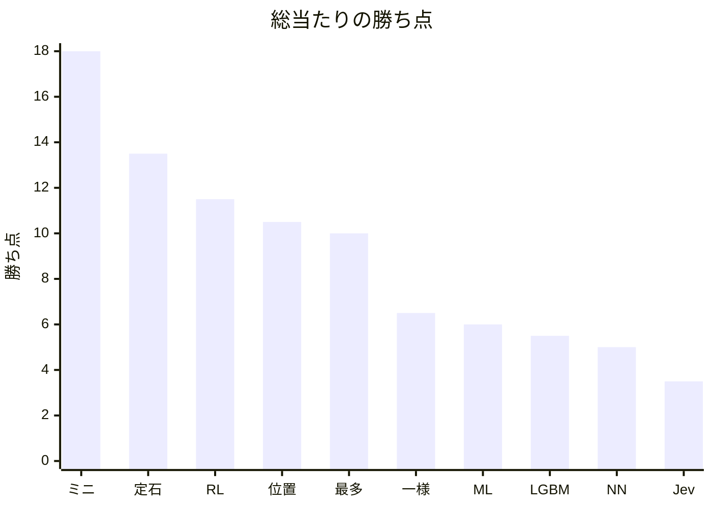

<!-- このファイルは docs/benchmarks/render.py が round-robin.json から書く。手で直さない。 -->

# カタログ個体の総当たり

数値の正本は [`round-robin.json`](round-robin.json) である。本ファイルは GitHub 上の閲覧用の写しである。

写しを作り直す:

```bash
python3 docs/benchmarks/render.py
```

- 記録: 2026-09-20 13:23
- 学習成果物のコミット: `e259b3bfef6c6361674aa2e9369664fe3943ed92`
- 対局数: 90（先後入れ替えあり、自己対局なし）
- 入口: `https://127.0.0.1:3000` / `agent_vs_agent`
- 勝ち点: 勝 1、分 0.5、負 0

対象ファイル:

- `models/ml.json`
- `models/lgbm.txt`
- `models/rl.json`
- `models/nn.onnx`

- カタログ 10 個体の総当たり。各対について先攻（黒）と後攻（白）を入れ替えた 2 局。
- ランダム (一様) と生成 AI (Jev) は非決定的なので、同じ重みでも再実行で勝敗は変わりうる。
- 新しい対局開始は進行中の 1 局を置き換えるため、局は順次実行した。
- この記録は git.blobs の学習成果物に対するスナップショットである。現行の models/ と blob が異なれば成績は一致しない。

## 勝ち点

横軸はカタログ個体の略称、縦軸は勝ち点（勝 1・分 0.5）。



## 順位

| 順 | 個体 | 勝-分-負 | 点 | 得石 | 失石 | 石差 |
| --- | --- | --- | --- | --- | --- | --- |
| 1 | ルールベース (ミニマックス) | 18-0-0 | 18 | 720 | 432 | 288 |
| 2 | ルールベース (定石) | 13-1-4 | 13.5 | 667 | 485 | 182 |
| 3 | 強化学習 (自己対局) | 11-1-6 | 11.5 | 644 | 508 | 136 |
| 4 | ルールベース (位置評価) | 10-1-7 | 10.5 | 580 | 572 | 8 |
| 5 | ルールベース (最多取り) | 10-0-8 | 10 | 689 | 463 | 226 |
| 6 | ランダム (一様) | 6-1-11 | 6.5 | 538 | 614 | -76 |
| 7 | 機械学習 (棋譜) | 6-0-12 | 6 | 518 | 634 | -116 |
| 8 | 機械学習 (LightGBM) | 5-1-12 | 5.5 | 474 | 678 | -204 |
| 9 | ニューラルネットワーク (棋譜) | 5-0-13 | 5 | 478 | 674 | -196 |
| 10 | 生成 AI (Jev) | 3-1-14 | 3.5 | 452 | 700 | -248 |

## 先攻と後攻

各個体 9 局が先攻（黒）、9 局が後攻（白）。

| 個体 | 先攻 勝-分-負 | 先攻点 | 後攻 勝-分-負 | 後攻点 |
| --- | --- | --- | --- | --- |
| ルールベース (ミニマックス) | 9-0-0 | 9 | 9-0-0 | 9 |
| ルールベース (定石) | 8-0-1 | 8 | 5-1-3 | 5.5 |
| 強化学習 (自己対局) | 5-1-3 | 5.5 | 6-0-3 | 6 |
| ルールベース (位置評価) | 5-0-4 | 5 | 5-1-3 | 5.5 |
| ルールベース (最多取り) | 7-0-2 | 7 | 3-0-6 | 3 |
| ランダム (一様) | 3-1-5 | 3.5 | 3-0-6 | 3 |
| 機械学習 (棋譜) | 3-0-6 | 3 | 3-0-6 | 3 |
| 機械学習 (LightGBM) | 4-1-4 | 4.5 | 1-0-8 | 1 |
| ニューラルネットワーク (棋譜) | 2-0-7 | 2 | 3-0-6 | 3 |
| 生成 AI (Jev) | 2-0-7 | 2 | 1-1-7 | 1.5 |

## 対戦表（行が黒・列が白）

セルは黒から見た勝敗と公式石数（黒-白）。対角は対局していない。

| 黒 \ 白 | 一様 | 最多 | 位置 | ミニ | 定石 | ML | LGBM | RL | NN | Jev |
| --- | --- | --- | --- | --- | --- | --- | --- | --- | --- | --- |
| 一様 | — | 勝 54-10 | 負 30-34 | 負 18-46 | 負 15-49 | 勝 53-11 | 勝 42-22 | 負 19-45 | 負 15-49 | 分 32-32 |
| 最多 | 勝 43-21 | — | 勝 64-0 | 負 23-41 | 勝 64-0 | 勝 60-4 | 勝 64-0 | 負 13-51 | 勝 39-25 | 勝 51-13 |
| 位置 | 勝 47-17 | 勝 40-24 | — | 負 25-39 | 勝 33-31 | 負 27-37 | 勝 39-25 | 負 26-38 | 負 24-40 | 勝 42-22 |
| ミニ | 勝 50-14 | 勝 40-24 | 勝 39-25 | — | 勝 46-18 | 勝 34-30 | 勝 35-29 | 勝 44-20 | 勝 33-31 | 勝 37-27 |
| 定石 | 勝 34-30 | 勝 45-19 | 勝 45-19 | 負 23-41 | — | 勝 33-31 | 勝 47-17 | 勝 51-13 | 勝 43-21 | 勝 41-23 |
| ML | 負 19-45 | 勝 47-17 | 負 29-35 | 負 27-37 | 負 17-47 | — | 負 19-45 | 負 10-54 | 勝 54-10 | 勝 36-28 |
| LGBM | 勝 36-28 | 負 26-38 | 負 18-46 | 負 22-42 | 分 32-32 | 勝 34-30 | — | 負 8-56 | 勝 41-23 | 勝 35-29 |
| RL | 勝 42-22 | 勝 42-22 | 分 32-32 | 負 23-41 | 負 18-46 | 負 16-48 | 勝 40-24 | — | 勝 37-27 | 勝 40-24 |
| NN | 負 23-41 | 負 14-50 | 負 18-46 | 負 29-35 | 負 18-46 | 負 19-45 | 勝 34-30 | 勝 33-31 | — | 負 16-48 |
| Jev | 負 22-42 | 負 0-64 | 負 24-40 | 負 24-40 | 負 28-36 | 勝 40-24 | 勝 34-30 | 負 18-46 | 負 16-48 | — |

## 2 局シリーズ

同じ相手について、左の個体が黒の局と白の局。シリーズ点は左-右。

| 左 | 右 | 左が黒 | 右が黒 | シリーズ点 |
| --- | --- | --- | --- | --- |
| ランダム (一様) | ルールベース (最多取り) | 54-10 | 43-21 | 1-1 |
| ランダム (一様) | ルールベース (位置評価) | 30-34 | 47-17 | 0-2 |
| ランダム (一様) | ルールベース (ミニマックス) | 18-46 | 50-14 | 0-2 |
| ランダム (一様) | ルールベース (定石) | 15-49 | 34-30 | 0-2 |
| ランダム (一様) | 機械学習 (棋譜) | 53-11 | 19-45 | 2-0 |
| ランダム (一様) | 機械学習 (LightGBM) | 42-22 | 36-28 | 1-1 |
| ランダム (一様) | 強化学習 (自己対局) | 19-45 | 42-22 | 0-2 |
| ランダム (一様) | ニューラルネットワーク (棋譜) | 15-49 | 23-41 | 1-1 |
| ランダム (一様) | 生成 AI (Jev) | 32-32 | 22-42 | 1.5-0.5 |
| ルールベース (最多取り) | ルールベース (位置評価) | 64-0 | 40-24 | 1-1 |
| ルールベース (最多取り) | ルールベース (ミニマックス) | 23-41 | 40-24 | 0-2 |
| ルールベース (最多取り) | ルールベース (定石) | 64-0 | 45-19 | 1-1 |
| ルールベース (最多取り) | 機械学習 (棋譜) | 60-4 | 47-17 | 1-1 |
| ルールベース (最多取り) | 機械学習 (LightGBM) | 64-0 | 26-38 | 2-0 |
| ルールベース (最多取り) | 強化学習 (自己対局) | 13-51 | 42-22 | 0-2 |
| ルールベース (最多取り) | ニューラルネットワーク (棋譜) | 39-25 | 14-50 | 2-0 |
| ルールベース (最多取り) | 生成 AI (Jev) | 51-13 | 0-64 | 2-0 |
| ルールベース (位置評価) | ルールベース (ミニマックス) | 25-39 | 39-25 | 0-2 |
| ルールベース (位置評価) | ルールベース (定石) | 33-31 | 45-19 | 1-1 |
| ルールベース (位置評価) | 機械学習 (棋譜) | 27-37 | 29-35 | 1-1 |
| ルールベース (位置評価) | 機械学習 (LightGBM) | 39-25 | 18-46 | 2-0 |
| ルールベース (位置評価) | 強化学習 (自己対局) | 26-38 | 32-32 | 0.5-1.5 |
| ルールベース (位置評価) | ニューラルネットワーク (棋譜) | 24-40 | 18-46 | 1-1 |
| ルールベース (位置評価) | 生成 AI (Jev) | 42-22 | 24-40 | 2-0 |
| ルールベース (ミニマックス) | ルールベース (定石) | 46-18 | 23-41 | 2-0 |
| ルールベース (ミニマックス) | 機械学習 (棋譜) | 34-30 | 27-37 | 2-0 |
| ルールベース (ミニマックス) | 機械学習 (LightGBM) | 35-29 | 22-42 | 2-0 |
| ルールベース (ミニマックス) | 強化学習 (自己対局) | 44-20 | 23-41 | 2-0 |
| ルールベース (ミニマックス) | ニューラルネットワーク (棋譜) | 33-31 | 29-35 | 2-0 |
| ルールベース (ミニマックス) | 生成 AI (Jev) | 37-27 | 24-40 | 2-0 |
| ルールベース (定石) | 機械学習 (棋譜) | 33-31 | 17-47 | 2-0 |
| ルールベース (定石) | 機械学習 (LightGBM) | 47-17 | 32-32 | 1.5-0.5 |
| ルールベース (定石) | 強化学習 (自己対局) | 51-13 | 18-46 | 2-0 |
| ルールベース (定石) | ニューラルネットワーク (棋譜) | 43-21 | 18-46 | 2-0 |
| ルールベース (定石) | 生成 AI (Jev) | 41-23 | 28-36 | 2-0 |
| 機械学習 (棋譜) | 機械学習 (LightGBM) | 19-45 | 34-30 | 0-2 |
| 機械学習 (棋譜) | 強化学習 (自己対局) | 10-54 | 16-48 | 1-1 |
| 機械学習 (棋譜) | ニューラルネットワーク (棋譜) | 54-10 | 19-45 | 2-0 |
| 機械学習 (棋譜) | 生成 AI (Jev) | 36-28 | 40-24 | 1-1 |
| 機械学習 (LightGBM) | 強化学習 (自己対局) | 8-56 | 40-24 | 0-2 |
| 機械学習 (LightGBM) | ニューラルネットワーク (棋譜) | 41-23 | 34-30 | 1-1 |
| 機械学習 (LightGBM) | 生成 AI (Jev) | 35-29 | 34-30 | 1-1 |
| 強化学習 (自己対局) | ニューラルネットワーク (棋譜) | 37-27 | 33-31 | 1-1 |
| 強化学習 (自己対局) | 生成 AI (Jev) | 40-24 | 18-46 | 2-0 |
| ニューラルネットワーク (棋譜) | 生成 AI (Jev) | 16-48 | 16-48 | 1-1 |
