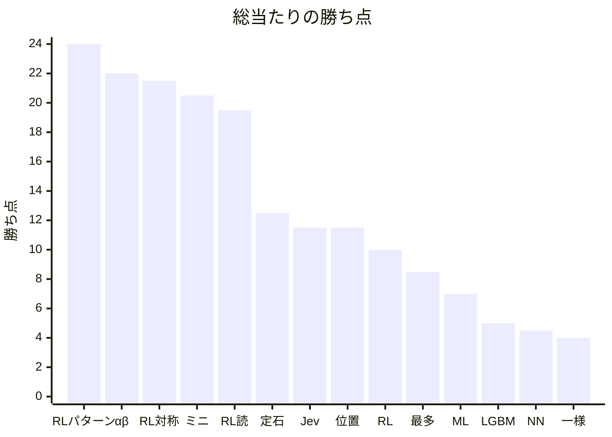

<!-- このファイルは docs/benchmarks/render.py が round-robin.json から書く。手で直さない。 -->

# カタログ個体の総当たり

数値の正本は [`round-robin.json`](round-robin.json) である。本ファイルは GitHub 上の閲覧用の写しである。勝ち点の推移は [`history.md`](history.md) である。

写しを作り直す:

```bash
python3 docs/benchmarks/render.py
```

- 記録: 2026-09-22 21:19
- 学習成果物のコミット: `5fe5a3070e3579ec8411710556767ec423df8446`
- 対局数: 182（先後入れ替えあり、自己対局なし）
- 入口: `in-process` / `agent_vs_agent`
- 勝ち点: 勝 1、分 0.5、負 0

対象ファイル:

- `models/ml.json`
- `models/lgbm.txt`
- `models/rl.json`
- `models/rl-tied.json`
- `models/rl-pattern.json`
- `models/nn.onnx`

- カタログ 14 個体の総当たり。各対について先攻（黒）と後攻（白）を入れ替えた 2 局。
- ランダム (一様) と生成 AI (Jev) は非決定的なので、同じ重みでも再実行で勝敗は変わりうる。
- 新しい対局開始は進行中の 1 局を置き換えるため、局は順次実行した。
- この記録は git.blobs の学習成果物に対するスナップショットである。現行の models/ と blob が異なれば成績は一致しない。
- 強化学習 (自己対局＋読み) は線形 v を葉にした深さ 4 のアルファベータ。
- ホストの着手関数を直接呼んだ。対局 API は使っていない。

## 勝ち点

横軸はカタログ個体の略称、縦軸は勝ち点（勝 1・分 0.5）。



## 順位

| 順 | 個体 | 勝-分-負 | 点 | 得石 | 失石 | 石差 |
| --- | --- | --- | --- | --- | --- | --- |
| 1 | 強化学習 (パターンの読み) | 24-0-2 | 24 | 1284 | 380 | 904 |
| 2 | ルールベース (αβ) | 22-0-4 | 22 | 1284 | 380 | 904 |
| 3 | 強化学習 (対称な読み) | 21-1-4 | 21.5 | 1157 | 507 | 650 |
| 4 | ルールベース (ミニマックス) | 20-1-5 | 20.5 | 918 | 746 | 172 |
| 5 | 強化学習 (自己対局＋読み) | 19-1-6 | 19.5 | 1110 | 554 | 556 |
| 6 | ルールベース (定石) | 12-1-13 | 12.5 | 740 | 924 | -184 |
| 7 | 生成 AI (Jev) | 10-3-13 | 11.5 | 776 | 888 | -112 |
| 8 | ルールベース (位置評価) | 10-3-13 | 11.5 | 750 | 914 | -164 |
| 9 | 強化学習 (自己対局) | 9-2-15 | 10 | 611 | 1053 | -442 |
| 10 | ルールベース (最多取り) | 8-1-17 | 8.5 | 766 | 898 | -132 |
| 11 | 機械学習 (棋譜) | 7-0-19 | 7 | 573 | 1091 | -518 |
| 12 | 機械学習 (LightGBM) | 4-2-20 | 5 | 595 | 1069 | -474 |
| 13 | ニューラルネットワーク (棋譜) | 3-3-20 | 4.5 | 564 | 1100 | -536 |
| 14 | ランダム (一様) | 3-2-21 | 4 | 520 | 1144 | -624 |

## 先攻と後攻

各個体 13 局が先攻（黒）、13 局が後攻（白）。

| 個体 | 先攻 勝-分-負 | 先攻点 | 後攻 勝-分-負 | 後攻点 |
| --- | --- | --- | --- | --- |
| 強化学習 (パターンの読み) | 12-0-1 | 12 | 12-0-1 | 12 |
| ルールベース (αβ) | 12-0-1 | 12 | 10-0-3 | 10 |
| 強化学習 (対称な読み) | 10-1-2 | 10.5 | 11-0-2 | 11 |
| ルールベース (ミニマックス) | 10-0-3 | 10 | 10-1-2 | 10.5 |
| 強化学習 (自己対局＋読み) | 9-0-4 | 9 | 10-1-2 | 10.5 |
| ルールベース (定石) | 7-0-6 | 7 | 5-1-7 | 5.5 |
| 生成 AI (Jev) | 5-2-6 | 6 | 5-1-7 | 5.5 |
| ルールベース (位置評価) | 7-0-6 | 7 | 3-3-7 | 4.5 |
| 強化学習 (自己対局) | 4-2-7 | 5 | 5-0-8 | 5 |
| ルールベース (最多取り) | 6-0-7 | 6 | 2-1-10 | 2.5 |
| 機械学習 (棋譜) | 2-0-11 | 2 | 5-0-8 | 5 |
| 機械学習 (LightGBM) | 2-2-9 | 3 | 2-0-11 | 2 |
| ニューラルネットワーク (棋譜) | 2-2-9 | 3 | 1-1-11 | 1.5 |
| ランダム (一様) | 1-1-11 | 1.5 | 2-1-10 | 2.5 |

## 対戦表（行が黒・列が白）

セルは黒から見た勝敗と公式石数（黒-白）。対角は対局していない。

| 黒 \ 白 | 一様 | 最多 | 位置 | ミニ | αβ | 定石 | ML | LGBM | RL | RL読 | RL対称 | RLパターン | NN | Jev |
| --- | --- | --- | --- | --- | --- | --- | --- | --- | --- | --- | --- | --- | --- | --- |
| 一様 | — | 負 20-44 | 負 12-52 | 負 23-41 | 負 2-62 | 負 27-37 | 負 17-47 | 勝 33-31 | 負 28-36 | 負 19-45 | 負 14-50 | 負 11-53 | 分 32-32 | 負 13-51 |
| 最多 | 勝 42-22 | — | 勝 64-0 | 負 23-41 | 負 19-45 | 勝 64-0 | 勝 60-4 | 勝 64-0 | 負 28-36 | 負 19-45 | 負 6-58 | 負 15-49 | 勝 64-0 | 負 25-39 |
| 位置 | 勝 56-8 | 勝 40-24 | — | 負 25-39 | 負 19-45 | 勝 33-31 | 負 27-37 | 勝 33-31 | 勝 39-25 | 負 14-50 | 負 19-45 | 負 17-47 | 勝 53-11 | 勝 36-28 |
| ミニ | 勝 45-19 | 勝 40-24 | 勝 39-25 | — | 負 16-48 | 勝 46-18 | 勝 34-30 | 勝 36-28 | 勝 33-31 | 負 11-53 | 勝 33-31 | 負 14-50 | 勝 41-23 | 勝 53-11 |
| αβ | 勝 63-1 | 勝 64-0 | 勝 46-18 | 勝 48-16 | — | 勝 53-11 | 勝 50-14 | 勝 63-1 | 勝 57-7 | 勝 49-15 | 負 27-37 | 勝 35-29 | 勝 61-3 | 勝 57-7 |
| 定石 | 勝 36-28 | 勝 45-19 | 勝 45-19 | 負 23-41 | 負 14-50 | — | 勝 33-31 | 勝 37-27 | 勝 44-20 | 負 26-38 | 負 16-48 | 負 25-39 | 勝 44-20 | 負 19-45 |
| ML | 負 17-47 | 勝 47-17 | 負 29-35 | 負 27-37 | 負 4-60 | 負 17-47 | — | 負 16-48 | 負 18-46 | 負 4-60 | 負 3-61 | 負 6-58 | 勝 33-31 | 負 20-44 |
| LGBM | 勝 53-11 | 負 28-36 | 分 32-32 | 分 32-32 | 負 7-57 | 負 30-34 | 勝 45-19 | — | 負 24-40 | 負 2-62 | 負 21-43 | 負 6-58 | 負 23-41 | 負 22-42 |
| RL | 勝 38-26 | 勝 49-15 | 分 32-32 | 負 15-49 | 負 0-64 | 負 4-60 | 負 30-34 | 勝 45-19 | — | 負 8-56 | 負 8-56 | 負 18-46 | 勝 38-26 | 分 32-32 |
| RL読 | 勝 45-19 | 勝 60-4 | 勝 49-15 | 負 29-35 | 勝 34-30 | 勝 51-13 | 負 28-36 | 勝 50-14 | 勝 56-8 | — | 負 15-49 | 負 17-47 | 勝 43-21 | 勝 48-16 |
| RL対称 | 勝 55-9 | 勝 43-21 | 勝 54-10 | 負 15-49 | 勝 35-29 | 勝 61-3 | 勝 49-15 | 勝 48-16 | 勝 64-0 | 分 32-32 | — | 負 24-40 | 勝 47-17 | 勝 46-18 |
| RLパターン | 勝 50-14 | 勝 52-12 | 勝 39-25 | 勝 47-17 | 負 31-33 | 勝 61-3 | 勝 57-7 | 勝 64-0 | 勝 55-9 | 勝 43-21 | 勝 52-12 | — | 勝 56-8 | 勝 59-5 |
| NN | 分 32-32 | 分 32-32 | 負 20-44 | 負 28-36 | 負 2-62 | 負 20-44 | 勝 39-25 | 負 24-40 | 負 29-35 | 負 10-54 | 負 20-44 | 負 16-48 | — | 勝 35-29 |
| Jev | 負 31-33 | 勝 39-25 | 分 32-32 | 負 20-44 | 勝 38-26 | 分 32-32 | 負 31-33 | 勝 49-15 | 勝 63-1 | 負 10-54 | 負 14-50 | 負 10-54 | 勝 40-24 | — |

## 2 局シリーズ

同じ相手について、左の個体が黒の局と白の局。シリーズ点は左-右。

| 左 | 右 | 左が黒 | 右が黒 | シリーズ点 |
| --- | --- | --- | --- | --- |
| ランダム (一様) | ルールベース (最多取り) | 20-44 | 42-22 | 0-2 |
| ランダム (一様) | ルールベース (位置評価) | 12-52 | 56-8 | 0-2 |
| ランダム (一様) | ルールベース (ミニマックス) | 23-41 | 45-19 | 0-2 |
| ランダム (一様) | ルールベース (αβ) | 2-62 | 63-1 | 0-2 |
| ランダム (一様) | ルールベース (定石) | 27-37 | 36-28 | 0-2 |
| ランダム (一様) | 機械学習 (棋譜) | 17-47 | 17-47 | 1-1 |
| ランダム (一様) | 機械学習 (LightGBM) | 33-31 | 53-11 | 1-1 |
| ランダム (一様) | 強化学習 (自己対局) | 28-36 | 38-26 | 0-2 |
| ランダム (一様) | 強化学習 (自己対局＋読み) | 19-45 | 45-19 | 0-2 |
| ランダム (一様) | 強化学習 (対称な読み) | 14-50 | 55-9 | 0-2 |
| ランダム (一様) | 強化学習 (パターンの読み) | 11-53 | 50-14 | 0-2 |
| ランダム (一様) | ニューラルネットワーク (棋譜) | 32-32 | 32-32 | 1-1 |
| ランダム (一様) | 生成 AI (Jev) | 13-51 | 31-33 | 1-1 |
| ルールベース (最多取り) | ルールベース (位置評価) | 64-0 | 40-24 | 1-1 |
| ルールベース (最多取り) | ルールベース (ミニマックス) | 23-41 | 40-24 | 0-2 |
| ルールベース (最多取り) | ルールベース (αβ) | 19-45 | 64-0 | 0-2 |
| ルールベース (最多取り) | ルールベース (定石) | 64-0 | 45-19 | 1-1 |
| ルールベース (最多取り) | 機械学習 (棋譜) | 60-4 | 47-17 | 1-1 |
| ルールベース (最多取り) | 機械学習 (LightGBM) | 64-0 | 28-36 | 2-0 |
| ルールベース (最多取り) | 強化学習 (自己対局) | 28-36 | 49-15 | 0-2 |
| ルールベース (最多取り) | 強化学習 (自己対局＋読み) | 19-45 | 60-4 | 0-2 |
| ルールベース (最多取り) | 強化学習 (対称な読み) | 6-58 | 43-21 | 0-2 |
| ルールベース (最多取り) | 強化学習 (パターンの読み) | 15-49 | 52-12 | 0-2 |
| ルールベース (最多取り) | ニューラルネットワーク (棋譜) | 64-0 | 32-32 | 1.5-0.5 |
| ルールベース (最多取り) | 生成 AI (Jev) | 25-39 | 39-25 | 0-2 |
| ルールベース (位置評価) | ルールベース (ミニマックス) | 25-39 | 39-25 | 0-2 |
| ルールベース (位置評価) | ルールベース (αβ) | 19-45 | 46-18 | 0-2 |
| ルールベース (位置評価) | ルールベース (定石) | 33-31 | 45-19 | 1-1 |
| ルールベース (位置評価) | 機械学習 (棋譜) | 27-37 | 29-35 | 1-1 |
| ルールベース (位置評価) | 機械学習 (LightGBM) | 33-31 | 32-32 | 1.5-0.5 |
| ルールベース (位置評価) | 強化学習 (自己対局) | 39-25 | 32-32 | 1.5-0.5 |
| ルールベース (位置評価) | 強化学習 (自己対局＋読み) | 14-50 | 49-15 | 0-2 |
| ルールベース (位置評価) | 強化学習 (対称な読み) | 19-45 | 54-10 | 0-2 |
| ルールベース (位置評価) | 強化学習 (パターンの読み) | 17-47 | 39-25 | 0-2 |
| ルールベース (位置評価) | ニューラルネットワーク (棋譜) | 53-11 | 20-44 | 2-0 |
| ルールベース (位置評価) | 生成 AI (Jev) | 36-28 | 32-32 | 1.5-0.5 |
| ルールベース (ミニマックス) | ルールベース (αβ) | 16-48 | 48-16 | 0-2 |
| ルールベース (ミニマックス) | ルールベース (定石) | 46-18 | 23-41 | 2-0 |
| ルールベース (ミニマックス) | 機械学習 (棋譜) | 34-30 | 27-37 | 2-0 |
| ルールベース (ミニマックス) | 機械学習 (LightGBM) | 36-28 | 32-32 | 1.5-0.5 |
| ルールベース (ミニマックス) | 強化学習 (自己対局) | 33-31 | 15-49 | 2-0 |
| ルールベース (ミニマックス) | 強化学習 (自己対局＋読み) | 11-53 | 29-35 | 1-1 |
| ルールベース (ミニマックス) | 強化学習 (対称な読み) | 33-31 | 15-49 | 2-0 |
| ルールベース (ミニマックス) | 強化学習 (パターンの読み) | 14-50 | 47-17 | 0-2 |
| ルールベース (ミニマックス) | ニューラルネットワーク (棋譜) | 41-23 | 28-36 | 2-0 |
| ルールベース (ミニマックス) | 生成 AI (Jev) | 53-11 | 20-44 | 2-0 |
| ルールベース (αβ) | ルールベース (定石) | 53-11 | 14-50 | 2-0 |
| ルールベース (αβ) | 機械学習 (棋譜) | 50-14 | 4-60 | 2-0 |
| ルールベース (αβ) | 機械学習 (LightGBM) | 63-1 | 7-57 | 2-0 |
| ルールベース (αβ) | 強化学習 (自己対局) | 57-7 | 0-64 | 2-0 |
| ルールベース (αβ) | 強化学習 (自己対局＋読み) | 49-15 | 34-30 | 1-1 |
| ルールベース (αβ) | 強化学習 (対称な読み) | 27-37 | 35-29 | 0-2 |
| ルールベース (αβ) | 強化学習 (パターンの読み) | 35-29 | 31-33 | 2-0 |
| ルールベース (αβ) | ニューラルネットワーク (棋譜) | 61-3 | 2-62 | 2-0 |
| ルールベース (αβ) | 生成 AI (Jev) | 57-7 | 38-26 | 1-1 |
| ルールベース (定石) | 機械学習 (棋譜) | 33-31 | 17-47 | 2-0 |
| ルールベース (定石) | 機械学習 (LightGBM) | 37-27 | 30-34 | 2-0 |
| ルールベース (定石) | 強化学習 (自己対局) | 44-20 | 4-60 | 2-0 |
| ルールベース (定石) | 強化学習 (自己対局＋読み) | 26-38 | 51-13 | 0-2 |
| ルールベース (定石) | 強化学習 (対称な読み) | 16-48 | 61-3 | 0-2 |
| ルールベース (定石) | 強化学習 (パターンの読み) | 25-39 | 61-3 | 0-2 |
| ルールベース (定石) | ニューラルネットワーク (棋譜) | 44-20 | 20-44 | 2-0 |
| ルールベース (定石) | 生成 AI (Jev) | 19-45 | 32-32 | 0.5-1.5 |
| 機械学習 (棋譜) | 機械学習 (LightGBM) | 16-48 | 45-19 | 0-2 |
| 機械学習 (棋譜) | 強化学習 (自己対局) | 18-46 | 30-34 | 1-1 |
| 機械学習 (棋譜) | 強化学習 (自己対局＋読み) | 4-60 | 28-36 | 1-1 |
| 機械学習 (棋譜) | 強化学習 (対称な読み) | 3-61 | 49-15 | 0-2 |
| 機械学習 (棋譜) | 強化学習 (パターンの読み) | 6-58 | 57-7 | 0-2 |
| 機械学習 (棋譜) | ニューラルネットワーク (棋譜) | 33-31 | 39-25 | 1-1 |
| 機械学習 (棋譜) | 生成 AI (Jev) | 20-44 | 31-33 | 1-1 |
| 機械学習 (LightGBM) | 強化学習 (自己対局) | 24-40 | 45-19 | 0-2 |
| 機械学習 (LightGBM) | 強化学習 (自己対局＋読み) | 2-62 | 50-14 | 0-2 |
| 機械学習 (LightGBM) | 強化学習 (対称な読み) | 21-43 | 48-16 | 0-2 |
| 機械学習 (LightGBM) | 強化学習 (パターンの読み) | 6-58 | 64-0 | 0-2 |
| 機械学習 (LightGBM) | ニューラルネットワーク (棋譜) | 23-41 | 24-40 | 1-1 |
| 機械学習 (LightGBM) | 生成 AI (Jev) | 22-42 | 49-15 | 0-2 |
| 強化学習 (自己対局) | 強化学習 (自己対局＋読み) | 8-56 | 56-8 | 0-2 |
| 強化学習 (自己対局) | 強化学習 (対称な読み) | 8-56 | 64-0 | 0-2 |
| 強化学習 (自己対局) | 強化学習 (パターンの読み) | 18-46 | 55-9 | 0-2 |
| 強化学習 (自己対局) | ニューラルネットワーク (棋譜) | 38-26 | 29-35 | 2-0 |
| 強化学習 (自己対局) | 生成 AI (Jev) | 32-32 | 63-1 | 0.5-1.5 |
| 強化学習 (自己対局＋読み) | 強化学習 (対称な読み) | 15-49 | 32-32 | 0.5-1.5 |
| 強化学習 (自己対局＋読み) | 強化学習 (パターンの読み) | 17-47 | 43-21 | 0-2 |
| 強化学習 (自己対局＋読み) | ニューラルネットワーク (棋譜) | 43-21 | 10-54 | 2-0 |
| 強化学習 (自己対局＋読み) | 生成 AI (Jev) | 48-16 | 10-54 | 2-0 |
| 強化学習 (対称な読み) | 強化学習 (パターンの読み) | 24-40 | 52-12 | 0-2 |
| 強化学習 (対称な読み) | ニューラルネットワーク (棋譜) | 47-17 | 20-44 | 2-0 |
| 強化学習 (対称な読み) | 生成 AI (Jev) | 46-18 | 14-50 | 2-0 |
| 強化学習 (パターンの読み) | ニューラルネットワーク (棋譜) | 56-8 | 16-48 | 2-0 |
| 強化学習 (パターンの読み) | 生成 AI (Jev) | 59-5 | 10-54 | 2-0 |
| ニューラルネットワーク (棋譜) | 生成 AI (Jev) | 35-29 | 40-24 | 1-1 |
