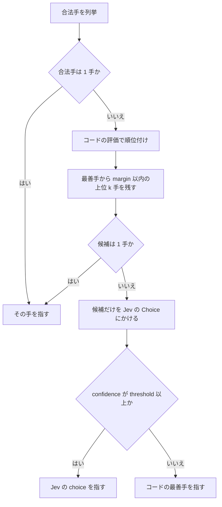

# リバーシ Jev 個体 改善提案書

この提案書は、OpenRouter 経由で `typesafe/jev-1.13` を呼ぶリバーシ個体（`SPECIMEN_ID = "jev"`）について、成績低下を受けた今後の設計方針と検証手順をまとめたものです。設計判断の根拠には、TypeSafe のドキュメント（2026-09-20 時点で取得、jev-1.13 の弱点一覧は 2026-09-17 レビュー版）を用いています。

## 1. 背景と経緯

これまでに 2 つの版を作っています。

第 1 版では、Jev に「角を優先すべきか」「手数を優先すべきか」などの戦略上の優先度を Noul と Score で答えさせ、段階（序盤・中盤・終盤）を Choice で判定させていました。Jev の答えは、コードが計算した着手後の指標に掛ける係数（`1 + w × 値`）として使われていたため、実質的にはコードの評価関数が着手を決めていました。盤面は 2 次元配列と座標変換の説明（`origin`）で渡しており、Jev にとっては間接性が高く、答えが盤面にほとんど反応しない懸念がありました。

第 2 版では、コードが各合法手を 5 つの言葉の事実（マスの種類、角を取るか、次に角を与えるか、相手の手数、返す石の量）で記述し、全合法手を選択肢とする Choice で Jev に選ばせました。段階は空きマス数からコードで判定し、最終スコアはコードの評価と Jev の確率を加算で合成しています（`w_code × code + w_jev × w_confidence × probability × confidence`、`w_jev = 4`）。この版で成績が下がりました。

## 2. 現状分析

### 2.1 第 2 版では 2 つの変更が同時に入っている

成績低下の原因は、次のどちらか、または両方です。現時点ではどちらが主因か切り分けられていません。

- コード側の評価関数の変更。候補手ごとの最小・最大正規化から固定の `scales` による正規化へ、Jev の確率で混ぜた段階重みから空きマス数による段階の切り替えへ変わり、指標同士の相対的な強さが大きく変わった可能性があります。
- Jev の役割の変更。第 1 版では Jev の答えは係数でしかなく、コードの判断を覆しにくい構造でした。第 2 版では加算項の重みが 4 と大きく、Jev の選択がコードの最善手を上書きできます。Jev の判断がコードより劣っていれば、成績は下がります。

### 2.2 Jev 側で考えられる原因

いずれも仮説であり、第 5 章の検証で確認します。

- 字義どおりの読み方による偏り。state の `objective`（最後に石が多いほうが勝ち）を字義どおりに読むと、序盤・中盤に石を多く返す手を好む方向に引っぱられます。jev-1.13 は意図ではなく書かれた言葉に基づいて答えることが、既知の弱点として挙げられています。
- `gives_corner` の意味のずれ。実装は「着手後に相手が角に打てるか」を見ているため、着手前から相手が角を取れる局面では全候補が yes になり、手の危険性を区別する情報になっていません。文言の "Gives a corner next" も、誰に与えるのかを書いていません。
- 説明の粗さ。5 項目・3 段階の説明では、位置表や手数の実数値が持つ情報の大半が失われます。粗い情報しか持たない Jev が、細かい情報を持つコードの判断を上書きしている可能性があります。
- 同一説明の候補による確率の分散。説明文がまったく同じ手が複数あると、Jev は区別できないため確率をほぼ均等に割り、confidence が下がります。`probability × confidence` の二重の減点により、種類の違う手の間の判断まで効かなくなります。
- instructions が state の `stage` を参照しておらず、"you" が誰を指すかも曖昧です。

### 2.3 運用上の不具合

成績とは別に、対局が止まりうる箇所があります。`_bucket_label` はどのバケットにも入らない値で `ExternalModelError` を送出します。`opponent_places` の上限 32 は、リバーシの 1 局面の合法手の最大数（33 手とされる）より小さく、`flips` の上限 20 も理論上の最大に対して余裕があるとは言い切れません。

## 3. 新しい方針

### 3.1 基本方針：コードが絞り込み、Jev は候補の中から選ぶ

リバーシでは、盤面に関する事実はすべてコードで正確に計算できます。TypeSafe のドキュメントも、コードで正確に計算できることをモデルに聞かず、制御はコードが持つことを推奨しています。そこで、Jev がコードの判断を無制限に上書きする加算合成をやめ、役割を「コードがほぼ互角とみなした候補の中から選ぶ」ことに限定します。TypeSafe の re-ranking クックブックが、BM25 で絞った候補を TypeSafe で並べ直しているのと同じ構造です。



この構造には 3 つの利点があります。1 つ目は、Jev が最悪の判断をしても、選ばれるのはコードがほぼ互角とみなした手なので、成績の下がり幅に上限ができることです。2 つ目は、`margin` と `threshold` を調整することで、コードだけの版（`margin = 0`）から Jev の裁量が大きい版まで、1 本の軸で段階的に比較できることです。3 つ目は、候補が少ないため、同じ説明文の手が並んで確率が割れる問題が起きにくいことです。

### 3.2 選択ロジックの概略

```python
def choose(position, places, spec):
    scores = {s: code_score(position, s, spec) for s in places}
    ranked = sorted(places, key=lambda s: scores[s], reverse=True)
    best = scores[ranked[0]]
    shortlist = [
        s for s in ranked[: spec.shortlist_size]
        if best - scores[s] <= spec.margin
    ]
    if len(shortlist) == 1:
        return shortlist[0]
    answer = ask_jev(position, shortlist, spec)  # 候補だけを criteria にする
    if answer.confidence < spec.confidence_threshold:
        return ranked[0]
    return answer.choice
```

`margin` はコードの評価値の単位で決めます。評価値の典型的な差の大きさは局面や重みによって変わるため、初期値は第 5 章のログから、最善手と次善手の差の分布（例えば中央値）を見て決めます。

### 3.3 プロンプトの変更

`jev.json` には、絞り込みのパラメータを追加し、合成用の重み（`jev`、`confidence`）は廃止します。`w_jev × w_confidence` は積でしか使われていなかったため、実質 1 つの重みでした。

```json
{
  "questions": {
    "place": {
      "type": "choice",
      "instructions": "Given `stage`, which place is best for `side_to_move` to play?"
    }
  },
  "place_line": "{kind}. Takes a corner: {takes_corner}. Newly lets the opponent take a corner next turn: {gives_corner}. Moves left to the opponent: {opponent_places}. Discs flipped: {flips}.",
  "selection": {
    "shortlist_size": 3,
    "margin": 0.5,
    "confidence_threshold": 0.3
  }
}
```

`objective` は、段階を参照する instructions に置き換えたうえで、外した版と残した版を第 5 章のオフライン評価で比較して決めます。字義どおりの読み方で石を多く返す手に偏るかどうかは、実測しないと断定できないためです。

state は `side_to_move` と `stage`（残す場合は `objective`）だけにします。これまで state の `places` と Choice の `criteria` に同じ説明文が重複していましたが、選択肢は criteria でモデルに渡るため、state 側は不要です。

### 3.4 コードの修正

- `gives_corner` を差分にする。着手前に相手が角に打てず、着手後に打てるようになる場合だけ yes にします。これで文言の "Newly lets the opponent take a corner" と実装の意味が一致します。
- バケットの上限を広げる。`opponent_places` と `flips` の `many` の上限を 64 にし、`_require_cover` の検証範囲も合わせます。
- 候補手ごとのログを出す。コードの評価値、各指標、Jev の確率と confidence、最終的な選択、絞り込み後の候補を記録します。第 5 章の検証はこのログを前提にします。

## 4. 前提と限界

この方針は、Jev がコードの評価関数を単独で上回ることを期待していません。すべての事実をコードが計算できるリバーシでは、Jev の判断材料はコードが言葉にした事実に限られるため、それは難しいと考えられます。この個体の目的は、役割を限定した Jev が、コードだけの版に対して上積みを生むかどうかを示すことに置きます。純粋に勝率だけを追う場合は、コード側で探索を深くするほうがはるかに効果が大きいはずです。

また、Jev の主な学習言語は英語であり、説明文と instructions は英語のまま維持します。

## 5. 検証の進め方

検証は、手戻りが少なくなるように 5 段階で進めます。各段階の結果によって、次の段階の内容が変わります。

### 5.1 段階 0：ログと再現性の整備

候補手ごとのログ（3.4 節）を実装し、同じ局面を入力すると同じ結果が再現できることを確認します。Jev は同じ入力に安定した答えを返すよう設計されているため、ばらつきが大きい場合は入力の組み立て側を疑います。

### 5.2 段階 1：成績低下の原因の切り分け

次の 4 構成を、同じ対戦相手に対して同じ条件で対局させます。

| 構成 | 意味 |
| --- | --- |
| 第 1 版で Jev の答えを定数に固定 | 旧評価関数だけの強さ |
| 第 2 版で `jev: 0` | 新評価関数だけの強さ |
| 第 2 版で `code: 0` | Jev の判断だけの強さ |
| 第 2 版そのまま | 報告された低下した成績 |

判定の考え方は次のとおりです。第 2 版の `jev: 0` が第 1 版の定数版より弱ければ、主因は評価関数（`scales` と重みの釣り合い）にあり、まずコード側を戻すか調整します。第 2 版の `jev: 0` は強いのに第 2 版そのままが弱ければ、主因は Jev の判断がコードより劣っていることにあり、第 3 章の方針がそのまま当てはまります。以降の段階では、最も強かったコードだけの構成を基準線とします。

### 5.3 段階 2：局面単位のオフライン評価の構築

対局の勝敗はノイズが大きく時間もかかるため、プロンプトの改善は局面単位のオフライン評価で回します。

評価用の局面は、実際の対局ログから抽出し、合法手が 2 手以上ある局面を序盤・中盤・終盤から偏りなく集めます。各局面の正解は、手元で数手読ませた αβ 探索の評価値で決めます。空きマスが少ない終盤では完全読みで正確な値を出せます。熟練者の棋譜（WTHOR）の手を正解とする方法もあり、対局中に参照しないという方針とは矛盾しません。

指標は次の 3 つです。

- 一致率：選んだ手が探索の最善手と一致した割合。
- 平均損失：探索の評価値で見た、最善手と選んだ手の差の平均。一致率より情報量が多く、「惜しい手」と「大悪手」を区別できます。主指標にはこちらを使います。
- 大悪手率：損失が一定値を超えた手（空いた角の隣の X マスなど）の割合。

これを、コードの最善手、Jev 単独の選択（全合法手の Choice）、第 3 章の絞り込み方式の 3 通りについて計測します。あわせて、Jev の confidence を区間に分け、区間ごとの一致率と平均損失を出します。confidence が高いほど損失が小さければ、confidence による切り替えに根拠があることになり、`threshold` の初期値もこの表から決められます。

### 5.4 段階 3：プロンプトの改善

オフライン評価の上で、変更を 1 つずつ入れて効果を確かめます。複数の変更を同時に入れると、第 2 版と同じく原因が分からなくなるためです。試す順序の目安は次のとおりです。

1. instructions を、`stage` と `side_to_move` をバッククォートで参照する形に変える。
2. `objective` を外した版と残した版を比べる。ログで、Jev の選んだ手とコードの最善手の返した石数の平均を比べ、石を多く返す手への偏りがあるかも確認します。
3. `gives_corner` を差分に変える。
4. 候補間の差が出る事実を 1 項目ずつ足す。例えば、辺を取るか、確定石が増えるか、相手の手数が着手前より増えるか減るか、などです。

各変更は、平均損失が改善した場合だけ採用します。改訂に使った局面とは別の局面でも改善することを確かめてから確定します。

### 5.5 段階 4：絞り込みパラメータの調整

`shortlist_size`、`margin`、`confidence_threshold` を振り、オフライン評価の平均損失を比べます。`margin = 0` がコードだけの版に一致するので、ここから広げていき、平均損失が基準線より小さくなる範囲があるかを探します。そのような範囲がなければ、現状の説明では Jev が上積みを生まないという結論になり、段階 3 に戻って説明の項目を見直します。

### 5.6 段階 5：対局による最終確認

オフラインで基準線を上回った設定だけを対局で確認します。

対局は、同じ開始局面の組（冒頭の数手をランダムに進めた局面の集合など）を使い、各開始局面で先後を入れ替えて打たせます。同じ開始局面での成績差を比べる対の比較にすると、開始局面によるばらつきを打ち消せます。

勝率の標準誤差はおよそ `sqrt(p(1 - p) / n)` で、勝率 50% 付近では 100 局で約 5 ポイント、400 局で約 2.5 ポイントです。数ポイントの差を判定するには数百局が必要なため、勝敗に加えて、ばらつきの小さい最終石差の平均も主要な指標にします。

採用基準は、基準線（コードだけの版）に対して、最終石差の平均が統計的に有意に良く、勝率も下回らないこととします。この基準を満たさない場合は、コードだけの版を維持しつつ、段階 3 と段階 4 に戻ります。

## 6. 作業一覧

| 順序 | 作業 | 完了条件 |
| --- | --- | --- |
| 1 | バケット上限の修正と候補手ログの実装 | 全局面でログが出力され、例外で対局が止まらない |
| 2 | 4 構成の対局による原因の切り分け | 基準線とする構成が決まる |
| 3 | オフライン評価用の局面と正解の作成 | 3 通りの方式の一致率・平均損失・大悪手率が出る |
| 4 | 絞り込み方式の実装と `jev.json` の変更 | `margin = 0` でコードだけの版と同じ手を選ぶ |
| 5 | プロンプトの変更を 1 つずつ評価 | 採用する変更が決まる |
| 6 | 絞り込みパラメータの調整 | 基準線を上回る設定があるかが分かる |
| 7 | 対局による最終確認 | 採用基準の判定が出る |
