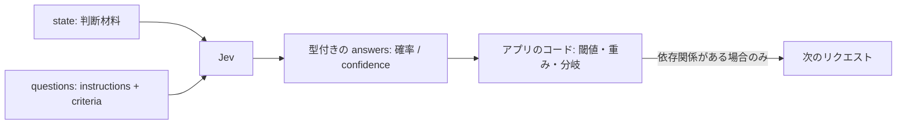

# Jev で良いプロンプト（state と questions）を作る方法

この文書は、TypeSafe のドキュメント（https://docs.typesafe.ai/llms.txt を起点に Firecrawl で取得、2026-09-20 時点）をもとに、System One モデル Jev に渡す入力をどう設計すればよいかをまとめたものです。対象は `jev-1.13`（エイリアス `jev-latest` / `jev-preview` は取得時点で `jev-1.13.0` を指す）で、弱点に関する記述はドキュメント側で 2026-09-17 にレビューされた内容に基づきます。

## Jev における「プロンプト」は何でできているか

Jev は文章を生成するモデルではなく、コードが直接使える型付きの判断を高速に返すモデルです。そのため、一般的な LLM の「システムプロンプト＋自由記述の指示」に相当するものはありません。代わりに、1 回のリクエストで次の 2 つを渡します。

- `state`：判断の対象になる内容（問い合わせ文、文書、アプリケーションの状態など）
- `questions`：その state について下してほしい判断の集合。ID をキーにした map で、各質問は `type`（`choice` / `score` / `noul`）、`instructions`（問いそのもの）、`criteria`（選択肢・段階・yes/no の定義）を持つ

返ってくるのは、質問ごとに自分が指定した選択肢や段階の上の確率分布です。モデルが選択肢の外の値を返すことはないので、コードは生成文から値を拾い出す必要がありません。



この構造から、Jev の「良いプロンプト」は 2 つの設計問題に分かれます。どんな判断材料を state に入れるか、そしてどんな粒度・言葉で questions を定義するかです。以下ではこの順に説明します。

## 中心となる原則：一つの質問は一つの即断にする

ドキュメントが繰り返し強調するのは、Jev に頼むのは「適切な文脈を与えられた詳しい人が 1 秒で下せる判断」だという点です。「このメッセージは緊急性を伝えているか？」は良い質問で、「このメッセージを分析して最善の対応を決めよ」は悪い質問です。後者はじっくり考える推論（System Two 的な作業）を要求しており、それ自体が「小さな質問に分解してコードで組み合わせよ」というサインだとされています。

分解する理由は精度だけではありません。判断が複数の要因に依存するとき、一つの質問にまとめると、ある要因では高く別の要因では低い入力をモデルが置き場所に困り、確率が割れて confidence が下がります。要因ごとの質問に分ければ、それぞれの答えを検査・調整でき、組み合わせ方（重み）はコード側に残ります。例えば「このスタートアップのピッチを評価して」ではなく、市場規模・技術的実現性・差別化をそれぞれ質問し、重み付けはコードで行います。優先度が変わったときはプロンプトを書き直すのではなく重みの値を変えればよい、というのがドキュメントの立場です。

この原則の背後には「制御はコードが持つ」という設計思想があります。制御フロー、決定的なルール、副作用はコードが担当し、AI が必要な箇所にだけ System One の狭い判断を差し込みます。エージェント的な while ループではなく、通常のソフトウェアのワークフローとして組み立てることが推奨されています。

## 質問タイプの選び方

必要な答えの形に合わせてタイプを選びます。迷ったときは、コードがそのまま行動に移せる答えを返すほうを選ぶのがドキュメントの推奨です。Choice は分岐先の数だけのコードパスに、Score は閾値に、Noul は `if` にそのまま対応します。

| タイプ | 答える問い | 返り値 | 向いている場面 |
| --- | --- | --- | --- |
| Choice | 既知の選択肢のうちどれか（順序なし） | `choice`, `probabilities`, `confidence` | チケットの担当部署、文書の種類、プログラミング言語の判定 |
| Score | 記述可能な段階のうちどの位置か（順序あり） | `score`, `legend`, `probabilities`, `confidence` | バグの深刻度、顧客の苛立ち、スキルレベル |
| Noul | その記述は真か（yes/no） | `noul`（yes の確率、0〜1） | 個人情報を含むか、返金を求めているか |

特に混同しやすいのが Noul と Score です。「この候補者は Python が強いか？」を Noul で聞くと、「強い」の定義が曖昧なまま確率が返ります。Noul の 0.5 は「yes と no が同じくらいありそう」という意味であって、「中程度に強い」という意味ではありません。程度を測りたいなら「経験なし／多少知っている／日常的に使う／深い専門性」のような段階を定義した Score を使い、yes/no の判断が必要なら「履歴書に、業務で Python を使った経験が書かれているか？」のように条件を明確にした Noul を使います。

## state の設計

state は文字列、JSON オブジェクト、配列のいずれでも渡せます。ドキュメントの推奨はほとんどの場合オブジェクトを使うことで、各部分に説明的な名前が付き、部分同士の関係が明確になるからです。state は「専門家パネルに判断を求める前に見せる資料」だと考えるとよい、とされています。

```json
{
  "ticket": {
    "subject": "Duplicate charge",
    "messages": [
      {"from": "customer", "text": "I was charged twice for order A-104. Please refund the duplicate."},
      {"from": "support", "text": "We are checking the charges."}
    ]
  },
  "order": {
    "id": "A-104",
    "charges": [
      {"amount_usd": 49, "status": "captured"},
      {"amount_usd": 49, "status": "captured"}
    ]
  },
  "refund_policy": "Duplicate charges are eligible for a refund."
}
```

これは会話・注文・ポリシーを含んでいても 1 つの state です。判断に部分同士の比較が必要なら、関連情報は同じ state にまとめます。一方で、内容（state）と判断（questions）は分けて書きます。返金依頼とポリシーは state に置き、「顧客は返金を求めているか」「ポリシーはそれを支持するか」は質問として書く、という分担です。

state に何を入れるかについては、判断に関係ない情報を入れないことが重要です。`jev-1.13` は state が無関係な内容で膨らむと精度が落ちることが既知の弱点として挙げられており（ドキュメントでは context rot と表現）、無関係な詳細は注意をそらすうえ、誤答の原因箇所を特定しにくくします。検索やフィルタリングはコードで先に行い、質問に必要なフィールドだけを送ります。コードで絞り込めない場合は、関連性を判定する Noul をフィルタとして使う方法が紹介されています。また、モデルの重みに入っている知識に頼らず、最新の情報は自前のナレッジベースから state に入れることも推奨されています。

制約として、Jev はテキストのみを受け付けます（画像・音声・動画は未対応）。`jev-1.13.0` のコンテキストは 1 リクエストあたり 64k トークンで、state と最長の質問を合わせて 32k トークンまでです。主な学習言語は英語で、日本語を含む CJK などの他言語も受け付けますが、現時点では精度が低いと明記されています。ここからの推論として、日本語の入力を扱う場合でも instructions と criteria は英語で書く案を検討し、自分のデータで日本語版と比較検証するのが安全だと考えられます（これはドキュメントの明示的な推奨ではなく、言語サポートの記述から導いた提案です）。

## instructions の書き方

### 意図ではなく書かれた言葉どおりに読まれる

`jev-1.13` の既知の弱点の筆頭は「字義どおりの読み方（literal reading）」です。範囲を限定する語、否定、暗黙の条件はすべて額面どおりに解釈され、人間なら汲み取るはずの意図は補われません。したがって、判断させたい条件そのものを instructions に正確に書き、境界事例は criteria に入れます。ドキュメントには実践的な目安があり、誤答を見て「本当はこういう意味だった」と説明したくなったら、その説明こそが instructions に欠けていた半分だ、とされています。解釈がどうしても必要な場合は、2 つの字義どおりの質問に分けてコードで組み合わせます。

### 間接性を減らす

二重否定や、「性質の性質」を問うような多段の推論を要する質問は信頼性が下がります。できるだけ直接的に書き、state の関連部分は名前で指し示します。

### state の特定フィールドをパスで指す

state が構造化されている場合は、質問がどの部分についての判断なのかを、バッククォートで囲んだドット＋インデックス形式のパスで示します。

```python
questions = {
    "refund_requested": {
        "type": "noul",
        "instructions": "Does `ticket.messages[0].text` request a refund?",
    },
    "policy_supports_refund": {
        "type": "noul",
        "instructions": (
            "Does `refund_policy` support the refund requested "
            "in `ticket.messages[0].text`, given `order.charges`?"
        ),
    },
}
```

### 質問 ID に意味を持たせない

質問 ID（上の `refund_requested` など）はコードのためのもので、モデルには送られません。ID が自明に見えても、完全な質問を instructions に書きます。なお、Choice の選択肢名や、構造化 criteria で使うフィールド名（`what`, `not_for` など）はモデルに見えます。

### 質問形でも平叙文でもよい

instructions は明確で具体的な疑問文でも、「The customer is requesting a refund.」のようにモデルに真偽を判定させる平叙文でも構いません。どちらの場合も、平均的な人が読んで理解しやすい文にすることが推奨されています。

## criteria の書き方（タイプ別）

### Choice：選択肢同士を区別する説明を書く

Choice の criteria は、選択肢名をキー、その説明を値とする map です。選択肢名と説明の両方がモデルに渡るため、説明は「ほかの選択肢との違い」が分かるように書きます。

```python
Choice(
    instructions="Which team should handle this?",
    criteria={
        "returns": "Exchanges, wrong or damaged items",
        "shipping": "Delivery status, delays, lost packages",
        "billing": "Charges, invoices, payment problems",
    },
)
```

選択肢は最大 255 個まで指定でき、1 個あたり数トークンしか増えないため、候補を絞った短いリストではなく、チーム・カテゴリ・商品の完全なリストを渡すことが推奨されています。リストがすべての入力を網羅しない可能性があるときは、`other` や `none of the above` を加えて「どれにも当てはまらない」と答えられるようにします。選択肢名だけで意味が明らかな場合（`calm` / `frustrated` / `angry` など）は、説明を `null` にしてもかまいません。

まずは 1 行の説明から始め、似た選択肢をモデルが取り違え続けるときだけ、説明をオブジェクトにします。その選択肢が何をカバーするか、隣の選択肢に属するのは何か、入力例をいくつか、というフィールドを持たせます。

```python
"topic": Choice(
    instructions={
        "question": "Which team should handle `ticket.message`?",
        "focus": "Classify the customer's primary request.",
    },
    criteria={
        "billing": {
            "what": "Charges, invoices, refunds, or subscriptions",
            "not_for": "Order tracking or account access",
            "examples": ["I was charged twice", "Where is my refund?"],
        },
        # 他の選択肢も同じフィールド名で書く
    },
)
```

`question`, `focus`, `what`, `not_for`, `examples` といったフィールド名は API の予約語ではなく、自由に決められます。ただしモデルは名前も値と一緒に読むので、後に続く内容を短く表すラベルにし、全選択肢で同じ名前を使います。

### Score：程度ではなく状況を記述する

Score の criteria は、低い側から高い側へ並べた段階（level）の配列で、2 段階以上、最大 10 段階です。配列内の位置がそのまま段階番号（0 から始まる）になります。

Score の段階設計で最も重要なのは、程度ではなく状況を記述することです。「Broken or degraded feature, but workaround exists」はモデルが state と照合できる手がかりになりますが、「Moderately severe」はなりません。これは Score の仕組みから来ています。各段階は state に対して個別に評価され、モデルは段階の番号も隣の段階も見ません。そのため「前の段階より悪い」という書き方は意味を持たず、説明や instructions に数字を入れても役に立ちません。ドキュメントの実例では、ボタンが数ピクセルずれているだけの報告に対し、段階を `["0", "1", "2"]` の数字だけにすると score 0.55・confidence 0.33 と割れたのに対し、状況を記述した 3 段階では score 0.0・confidence 1.0 になりました。

そのほかの段階設計の指針は次のとおりです。

- 明確に区別して記述できる数だけ段階を作る。3 段階で十分なことも多く、区別できない段階を足さない
- 1 つの Score は 1 つの次元だけを測る。「時間に正確で、賢く、経験豊富」のように複数の性質を 1 つの記述に入れると、ある性質は高く別の性質は低い入力を配置できず、confidence が下がり score の意味も薄れる
- 尺度の端に、別扱いが必要なまれな極端ケースがあるなら独立した段階にする。感情尺度が「非常に怒っている」で終わっているなら「罵倒・脅迫」を追加しないと、両者がどちらも最上段付近の score になって区別できない
- 中間が存在せず離散的なカテゴリなら、Score ではなく Choice にするか、複数の Noul に分ける

モデルが明確なはずの入力で隣り合う段階の間に割れ続けるときは、各段階をオブジェクトにして、何をカバーするかと例を加えます。このとき例は実際の入力に似ていなければ効果がありません。ドキュメントの比較では、「Safari でエクスポートがクラッシュするが Chrome では動く」という報告に対し、プレーンな文字列の段階では score 1.43・confidence 0.35 でしたが、段階 1 に「あるブラウザでは失敗するが別のブラウザでは動く」という例を加えると score 1.03・confidence 0.96 になりました。一方、ブラウザと無関係な例（「検索は失敗するがカテゴリ閲覧は動く」）を加えた場合は、プレーンな文字列と同じ 1.43・0.35 のままでした。

ただし、confidence が上がったことはその答えが正しいことを意味しません。期待される段階が分かっている例で記述を改訂し、別の入力で検証してから採用する、という手順が推奨されています。同じ尺度でも言い回しが違えば自分のデータ上で挙動が変わりうるため、段階は必ず手元のデータで試します。

### Noul：一つの条件を、高い値が yes になるように書く

Noul の criteria は省略可能で、yes と no がそれぞれ何を意味するかを `true` / `false` で補足します。書き方の指針は次のとおりです。

- 1 つの Noul には 1 つの yes/no 条件だけを入れる。条件が 2 つあるなら Noul を 2 つにしてコードで組み合わせる
- 高い値が yes を意味するように書く。「メッセージに個人データが含まれるか？」は明確だが、「メッセージに個人データが含まれていないか？」は意味が反転している
- yes と no の境界に中間領域を残さない。「any」のような語で境界を明確にする
- 境界が微妙な場合は `criteria` の `true` / `false` で定義する

```python
Noul(
    instructions="Has the customer contacted support about this before?",
    criteria={
        "true": "Mentions a prior attempt, ticket, or that they have asked before",
        "false": "No sign of any previous contact",
    },
)
```

instructions と criteria が食い違うと `jev-1.13` は混乱しやすいことも既知の弱点です。例えば `true` が「no」に、`false` が「yes」に対応するような Noul は性能が落ちます。criteria は instructions の延長として扱い、両者を明確な同じ方向の言葉でそろえます。

## 構造化された instructions を使う場面

instructions と criteria は文字列・オブジェクト・配列のいずれでも書けますが、ドキュメントの推奨は「まず文字列で始める」です。構造を加えるのは、次のような場合に限られます。

- 質問に複数の部分がある、または文脈や例が必要な場合（ラベル付きのキーで分けると明確になる）
- 質問の一部をコードが組み立てる場合（データベースの値など）
- スキーマ、分類体系、データベースの行がすでに JSON であり、文字列に直すより関連するサブフィールドをそのまま渡せる場合

```json
{
  "instructions": {
    "question": "Does the claimed sender identity conflict with the sending domain?",
    "compare": ["ticket.sender.display_name", "ticket.sender.email"],
    "focus": "Compare the named organization with the email domain."
  }
}
```

コードが組み立てる例として、履歴書と候補者レコードの重複判定では、既存レコードの値を instructions のオブジェクトに入れて問い合わせます。

```python
Noul(
    instructions={
        "potential_duplicate": {
            "name": candidate["name"],
            "location": candidate["location"],
            "last_employer": candidate["last_employer"],
        },
        "question": "Is the resume for the same person as `potential_duplicate`?",
    },
)
```

ドキュメントの例では、名前の綴りは違うが所在地と前職が一致するレコードで 0.74、名前は同じだが都市も前職も違うレコードで 0.09 が返っています。

深い分類体系を扱う場合は、Choice の各選択肢の値にその配下のサブツリーを入れると、モデルが確定前に子ノードを見られます。サブツリーが大きくなりすぎる場合は、直下の子と葉のサンプルに削ります。

## 質問はまとめて、投機的に送る

同じ state を使う質問は、タイプを混在させて 1 回のリクエストにまとめます。Jev はリクエスト内の質問を並列に評価するため、質問を増やしても応答時間はほとんど変わらず、追加の質問分のトークン費用しかかかりません。ドキュメントは「使わないかもしれない質問を聞くのはほぼ無料」と表現しています。

これを積極的に使うのが投機的ファンアウト（Speculative fan-out）で、一部の入力でしか意味を持たない質問も含めてすべて聞き、どの答えを使うかはコードが決めます。例えば返品理由を問う質問は、部署判定が `returns` になったときだけ使い、それ以外では無視します。GDPR の記事に 13 問を投げるクックブックでは、1 回にまとめたほうが大幅に安く速く、答えは変わらなかったと報告されています（倍率は llms.txt の要約では 12.2 倍安く 10.0 倍速い、Primitives ページでは 11.5 倍と 9.6 倍と記載に差があります）。コーディングエージェントは「1 呼び出し 1 質問」に陥りやすいため、TypeSafe はエージェント向けスキルでこれを抑止しています。

ここで前提となるのが、リクエスト内の質問は互いに独立していることです。ある質問の答えが別の質問の隠れた文脈になることはないので、質問を追加・削除しても他の質問の結果は変わりません。逆に言えば、後の判断が前の答えに本当に依存する場合（答えを使って state に追加データを取りに行く、次の質問の選択肢を決めるなど）だけ、コードで 2 回目のリクエストを組みます。2 回目の質問が元の state に対して聞けるものなら、最初のリクエストに入れて不要なら無視するほうがよい、とされています。

## Jev に任せず、コードで処理すべきこと

`jev-1.13` は常識的な判断は得意ですが、数値の精密さ、多段の間接性、生成は苦手です。プロンプトを工夫するより、仕事の分担を変えるほうが効果的な領域をまとめます。

数え上げは信頼できません。単語の文字数、文中の出現回数、長いリストの項目数などは、モデルが集計するのではなく答えの「形」を認識するため、対象が大きいほど誤差が増えます。正規表現やパーサで見つけられる単位ならコードで数え、条件に合う項目を数えたい場合は項目ごとに 1 つの質問を立てて答えをコードで合計します。

```python
from typesafe_sdk import Noul, TypeSafeClient

client = TypeSafeClient(model="jev-1.13")
YES = 0.5  # 閾値はユースケースに応じて決める

items = ["typesafe", "apple", "california", "banana", "likes", "calibration", "orange", "vertex"]

result = client.system_one(
    {"items": items},
    {
        f"item_{i}": Noul(instructions=f"Is `items[{i}]` the name of a fruit?")
        for i in range(len(items))
    },
)

count = sum(result.nouls[f"item_{i}"].noul > YES for i in range(len(items)))
```

この設計では、モデルがするのは「これは果物の名前か」という意味的な判断だけで、数える作業はコードの `sum` が担います。すべての質問は 1 回のリクエストで並列に評価されるので、項目数が増えてもリクエスト数は増えません。

数値表現も苦手です。色を hex 値や RGB で渡すより英語の色名で渡すほうがよく、低レベルのアセンブリより高水準言語のほうが良い結果になります。変換はコードで行い、計算済みの数値か名前付きのバケットを渡し、「その色は警告に見えるか」のような本当に判断が必要な部分だけをモデルに残します。

日付と時刻の比較も不安定です。日付は順序を持つ量ではなくテキストとして読まれるため、前後関係、間隔、期間内かどうかの判定は信頼できず、形式の混在、相対表現、四半期などの境界でさらに悪化します。抽出は判断なのでモデルに、計算はコードに任せます。月・日・年はそれぞれ小さな閉じた集合なので、抽出を Choice にでき、「記載なし」という選択肢を置けば欠けている部分が推測で埋められずに報告されます。

テキスト生成も対象外です。Choice を連鎖させれば無理に生成させることはできますが、うまく動かず非常に遅くなります。データ抽出では、正規表現や生成モデルで候補を取り出し、正しい候補を Jev に Choice で選ばせます。

最後に、質問間の構造的な整合性は保証されません。Jev は意味的に近い入力には量的に近い出力を返すという意味で一貫性が高いものの、人が期待しがちな恒等式は成り立ちません。ドキュメントの例では、「顧客は返金を求めているか」を Noul で聞くと 0.22、yes/no の Choice で聞くと yes が 0.01 でした。また「返金を求めているか」と「返金以外を求めているか」の 2 つの Noul の和は 1.19 になりました。Noul で調整した閾値を Choice に流用しない、別々の質問に算術的な関係を期待しない、欲しい意味をそのまま表す言葉で質問する、というのが対処です。Choice は複数の選択肢のうち「どれか」を相対的に決め、選択肢ごとの Noul は絶対的な判断なので全部が低くなりうる、という違いもあります。

## 答えの読み方と閾値

Choice と Score の `confidence` は、確率分布がどれだけ一つに尖っているかを 0〜1 にまとめた統計量です。一つの選択肢に確率が集中すれば高く、複数に広がれば低くなります。Noul には別の confidence はなく、`noul` の値そのものが分布を完全に表します（1 に近いほど強い yes、0 に近いほど強い no、0.5 付近は不確か）。

confidence の低さはプロンプト設計へのフィードバックにもなります。Score で confidence が低いのは、この state に対して段階が重なっている、質問が複数のことを測っている、state が配置に足る情報を含んでいない、のいずれかであることが多いとされています。前の 2 つは質問の書き直しで、最後の 1 つは state の見直しか、利用者への確認で対処します。

コード側では、confidence に応じて 3 つの経路を用意するのが基本形です。高ければ自動で実行し、中程度なら確認や要レビューのフラグを付け、低ければ実行せず人間や別のシステム（より高価な推論モデルなど）に回します。閾値はリスクに応じて変え、破壊的な操作には読み取り専用の操作より高い閾値を設定します。Noul の場合も同様で、yes と no が同じくらい行動しやすければ 0.5、誤った yes に基づく行動が高くつくなら高く、真の yes を見逃すのが高くつくなら低くし、中間は人のレビューに回します。ドキュメントのコード例では 0.5 を不確かさの下限、0.9 を高リスクの行動の基準に使っていますが、値はドメインと実データ次第です。保守的な閾値から始め、confidence と正解率をプロットして調整することが推奨されています。

Score の `score` は、段階番号をその確率で重み付けした平均（例：0×0.0 + 1×0.57 + 2×0.43 = 1.43）です。ランキングや閾値判定、最も近い段階への丸めには使えますが、段階間を補間して正確な数量を復元する用途には使えません。`jev-1.13` の段階は数値的な較正が弱いためです。また、全確率が段階 1 にある場合と段階 0 と 2 に半分ずつある場合はどちらも 1.0 になるので、`probabilities` と `confidence` も併せて読みます。長さの異なる Score を重み付きで組み合わせるときは、各 score を最上段の番号（`len(criteria) - 1`）で割って 0〜1 に正規化してから重みを掛けます。

## プロンプトを改善していく手順

Jev のプロンプト改善は、手元のデータでの検証を中心に回します。期待される答えが分かっている例を用意し、誤答が出たら、それが字義どおりの読み方によるものか（instructions に条件を書き足す）、選択肢や段階の重なりによるものか（criteria を構造化し `not_for` や実データに近い例を加える）、state のノイズや情報不足によるものか（state を絞る・補う）、そもそも Jev に向かない作業か（コードに移す）を切り分けます。改訂したら、改訂に使ったものとは別の入力で確認します。

また、敵対的な内容への耐性は現時点で限定的です。state はデータとして扱われますが、注入された指示や自分の分類を主張するような文章が答えを動かすことがあります。criteria を明示的に書き、多くのユーザーに展開する前にエッジケースを十分にテストします。

運用面では、質問と閾値の定数を一つのコードファイルにまとめ、人間がレビューしやすくしておくことが推奨されています。コーディングエージェントに統合を書かせる場合でも、エージェントは質問を書くのが得意ではないため、質問は人間が一緒に編集し、より具体的に調整する前提で進めます。

## 設計時のチェックリスト

- 各質問は、詳しい人が 1 秒で下せる一つの判断になっているか。複数の判断を一つの質問に隠していないか
- 質問タイプは答えの形（順序なしの選択・順序ある段階・yes/no）と、コードでの使い方に合っているか
- state はオブジェクトで名前付けされ、質問に必要な情報だけに絞られているか
- instructions は意図ではなく条件そのものを書いているか。二重否定や多段の間接性はないか。構造化 state の該当箇所をバッククォートのパスで指しているか
- Choice の説明は選択肢同士を区別しているか。リストは網羅的か、`other` / `none of the above` は必要か
- Score の段階は数字や程度語ではなく状況を記述しているか。1 次元に限定されているか
- Noul は一つの条件だけで、高い値が yes を意味し、criteria と instructions の向きがそろっているか
- 計算・数え上げ・日付比較・生成をモデルに頼っていないか
- 同じ state に対する質問を 1 リクエストにまとめ、必要なら投機的な質問も含めているか
- confidence や noul の閾値はリスクに応じて設定し、実データで検証したか

## 出典

- TypeSafe docs index: https://docs.typesafe.ai/llms.txt
- State: https://docs.typesafe.ai/concepts/state.md
- Primitives (Questions): https://docs.typesafe.ai/primitives.md
- Choice: https://docs.typesafe.ai/primitives/choice.md
- Score: https://docs.typesafe.ai/primitives/score.md
- Noul: https://docs.typesafe.ai/primitives/noul.md
- Advanced: structure: https://docs.typesafe.ai/primitives/advanced.md
- How to build with TypeSafe: https://docs.typesafe.ai/concepts/how-to-build-with-system-one.md
- Confidence: https://docs.typesafe.ai/confidence.md
- Jev 1.13 jaggedness: https://docs.typesafe.ai/model-jaggedness/jev-1.13.md
- Models: https://docs.typesafe.ai/models.md
- Agent skill: https://docs.typesafe.ai/agent-skill.md
