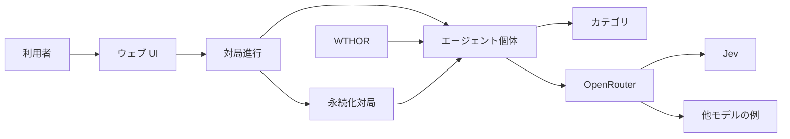

# ソフトウェア要求仕様書

| 項目 | 内容 |
| --- | --- |
| 文書識別 | reversi-ai-SRS |
| 対象ソフトウェア | Reversi Agents |
| 版 | 0.1.24 |
| 状態 | 現行 (Working) |
| 日付 | 2026-09-20 |
| 準拠 | ISO/IEC/IEEE 29148:2018（内容項目は箇条 9.6。章立ては 29148:2011 図 8 / JIS X 0166:2014 の例示アウトラインを用い、2018 で独立項となった項目を追加した） |
| 入力 | [`docs/source-of-truth/01-seed.md`](source-of-truth/01-seed.md)（以下「シード」） |

本文書はシードを入力とした要求仕様であり、開発中のソフトウェア要求の正本である。シードは [`docs/source-of-truth/01-seed.md`](source-of-truth/01-seed.md) に残す。shall の追加・変更・撤回は GitHub Issue と、CODEOWNERS レビュー付きのプルリクエストによる（手順はリポジトリの CONTRIBUTING.md）。シードに無い事項は発明せず、**TBD**（決定予定）として識別する。本版時点で未決の TBD は無い。TBD が新たに立つあいだ、関連要求は完全ではない。

## 改訂履歴

| 版 | 日付 | 内容 |
| --- | --- | --- |
| 0.1.0 | 2026-09-19 | シードを ISO/IEC/IEEE 29148:2018 形式へ展開した初稿 |
| 0.1.1 | 2026-09-19 | シードのタイプ列挙を閉じた 5 種別ではなくカテゴリの例と解釈し、選択単位をエージェント個体へ改める |
| 0.1.2 | 2026-09-19 | Jev を排他指定ではなく「少なくとも用いる」下限とし、他モデルの併用を禁止しない |
| 0.1.3 | 2026-09-19 | ステークホルダ回答により TBD-RUL-001/002、TBD-MOD-001、TBD-DAT-003、TBD-UI-002 を決定。TBD-DAT-001 は調査結果を反映 |
| 0.1.4 | 2026-09-19 | ホスト主記憶の上限を 16 GiB とする（TBD-PER-001 のメモリ） |
| 0.1.5 | 2026-09-19 | 実行環境を個人 PC、UI 言語を日本語とする（TBD-OPS-001） |
| 0.1.6 | 2026-09-19 | Opus と Astra を必須から外し例示とする。SRS-INT-SW-003 を撤回（ID は再利用しない） |
| 0.1.7 | 2026-09-19 | エージェント対エージェントは終局まで自動進行する（TBD-UI-003） |
| 0.1.8 | 2026-09-19 | ランダムカテゴリは合法手の一様分布とする（TBD-AGT-002） |
| 0.1.9 | 2026-09-19 | 強化学習は自己対局。WTHOR は機械学習用（TBD-DAT-002） |
| 0.1.10 | 2026-09-19 | 使用性の数値目標と WCAG 適合を初版の要求としない（TBD-USE-001/002） |
| 0.1.11 | 2026-09-19 | 同時対局は 1、レイテンシと可用性の数値目標は初版の要求としない（TBD-PER-001/002） |
| 0.1.12 | 2026-09-19 | セキュリティの必須範囲を資格情報・ループバック・他オリジン拒否・スクリプト不実行・個人データ非収集とする。認証・監査・保守性指標は初版の要求としない（TBD-SEC-001） |
| 0.1.13 | 2026-09-19 | 利用者特性を対局者と運用者の記述で確定する（TBD-USR-001） |
| 0.1.14 | 2026-09-19 | カタログ一覧（名称と説明）から相手を選び盤面へ移る。座標、合法手と直前着手の印。アニメーションは要求しない（TBD-UI-001） |
| 0.1.15 | 2026-09-19 | WTHOR は個人 PC・再配布なしの内部利用で足りるとする。FFO 個別許諾は初版の前提としない（TBD-DAT-001） |
| 0.1.16 | 2026-09-19 | 生成 AI (Jev) をカタログに置く。他モデルは 生成 AI (呼称) として追加できる（TBD-AGT-001） |
| 0.1.17 | 2026-09-19 | ルールベースは最多取りと位置評価の 2 個体（TBD-AGT-003） |
| 0.1.18 | 2026-09-19 | ルールベースにミニマックス（深さ 4）と定石 3 列を追加（TBD-AGT-003） |
| 0.1.19 | 2026-09-19 | ランダム・機械学習・強化学習・ニューラルネットワークを各 1 個体カタログに置く（TBD-AGT-004） |
| 0.1.20 | 2026-09-19 | 未決の詳細要求は残っていない。配分 TBD の要求は無く、TBD-APR-001 を閉じる |
| 0.1.21 | 2026-09-19 | 開発中の要求正本を本文書とする。shall 変更は Issue と CODEOWNERS レビュー付き PR |
| 0.1.22 | 2026-09-19 | 「床」を最低条件の意味で使っていた箇所を、通常の日本語に直す。shall は変えない |
| 0.1.23 | 2026-09-20 | エージェント対エージェントの着手間隔をウェブ UI で設定できる（未設定時は 1 秒） |
| 0.1.24 | 2026-09-20 | SRS-INT-UI-015 を、表示周期ではなく着手の盤への適用間隔として訂正する |

## 目次

- [1 序文 (Introduction)](#1-序文-introduction)
  - [1.1 目的 (Purpose)](#11-目的-purpose)
  - [1.2 適用範囲 (Scope)](#12-適用範囲-scope)
  - [1.3 製品の概要 (Product overview)](#13-製品の概要-product-overview)
  - [1.4 定義 (Definitions)](#14-定義-definitions)
  - [1.5 前提および依存性 (Assumptions and dependencies)](#15-前提および依存性-assumptions-and-dependencies)
  - [1.6 要求の配分 (Apportioning of requirements)](#16-要求の配分-apportioning-of-requirements)
- [2 参考文献 (References)](#2-参考文献-references)
- [3 詳細要求事項 (Specified requirements)](#3-詳細要求事項-specified-requirements)
  - [3.1 外部インタフェース (External interfaces)](#31-外部インタフェース-external-interfaces)
  - [3.2 機能 (Functions)](#32-機能-functions)
  - [3.3 使用性要求 (Usability requirements)](#33-使用性要求-usability-requirements)
  - [3.4 性能要求 (Performance requirements)](#34-性能要求-performance-requirements)
  - [3.5 論理データベース要求 (Logical database requirements)](#35-論理データベース要求-logical-database-requirements)
  - [3.6 設計制約 (Design constraints)](#36-設計制約-design-constraints)
  - [3.7 規格適合 (Standards compliance)](#37-規格適合-standards-compliance)
  - [3.8 ソフトウェアシステム属性 (Software system attributes)](#38-ソフトウェアシステム属性-software-system-attributes)
- [4 検証 (Verification)](#4-検証-verification)
- [5 付録 (Appendices)](#5-付録-appendices)
  - [5.1 頭字語および略語](#51-頭字語および略語)
  - [5.2 TBD 一覧](#52-tbd-一覧)
  - [5.3 シードからの追跡](#53-シードからの追跡)
  - [5.4 要求索引](#54-要求索引)
  - [5.5 WTHOR 利用条件の調査](#55-wthor-利用条件の調査)

要求の識別子は一度割り当てたら変更・再利用しない。拘束力のある要求は「しなければならない」(shall) で書く。望ましい事項は「することが望ましい」(should) であり、要求ではない。

検証方法の略号: **I** 検査 (Inspection)、**A** 分析 (Analysis)、**D** 実証 (Demonstration)、**T** 試験 (Test)。

---

## 1 序文 (Introduction)

### 1.1 目的 (Purpose)

本文書は、ウェブサービス **Reversi Agents** が満たさなければならないソフトウェア要求を定義する。対象読者は、発注者、設計者、実装者、試験者、およびレビュー担当者である。

本文書の目的は次のとおりである。

- シードに書かれた意図を、一意・検証可能な要求へ落とす
- 設計および試験の入力とする
- シードに無い判断を TBD として可視化する
- 開発中に shall を変えるときの正本とする

### 1.2 適用範囲 (Scope)

対象製品の名称は **Reversi Agents** である。

本ソフトウェアは、利用者がウェブ上でエージェントとリバーシ（オセロ）を対戦でき、エージェントどうしの対戦も行えるようにしなければならない（詳細は第 3 章）。利用者は対戦相手として **エージェント個体** を選べなければならず、石色も選べなければならない。シードが挙げるランダム、ルールベース、機械学習、強化学習、ニューラルネットワークは、エージェントが属しうる **カテゴリの例** であり、選択対象の閉じた 5 件ではない。同一カテゴリに複数のエージェントが存在してよい。外部の AI モデルとしては、少なくとも OpenRouter 上の Jev を、表示名が「生成 AI (Jev)」である個体が用いる。Jev 以外のモデルも、表示名が「生成 AI (〈呼称〉)」である個体として OpenRouter 経由で追加してよい（Opus や Astra はその例であり、必須ではない）。棋譜データ源は、機械学習には WTHOR および永続化した自対局、強化学習には自己対局（永続化してよい）を用いる。勝敗は公式ルールに従う。対象ブラウザは Google Chrome である。実行環境は運用者の個人所有 PC である。利用者向け言語は日本語である。

期待する便益は、エージェント個体の違いを対局として比較できること、および人間がそれらのエージェントと対局できることである。定量目標（同時多数対局、稼働率、学習精度など）は初版の要求としない。初版で満たすべき性能は [SRS-PER-001](#srs-per-001) と [SRS-PER-003](#srs-per-003) である。

上位仕様（SyRS 等）は存在しない。本文書が本製品の最上位要求文書である。

**適用範囲外**（シードに無く、初版の要求としない）:

- 人間どうしの対戦
- 10×10 など 8×8 以外の盤
- 大会運営、レーティング、ランキング、観戦配信プラットフォーム
- 課金、広告、第三者向け API 公開
- 利用者アカウントおよび認証
- 多言語 UI、複数拠点への配備
- 使用性の数値目標（操作数・学習時間・満足度スコア）および WCAG 適合の証明
- 多数同時対局、レイテンシ SLA、稼働率目標
- 監査ログ、第三者によるセキュリティ認証、保守性の数値指標（平均修復時間、網羅率下限など）
- LAN またはインターネットへの公開配備（既定はループバック。到達範囲の拡大は初版の合格条件ではない）
- FFO への WTHOR 利用の個別許諾取得

### 1.3 製品の概要 (Product overview)

#### 1.3.1 製品の位置づけ (Product perspective)

本ソフトウェアは独立したウェブサービスである。より大きな業務システムに組み込む前提はシードに無い。

制約下で動作するインタフェースの概観は次のとおりである。

| 観点 | 概要 |
| --- | --- |
| システム | ウェブブラウザから利用する対局サービス。サーバ構成は設計事項であり、本文書では固定しない |
| 利用者 | 対局を開始し、自分の手を指し、エージェントを選ぶ人。運用者は OpenRouter の認証情報を供給する |
| ハードウェア | 汎用の計算機およびネットワーク。専用 GPU は必須としない |
| ソフトウェア | ウェブブラウザ（Google Chrome）。外部 AI モデルは少なくとも OpenRouter 上の Jev。他モデル（例: Opus、Astra）も OpenRouter 経由で用いてよい。棋譜は WTHOR および自サービスが永続化した対局 |
| 通信 | 利用者と本ソフトウェアの間は既定で同一計算機のループバック。本ソフトウェアと OpenRouter の間はインターネット上の HTTPS |
| メモリ | ホストの主記憶は 16 GiB を上限の目安とする（[SRS-PER-003](#srs-per-003)） |
| 運用 | 運用者の個人所有 PC 上で実行する単一サービス。既定の利用者到達はループバック。利用者向け言語は日本語 |

#### 1.3.2 製品の機能 (Product functions)

主要機能の要約（詳細は [3.2](#32-機能-functions)）:

1. 8×8 リバーシの対局を進行する（合法手、裏返し、パス、終局、勝敗）
2. 利用者がカタログ一覧（名称と説明）から対戦相手のエージェント個体を選び、盤面画面へ移る（同一カテゴリに複数個体があってよい）
3. 利用者対エージェントの対局を提供する
4. エージェント対エージェントの対局を提供する
5. 各エージェントは合法手のみを指す
6. 外部 AI モデルとしては少なくとも OpenRouter の Jev を、個体「生成 AI (Jev)」が用いる。他モデルは「生成 AI (〈呼称〉)」として追加できる
7. ルールベースは最多取り、位置評価、ミニマックス、定石をカタログに置く
8. ランダム、機械学習、強化学習、ニューラルネットワークを各 1 個体カタログに置く。機械学習は WTHOR と永続化対局、強化学習は自己対局で学ぶ

上図は論理関係であり、プロセス分割や配備を規定しない。

#### 1.3.3 利用者の特性 (User characteristics)

シードに利用者特性の記述は無い。ステークホルダ決定により、次を確定する（TBD-USR-001）。

- 対局者: Google Chrome を使え、日本語の利用者インタフェースを読める個人。リバーシの公式ルールを知っていることを前提としない
- 運用者: 個人所有 PC 上で本ソフトウェアを起動し、OpenRouter の API キーを設定できる個人。対局者と同一人物であってよい

教育水準、障害、専門性に関する追加の特性は初版の要求としない。

#### 1.3.4 制限事項 (Limitations)

- 外部 AI モデルの供給者は OpenRouter である。少なくとも Jev を用いる。Opus や Astra は追加モデルの例であり必須ではない
- 製品形態はウェブサービスである
- 対象ブラウザは Google Chrome である
- 利用者向け言語は日本語である。多言語は初版の要求としない
- 実行環境は運用者の個人所有 PC である。複数拠点への配備は要求しない
- ホストの主記憶は 16 GiB を超えてはならない（個人所有 PC での運用）。OpenRouter 上のモデル重みはホストに載せない
- Jev は構造化決定モデルであり、自由文生成を行わない。Jev を用いる着手選択は合法手集合からの決定として扱うことが前提となる
- WTHOR 原本の再配布は行わない。FFO への個別許諾取得は初版の要求としない（権利上の残リスクは運用者が負う）
- 規制適合、安全完整性水準、および [TBD-SEC-001](#tbd-sec-001) で初版の要求としないとした監査は、初版の要求としない

### 1.4 定義 (Definitions)

| 用語 | 定義 |
| --- | --- |
| 本ソフトウェア | Reversi Agents として提供するウェブサービス全体 |
| リバーシ | 8×8 盤で石を挟んで裏返す対戦ゲーム。本文書ではオセロと同義 |
| エージェント | 着手を決定する対局主体の個体。人間の利用者は含まない。一意の識別を持ち、利用者が選ぶ対象である |
| カテゴリ | エージェントの着手方針を分類するラベル。シードの「タイプ」に対応する。選択単位ではない |
| 例示カテゴリ | カテゴリの例。シードのランダム、ルールベース、機械学習、強化学習、ニューラルネットワークに加え、生成 AI を含む。閉じた列挙ではない |
| カタログ | 利用者が対局相手として選べるエージェント個体の集合。各個体は表示名と説明文を持つ |
| カタログ画面 | 対局開始前に、エージェント一覧から対戦相手を選ぶ画面 |
| 盤面画面 | 対局開始後に 8×8 盤と対局状態を提示する画面 |
| 利用者 | ウェブ UI を操作して対局を開始・進行する人 |
| 運用者 | 本ソフトウェアを稼働させ、外部サービス資格情報を供給する人 |
| 合法手 | 空マスへ自分の石を置き、縦・横・斜めのいずれかで相手の石を 1 個以上挟み、挟んだ石をすべて裏返せる着手 |
| パス | 合法手が無いときにその手番を放棄すること |
| 公式スコア | 終局後の記録用石数。勝者には空マスを加算する。引き分けは常に 32–32 |
| Jev | TypeSafe が提供し OpenRouter 経由で利用する構造化決定モデル。識別子は `typesafe/jev-1.13`。唯一の外部モデルではない |
| Opus | 追加で用い得る外部モデルの例。Anthropic Claude Opus（OpenRouter 例: `anthropic/claude-opus-5`）。必須ではない |
| Astra | 追加で用い得る外部モデルの例。OpenAI GPT-6 Astra（OpenRouter 例: `openai/gpt-6-astra`）。必須ではない |
| ランダム | 例示カテゴリの一つ。学習済みモデルを用いず、合法手を等確率で選ぶ |
| ルールベース | 例示カテゴリの一つ。事前に定義した規則またはヒューリスティックで合法手を選ぶ。対局時に学習済みパラメータを用いない |
| 機械学習 | 例示カテゴリの一つ。教師あり学習など機械学習で得たモデルにより合法手を選ぶ |
| 強化学習 | 例示カテゴリの一つ。自己対局による強化学習で得た方針により合法手を選ぶ。WTHOR を学習データ源としない |
| ニューラルネットワーク | 例示カテゴリの一つ。ニューラルネットワークにより合法手を選ぶ |
| 生成 AI | 例示カテゴリの一つ。OpenRouter 上の外部モデルにより合法手を選ぶ。表示名は「生成 AI (〈呼称〉)」 |
| WTHOR | フランスオセロ連盟が公開する大会棋譜データベース |
| シード | `docs/source-of-truth/01-seed.md` |

同一カテゴリに複数のエージェントがあってよい。例: ルールベースでも、最多取りと位置評価は別のエージェントである。機械学習・強化学習・ニューラルネットワークは技術的に重なりうるが、それはカテゴリの分類問題であり、選択対象をカテゴリへ畳み込む理由にはならない。初版カタログは少なくとも次を含む。生成 AI (Jev)、ルールベース (最多取り)、ルールベース (位置評価)、ルールベース (ミニマックス)、ルールベース (定石)、ランダム (一様)、機械学習 (棋譜)、強化学習 (自己対局)、ニューラルネットワーク (棋譜)。これ以外の個体を予め置くことは初版の要求ではない。

### 1.5 前提および依存性 (Assumptions and dependencies)

これらは設計制約ではなく、変化すると本文書の要求が変わる要因である。

| ID | 前提または依存 | 変化した場合の影響 |
| --- | --- | --- |
| ASM-001 | 競技の公式ルールは World Othello Federation の Official rules および大会公式スコア（空マスは勝者に加算、引き分けは 32–32）に従う | 盤・パス・終局・勝敗の要求を改訂する |
| ASM-002 | OpenRouter が Jev（`typesafe/jev-1.13`）を提供し続ける | [SRS-CON-001](#srs-con-001) および [SRS-INT-SW-001](#srs-int-sw-001) を改訂する |
| ASM-003 | 運用者が OpenRouter の有効な認証情報を供給できる | 外部モデルを用いるエージェントは対局不能になる |
| ASM-004 | WTHOR の 8×8 棋譜（`.wtb`）を、原本再配布なしで、運用者の個人所有 PC 上の学習または評価に内部利用できる。FFO への事前の個別許諾は得ていない | [SRS-DAT-001](#srs-dat-001) を改訂する |
| ASM-005 | 利用者は Google Chrome から HTTPS で到達できる | [SRS-INT-SW-002](#srs-int-sw-002) を改訂する |

### 1.6 要求の配分 (Apportioning of requirements)

| 配分 | 意味 |
| --- | --- |
| 初版 | 最初に提供するウェブサービスが満たす |
| 将来 | シードに無く、採用判断を延期する |
| TBD | 配分自体が未定。本版では用いない |

第 3 章の必須要求はすべて配分が初版である。配分 TBD の要求は無い。適用範囲外および「初版の要求としない」とした事項は将来の候補であり、初版の合格条件ではない（TBD-APR-001）。

shall の追加・変更・撤回は、対象 Issue を起票したうえで本文書のプルリクエストとし、CODEOWNERS のレビューを経る。設計判断（shall を変えないもの）では本文書を改訂しない。

ソフトウェア要素（UI、対局進行、エージェント、外部 API 適応、棋譜取込み）への割当は設計であり、本文書では固定しない。追跡は [5.3](#53-シードからの追跡) の要求 ID で行う。

---

## 2 参考文献 (References)

| ID | 文献 | 本文書での使い方 |
| --- | --- | --- |
| REF-SEED | `docs/source-of-truth/01-seed.md` | 要求の入力。本文書より優先して改訂する場合は人間がシードを更新する |
| REF-29148 | ISO/IEC/IEEE 29148:2018, *Systems and software engineering — Life cycle processes — Requirements engineering* | 文書構成および要求の品質特性 |
| REF-JIS | JIS X 0166:2014（ISO/IEC/IEEE 29148:2011 対応）図 8 | 例示アウトラインの公開根拠 |
| REF-WOF | [WOF Official rules](https://www.worldothello.org/about/about-othello/othello-rules/official-rules/english) | 着手・パス・終局の骨格。勝敗は自色の石の多数 |
| REF-WOF-SCORE | [WOC 2024 Rules](https://woc2024.worldothello.org/woc-registration/woc-rules) および FFO 掲載の WOC Official Rules（大会公式スコア） | 空マスは勝者に加算。引き分けは 32–32 |
| REF-FFO-RULES | [FFO ルール](https://www.ffothello.org/othello/regles-du-jeu/) | 8×8、初期配置、挟み、パス、空マス加算の例 |
| REF-JOA | [日本オセロ連盟 競技ルール](https://www.othello.gr.jp/rule) | 空マスの勝者加算（第14条） |
| REF-WTHOR | [La base WTHOR](https://www.ffothello.org/informatique/la-base-wthor) | 棋譜データ源 |
| REF-WTHOR-FMT | FFO, *Format_WThor.pdf*（WTHOR ページから参照） | `.wtb` の論理内容 |
| REF-FFO-LEGAL | [FFO Mentions légales](https://www.ffothello.org/mentions-legales) | サイト内容の複製制限。WTHOR への適用範囲は未明示 |
| REF-JEV | [TypeSafe: Jev 1.13 on OpenRouter](https://openrouter.ai/typesafe/jev-1.13) | Jev の識別子および Decisions API |
| REF-OPUS | [Anthropic: Claude Opus 5 on OpenRouter](https://openrouter.ai/anthropic/claude-opus-5) | 追加モデルの例（必須ではない） |
| REF-ASTRA | [OpenAI: GPT-6 Astra on OpenRouter](https://openrouter.ai/openai/gpt-6-astra) | 追加モデルの例（必須ではない） |
| REF-TSAFE | [TypeSafe System One](https://docs.typesafe.ai/concepts/system-one) | Jev が構造化決定モデルであること |

規格本文の全文は有料のため転載しない。章立ての入れ子は 2011 年版の公開アウトラインと 2018 箇条 9.6 の内容項目に依る。

---

## 3 詳細要求事項 (Specified requirements)

各要求は単独で検証できる単位とする。優先度 **必須** は初版の合格条件である。本版に優先度が未定の要求は無い。

### 3.1 外部インタフェース (External interfaces)

#### 3.1.1 利用者インタフェース

##### SRS-INT-UI-001 ウェブからの利用

- **要求:** 本ソフトウェアは、利用者がウェブブラウザから対局機能を利用できるインタフェースを提供しなければならない。
- **根拠:** シード「ウェブサービス」
- **優先度 / 配分:** 必須 / 初版
- **検証:** D, T

##### SRS-INT-UI-002 盤面の提示

- **要求:** 利用者インタフェースは、8×8 の現在の石の配置、手番の色、黒および白の石数を提示しなければならない。
- **根拠:** 対局サービスとしてシードの概要を成立させるために必要
- **優先度 / 配分:** 必須 / 初版
- **検証:** D, T

##### SRS-INT-UI-003 エージェント選択

- **要求:** 利用者インタフェースは、カタログ上のエージェント個体を対戦相手として選ぶ手段を提供しなければならない。選択の単位はカテゴリであってはならない。同一カテゴリに複数のエージェントがあるとき、それぞれを別の選択肢として提示しなければならない。
- **根拠:** シード「対戦相手のエージェントを選ぶことができる」。タイプ列挙はカテゴリの例である
- **優先度 / 配分:** 必須 / 初版
- **検証:** D, T
- **補足:** 選択の提示は [SRS-INT-UI-010](#srs-int-ui-010) のカタログ一覧による

##### SRS-INT-UI-004 対局モードの選択

- **要求:** 利用者インタフェースは、少なくとも「利用者対エージェント」および「エージェント対エージェント」を対局モードとして選ぶ手段を提供しなければならない。
- **根拠:** シードの概要（人間対エージェント、エージェントどうし）
- **優先度 / 配分:** 必須 / 初版
- **検証:** D, T

##### SRS-INT-UI-005 着手入力

- **要求:** 利用者対エージェントモードにおいて、利用者インタフェースは、利用者の手番に空マスを指定して着手する手段を提供しなければならない。
- **根拠:** シード「エージェントとリバーシの対戦」
- **優先度 / 配分:** 必須 / 初版
- **検証:** D, T

##### SRS-INT-UI-006 終局の提示

- **要求:** 利用者インタフェースは、終局後に勝敗（黒勝ち、白勝ち、または引き分け）および双方の公式スコアを提示しなければならない。
- **根拠:** 対局の完了を観測するために必要。[SRS-FUN-006](#srs-fun-006)
- **優先度 / 配分:** 必須 / 初版
- **検証:** D, T

##### SRS-INT-UI-007 エージェント対エージェント時の双方選択

- **要求:** エージェント対エージェントモードにおいて、利用者インタフェースは、黒を担当するエージェント個体と白を担当するエージェント個体をそれぞれ選ぶ手段を提供しなければならない。同一個体を双方に選ぶこと、および同一カテゴリの異なる個体を双方に選ぶことを、禁止してはならない。
- **根拠:** シードの「選ぶ」と「エージェントどうし」を同時に満たすために必要
- **優先度 / 配分:** 必須 / 初版
- **検証:** D, T

##### SRS-INT-UI-008 石色の選択

- **要求:** 利用者対エージェントモードにおいて、利用者インタフェースは、対局開始前に利用者が黒または白を選べる手段を提供しなければならない。選ばなかった色は対戦相手エージェントが持たなければならない。
- **根拠:** ステークホルダ決定 TBD-RUL-002
- **優先度 / 配分:** 必須 / 初版
- **検証:** D, T

##### SRS-INT-UI-009 利用者向け言語

- **要求:** 利用者インタフェースに提示する文言は日本語でなければならない。
- **根拠:** ステークホルダ決定 TBD-OPS-001
- **優先度 / 配分:** 必須 / 初版
- **検証:** I, D

##### SRS-INT-UI-010 カタログ一覧

- **要求:** 利用者インタフェースは、対局開始前に、カタログ上の各エージェント個体を、表示名と説明文を含む一覧として提示しなければならない。表示名は [SRS-USE-001](#srs-use-001) のラベルと一致しなければならない。説明文は、その個体の着手方針を日本語で述べるものでなければならず、空であってはならない。カテゴリ名を併記してよいが、説明文の代わりにしてはならない。
- **根拠:** ステークホルダ決定 TBD-UI-001。複数エージェントの比較が目的である
- **優先度 / 配分:** 必須 / 初版
- **検証:** I, D
- **補足:** 一覧の見た目（表・カード・列数）は設計事項である。説明文の字数下限は置かない

##### SRS-INT-UI-011 カタログ画面から盤面画面へ

- **要求:** 対局の開始は、カタログ画面で対局モード、必要な石色、および対戦相手を選んだあとに行わなければならない。開始の操作のあと、利用者インタフェースは盤面画面へ移らなければならない。盤面画面は 8×8 の盤と対局状態を提示し、カタログの一覧を対戦相手の選択手段として用いてはならない。終局後、カタログ画面へ戻る手段を提供しなければならない。
- **根拠:** ステークホルダ決定 TBD-UI-001
- **優先度 / 配分:** 必須 / 初版
- **検証:** D
- **補足:** 盤面画面に現在の担当個体の表示名を出してよい。画面実装（別 URL か同一文書の切替か）は設計事項である。[SRS-INT-UI-004](#srs-int-ui-004)、[SRS-INT-UI-007](#srs-int-ui-007)、[SRS-INT-UI-008](#srs-int-ui-008) の選択はカタログ画面で行う

##### SRS-INT-UI-012 座標ラベル

- **要求:** 盤面画面の盤は、列を a から h、行を 1 から 8 とする座標ラベルを提示しなければならない。黒から見て左下のマスを a1 としなければならない。
- **根拠:** [SRS-FUN-002](#srs-fun-002) の初期配置表記と一致させる。ステークホルダ決定 TBD-UI-001
- **優先度 / 配分:** 必須 / 初版
- **検証:** I, D

##### SRS-INT-UI-013 合法手の印

- **要求:** 利用者の着手入力待ちであるとき、盤面画面は合法手である空マスを、合法手でない空マスと区別できる印で提示しなければならない。
- **根拠:** 対局者は公式ルールを前提としない（1.3.3）。ステークホルダ決定 TBD-UI-001
- **優先度 / 配分:** 必須 / 初版
- **検証:** D, T
- **補足:** 印の形状は設計事項である。エージェントの手番にこの印を出すことは初版の合格条件ではない

##### SRS-INT-UI-014 直前着手の印

- **要求:** 盤面画面は、その対局で直前に石が置かれたマスを、他のマスと区別できる印で提示しなければならない。まだ着手が無いときは、この印は無くてよい。
- **根拠:** エージェント対局を追うため。ステークホルダ決定 TBD-UI-001
- **優先度 / 配分:** 必須 / 初版
- **検証:** D, T
- **補足:** 印の形状は設計事項である。石の移動や裏返りのアニメーションは初版の要求としない

##### SRS-INT-UI-015 エージェント対エージェントの着手間隔

- **要求:** エージェント対エージェントモードにおいて、利用者インタフェースは着手間隔を設定する手段を提供しなければならない。未設定時の間隔は 1 秒でなければならない。本ソフトウェアは、1 手を盤に適用したあと、設定した秒数以上空いてから次の 1 手を盤に適用しなければならない。途中の着手（パスを含む）を省略してはならない。間隔は下限であり、着手決定に要した時間が間隔以上であるときは追加で待たなくてよい。人手の着手指示を待たず終局まで進むこと（[SRS-FUN-009](#srs-fun-009)）を変えてはならない。
- **根拠:** ステークホルダ要求。シードにこの数値は無い。表示だけを遅らせる解釈の訂正
- **優先度 / 配分:** 必須 / 初版
- **検証:** D, T
- **補足:** 入力部品の種類、許容範囲、値の永続化、待ちを置く層は設計事項である。対象はウェブ UI のエージェント対エージェントである。利用者対エージェントは対象外である。間隔を渡さない API 対局は速く終局してよい

ピクセル寸法、配色、フォント、一覧の段組は設計事項である。

#### 3.1.2 ハードウェアインタフェース

専用ハードウェアインタフェース要求は無い。汎用の入出力装置（ポインティングデバイスまたは同等のポインタ、ディスプレイ）で [3.1.1](#311-利用者インタフェース) を満たせばよい。

#### 3.1.3 ソフトウェアインタフェース

##### SRS-INT-SW-001 OpenRouter Jev（少なくとも）

- **要求:** 本ソフトウェアは、外部 AI モデルとして OpenRouter が提供する `typesafe/jev-1.13`（Jev）を、少なくとも 1 つの決定経路で用いなければならない。Jev を呼び出すときのモデル識別子は `typesafe/jev-1.13` でなければならない。
- **根拠:** シード「AI モデルサービス: OpenRouter（Jev を使う）」。使うことは下限であり、排他指定ではない
- **優先度 / 配分:** 必須 / 初版
- **検証:** I, T
- **インタフェース要点:** 名称 TypeSafe Jev 1.13。公開されている呼出しは OpenRouter Decisions API。入力は状態と質問、出力は構造化決定である。認証は運用者が供給する OpenRouter の資格情報による。

OpenRouter を呼ぶのは、カテゴリが生成 AI である個体である（[SRS-FUN-021](#srs-fun-021)）。少なくとも表示名「生成 AI (Jev)」の個体が Jev を呼ぶ。ランダムまたはルールベースに属するエージェントは、外部モデル無しで [3.2](#32-機能-functions) を満たせなければならない。

##### SRS-INT-SW-002 ブラウザ

- **要求:** 利用者向けインタフェースは、追加のネイティブアプリケーションのインストールを前提とせず、ウェブブラウザ上で動作しなければならない。初版の対象ブラウザは Google Chrome でなければならない。
- **根拠:** シード「ウェブサービス」。ステークホルダ決定 TBD-UI-002
- **優先度 / 配分:** 必須 / 初版
- **検証:** D

##### SRS-INT-SW-003 （撤回）

撤回。Opus および Astra の使用を必須としていた。追加モデルの例であり必須ではない。本 ID は再利用しない。

#### 3.1.4 通信インタフェース

##### SRS-INT-CM-001 利用者通信

- **要求:** 本ソフトウェアと利用者ブラウザの間の通信は、HTTPS で保護されなければならない。
- **根拠:** ウェブサービスとしての通信の既定。シードにプロトコル指定は無いが、平文 HTTP のみは初版の既定としない
- **優先度 / 配分:** 必須 / 初版
- **検証:** I, T

##### SRS-INT-CM-002 外部モデル通信

- **要求:** 本ソフトウェアと OpenRouter の間の通信は、HTTPS で保護されなければならない。
- **根拠:** [SRS-INT-SW-001](#srs-int-sw-001)
- **優先度 / 配分:** 必須 / 初版
- **検証:** I, T

Jev のメッセージ様式は OpenRouter / TypeSafe の公開 API に従う。Jev 以外の OpenRouter モデルを用いる場合の様式は、当該モデルの公開 API に従う。本文書は API 仕様を複製しない。

### 3.2 機能 (Functions)

#### 3.2.1 対局規則

##### SRS-FUN-001 対局の提供

- **要求:** 本ソフトウェアは、1 局のリバーシ対局を開始し、終局まで進行できなければならない。
- **根拠:** シード概要
- **優先度 / 配分:** 必須 / 初版
- **検証:** D, T

##### SRS-FUN-002 盤と初期配置

- **要求:** 対局の盤は 8×8 の 64 マスでなければならない。対局開始時の初期配置は、白が d4 と e5、黒が e4 と d5 でなければならない。黒が先手でなければならない。
- **根拠:** REF-FFO-RULES。シードは「リバーシ」とのみ書く
- **優先度 / 配分:** 必須 / 初版
- **検証:** I, T

##### SRS-FUN-003 合法手と裏返し

- **要求:** 着手は空マスへの配置であり、縦・横・斜めのいずれかで相手の石を 1 個以上挟むときに限り合法でなければならない。合法着手は、挟んだ相手の石をすべて自分の色へ裏返さなければならない。連鎖的な追加の裏返しを行ってはならない。
- **根拠:** REF-WOF, REF-FFO-RULES
- **優先度 / 配分:** 必須 / 初版
- **検証:** T

##### SRS-FUN-004 パス

- **要求:** 手番を持つ側に合法手が 1 つも無いとき、本ソフトウェアはその側にパスを適用し、相手に手番を渡さなければならない。合法手が 1 つ以上あるとき、パスを適用してはならない。
- **根拠:** REF-WOF, REF-FFO-RULES
- **優先度 / 配分:** 必須 / 初版
- **検証:** T

##### SRS-FUN-005 終局

- **要求:** 黒と白の双方が着手不能になったとき、本ソフトウェアはその対局を終局としなければならない。64 マスが埋まっていなくても終局してよい。
- **根拠:** REF-WOF, REF-FFO-RULES
- **優先度 / 配分:** 必須 / 初版
- **検証:** T

##### SRS-FUN-006 勝敗

- **要求:** 終局時、盤上で自色を表にした石の数が多い側を勝ちとしなければならない。同数のときは引き分けとし、公式スコアは 32–32 でなければならない。勝ちが決まったとき、空マスは勝者の公式スコアに加算しなければならない。
- **根拠:** ステークホルダ決定 TBD-RUL-001（公式ルールに従う）。遊び方の勝敗は REF-WOF。公式スコアは REF-WOF-SCORE、REF-FFO-RULES、REF-JOA
- **優先度 / 配分:** 必須 / 初版
- **検証:** T
- **例:** 黒 34、白 29、空 1 → 黒の勝ち、公式スコア 35–29

##### SRS-FUN-007 違法手の拒否

- **要求:** 本ソフトウェアは、合法手でない着手指定を対局状態に適用してはならない。利用者の違法指定に対しては、盤面を変えず、利用者が再度指定できるようにしなければならない。
- **根拠:** 対局の健全性。シードから導出
- **優先度 / 配分:** 必須 / 初版
- **検証:** T

#### 3.2.2 対局モードとエージェント

##### SRS-FUN-008 利用者対エージェント

- **要求:** 本ソフトウェアは、利用者が一方の色を持ち、選んだエージェントが他方の色を持つ対局を提供しなければならない。利用者は対局開始前に黒または白を選べなければならない。
- **根拠:** シード「エージェントとリバーシの対戦ができる」。ステークホルダ決定 TBD-RUL-002
- **優先度 / 配分:** 必須 / 初版
- **検証:** D, T

##### SRS-FUN-009 エージェント対エージェント

- **要求:** 本ソフトウェアは、利用者が着手せず、2 つのエージェントが黒と白を担当して 1 局を進行する対局を提供しなければならない。対局開始後、本ソフトウェアは人手の着手指示を待たず、終局まで自動で進行しなければならない。
- **根拠:** シード「エージェントどうしの対戦をおこなうこともできる」。ステークホルダ決定 TBD-UI-003
- **優先度 / 配分:** 必須 / 初版
- **検証:** D, T

##### SRS-FUN-010 対戦相手の選択

- **要求:** 本ソフトウェアは、対局開始前に、利用者が対戦相手としてカタログ上のエージェント個体を選べるようにしなければならない。未選択のまま対局を開始してはならない。
- **根拠:** シード「対戦相手のエージェントを選ぶことができる」
- **優先度 / 配分:** 必須 / 初版
- **検証:** T

##### SRS-FUN-011 カタログとカテゴリ

- **要求:** 本ソフトウェアは、選択可能なエージェント個体のカタログを提供しなければならない。各エージェントは一意の識別と、ちょうど 1 つのカテゴリと、空でない表示名および空でない説明文を持たなければならない。同一カテゴリに 2 つ以上のエージェントを置けなければならない。カテゴリだけでエージェントを識別してはならない。シードが挙げるランダム、ルールベース、機械学習、強化学習、ニューラルネットワーク、および生成 AI はカテゴリの例であり、カタログの要素数をこれらの件数に固定してはならない。
- **根拠:** シード「以下のタイプのエージェントが存在する」「対戦相手のエージェントを選ぶ」。タイプはカテゴリの例、選択単位は個体。ステークホルダ決定 TBD-UI-001（名称と説明の一覧）、TBD-AGT-001（生成 AI）、TBD-AGT-004（残りの初版個体）
- **優先度 / 配分:** 必須 / 初版
- **検証:** I, D, T
- **補足:** 初版カタログは少なくとも次を含む。[SRS-FUN-022](#srs-fun-022) の「生成 AI (Jev)」、[SRS-FUN-024](#srs-fun-024) から [SRS-FUN-027](#srs-fun-027) のルールベース 4 個体、[SRS-FUN-028](#srs-fun-028) の「ランダム (一様)」、[SRS-FUN-029](#srs-fun-029) の「機械学習 (棋譜)」、[SRS-FUN-030](#srs-fun-030) の「強化学習 (自己対局)」、[SRS-FUN-031](#srs-fun-031) の「ニューラルネットワーク (棋譜)」。これ以外の個体を予め置くことは初版の要求ではない。情報モデルと選択手段は、同一カテゴリの複数個体を扱えること。表示名は [SRS-USE-001](#srs-use-001) のラベルである

##### SRS-FUN-012 エージェントは合法手のみ

- **要求:** いずれのエージェントも、自分の手番では合法手の中からちょうど 1 手を選ばなければならない。合法手が無い手番では着手せず、[SRS-FUN-004](#srs-fun-004) のパスに従わなければならない。
- **根拠:** シードの対戦を成立させるために必要
- **優先度 / 配分:** 必須 / 初版
- **検証:** T

##### SRS-FUN-013 ランダムカテゴリ

- **要求:** カテゴリがランダムであるエージェントは、その手番の合法手を等確率で 1 つ選ばなければならない。対局中に WTHOR または学習済みモデルを参照してはならない。
- **根拠:** シード「ランダム」（カテゴリの例）。ステークホルダ決定 TBD-AGT-002（一様分布のみでよい）
- **優先度 / 配分:** 必須 / 初版
- **検証:** A, T
- **補足:** 初版カタログのランダム個体は [SRS-FUN-028](#srs-fun-028) である

##### SRS-FUN-014 ルールベースカテゴリ

- **要求:** カテゴリがルールベースであるエージェントは、その個体に対し対局開始前に固定された規則またはヒューリスティックのみに従って合法手を選ばなければならない。対局中に学習済みモデルおよび外部 AI モデルサービスを呼び出してはならない。規則が異なる個体は、同一カテゴリであっても別のエージェントでなければならない。評価が同点の合法手が複数あるとき、マスを a1、b1、…、h1、a2、…、h8 の順で見て最初に最大評価となった手を選ばなければならない。
- **根拠:** シード「ルールベース」（カテゴリの例）。ステークホルダ決定 TBD-AGT-003
- **優先度 / 配分:** 必須 / 初版
- **検証:** I, T
- **補足:** 初版のルールベース個体は [SRS-FUN-024](#srs-fun-024) から [SRS-FUN-027](#srs-fun-027) である。探索は [SRS-FUN-026](#srs-fun-026) に限り、深さは 4 で固定する。対局中の重み更新および WTHOR からの定石抽出は行ってはならない

##### SRS-FUN-015 機械学習カテゴリ

- **要求:** カテゴリが機械学習であるエージェントは、対局より前に機械学習によって得たモデルを用いて合法手を選ばなければならない。その学習または評価に用いる棋譜データ源は WTHOR および [SRS-DAT-004](#srs-dat-004) の永続化対局でなければならない。学習に用いたモデルが異なれば、同一カテゴリであっても別のエージェントでなければならない。
- **根拠:** シード「機械学習」および「参照: 棋譜 WTHOR」
- **優先度 / 配分:** 必須 / 初版
- **検証:** I, D, T
- **補足:** 初版カタログの機械学習個体は [SRS-FUN-029](#srs-fun-029) である

##### SRS-FUN-016 強化学習カテゴリ

- **要求:** カテゴリが強化学習であるエージェントは、対局より前に、自己対局から得た経験に基づく強化学習によって得た方針を用いて合法手を選ばなければならない。方針が異なれば、同一カテゴリであっても別のエージェントでなければならない。学習データ源として WTHOR を用いてはならない。
- **根拠:** シード「強化学習」（カテゴリの例）。ステークホルダ決定 TBD-DAT-002
- **優先度 / 配分:** 必須 / 初版
- **検証:** I, D, T
- **補足:** 自己対局の棋譜は [SRS-DAT-004](#srs-dat-004) により永続化してよい。利用者が関与した対局を追加の経験として使うことは禁止しないが、WTHOR 原本は使わない。初版カタログの強化学習個体は [SRS-FUN-030](#srs-fun-030) である

##### SRS-FUN-017 ニューラルネットワークカテゴリ

- **要求:** カテゴリがニューラルネットワークであるエージェントは、ニューラルネットワークの推論によって合法手を選ばなければならない。ネットワークまたは重みが異なれば、同一カテゴリであっても別のエージェントでなければならない。学習が教師ありであれば [SRS-FUN-015](#srs-fun-015) のデータ源に従い、強化学習であれば [SRS-FUN-016](#srs-fun-016) に従わなければならない。
- **根拠:** シード「ニューラルネットワーク」（カテゴリの例）。ステークホルダ決定 TBD-DAT-002
- **優先度 / 配分:** 必須 / 初版
- **検証:** I, D, T
- **補足:** 初版カタログのニューラルネットワーク個体は [SRS-FUN-031](#srs-fun-031) である

##### SRS-FUN-018 エージェント手番の適用

- **要求:** エージェントが選んだ合法手は、[SRS-FUN-003](#srs-fun-003) に従って盤面へ適用し、手番を更新しなければならない。
- **根拠:** シードの対戦
- **優先度 / 配分:** 必須 / 初版
- **検証:** T

##### SRS-FUN-019 新規対局

- **要求:** 本ソフトウェアは、終局後または対局中に、初期配置から新しい対局を開始する手段を提供しなければならない。
- **根拠:** ウェブサービスとして繰り返し対局するために必要。シードに明示は無いが適用範囲の「対戦ができる」を反復可能にするため
- **優先度 / 配分:** 必須 / 初版
- **検証:** D, T

##### SRS-FUN-020 外部モデル障害

- **要求:** 外部 AI モデルサービスの呼出しが失敗したとき、本ソフトウェアは対局状態を部分適用したままにせず、利用者に対局を継続できないことを提示しなければならない。失敗した呼出しの結果を合法手として採用してはならない。
- **根拠:** 異常時の機能（29148 の Functions が異常処理を含めること）。シードに障害仕様は無いが、外部依存 ASM-002/003 から必要
- **優先度 / 配分:** 必須 / 初版
- **検証:** T

##### SRS-FUN-021 生成 AI カテゴリ

- **要求:** カテゴリが生成 AI であるエージェントは、自分の手番の合法手を、OpenRouter 上の外部 AI モデルへの呼出しによって選ばなければならない。対局中に WTHOR を参照してはならない。用いるモデル識別子が異なれば、同一カテゴリであっても別のエージェントでなければならない。
- **根拠:** ステークホルダ決定 TBD-AGT-001。[SRS-INT-SW-001](#srs-int-sw-001)
- **優先度 / 配分:** 必須 / 初版
- **検証:** I, T
- **補足:** 機械学習・強化学習・ニューラルネットワークの学習経路とは別のカテゴリである。WTHOR を生成 AI の学習データ源としてはならない

##### SRS-FUN-022 生成 AI (Jev)

- **要求:** カタログは、表示名が「生成 AI (Jev)」であり、カテゴリが生成 AI である個体を少なくとも 1 つ含まなければならない。その個体が呼び出すモデル識別子は `typesafe/jev-1.13` でなければならない。説明文は、OpenRouter 上の Jev を用いて着手することを日本語で述べなければならない。
- **根拠:** シード「Jev を使う」。ステークホルダ決定 TBD-AGT-001
- **優先度 / 配分:** 必須 / 初版
- **検証:** I, D, T

##### SRS-FUN-023 生成 AI 個体の追加

- **要求:** 本ソフトウェアは、運用者が OpenRouter のモデル識別子と空でない呼称を与えることで、カテゴリが生成 AI であり表示名が「生成 AI (〈呼称〉)」である個体をカタログへ追加できなければならない。追加された個体は、与えられたモデル識別子を呼び出さなければならない。表示名はカタログ内で一意でなければならない。初版カタログに、Jev 以外の生成 AI 個体が予め入っていることは要求しない。
- **根拠:** ステークホルダ決定 TBD-AGT-001（「生成 AI (${モデル名})」を作れるようにする）
- **優先度 / 配分:** 必須 / 初版
- **検証:** I, D
- **補足:** 追加の手段（設定、画面、いずれか）は設計事項である。対局者向けの作成ウィザードは初版の要求ではない。Opus や Astra は呼称の例であり、予めカタログに置く対象ではない

##### SRS-FUN-024 ルールベース (最多取り)

- **要求:** カタログは、表示名が「ルールベース (最多取り)」であり、カテゴリがルールベースである個体を含まなければならない。その個体は、裏返す相手石の個数が最大の合法手を選ばなければならない。置いた自分の石は個数に含めてはならない。説明文は、裏返す石の数が最も多い手を選ぶことを日本語で述べなければならない。
- **根拠:** ステークホルダ決定 TBD-AGT-003
- **優先度 / 配分:** 必須 / 初版
- **検証:** I, T
- **補足:** 同点は [SRS-FUN-014](#srs-fun-014) の座標順による

##### SRS-FUN-025 ルールベース (位置評価)

- **要求:** カタログは、表示名が「ルールベース (位置評価)」であり、カテゴリがルールベースである個体を含まなければならない。その個体は、着手を適用した直後の、自分の色の石がある各マスの点数の合計が最大の合法手を選ばなければならない。点数表は対局中に変えてはならない。説明文は、マスごとの固定点数の合計で手を選ぶことを日本語で述べなければならない。点数表（行は 8 から 1、列は a から h）は次でなければならない。

|   | a | b | c | d | e | f | g | h |
| --- | ---: | ---: | ---: | ---: | ---: | ---: | ---: | ---: |
| 8 | 100 | -20 | 10 | 5 | 5 | 10 | -20 | 100 |
| 7 | -20 | -50 | -2 | -2 | -2 | -2 | -50 | -20 |
| 6 | 10 | -2 | 1 | -1 | -1 | 1 | -2 | 10 |
| 5 | 5 | -2 | -1 | 0 | 0 | -1 | -2 | 5 |
| 4 | 5 | -2 | -1 | 0 | 0 | -1 | -2 | 5 |
| 3 | 10 | -2 | 1 | -1 | -1 | 1 | -2 | 10 |
| 2 | -20 | -50 | -2 | -2 | -2 | -2 | -50 | -20 |
| 1 | 100 | -20 | 10 | 5 | 5 | 10 | -20 | 100 |

- **根拠:** ステークホルダ決定 TBD-AGT-003
- **優先度 / 配分:** 必須 / 初版
- **検証:** I, T
- **補足:** 同点は [SRS-FUN-014](#srs-fun-014) の座標順による。この表は学習済みパラメータではなく、対局開始前に固定したヒューリスティックである

##### SRS-FUN-026 ルールベース (ミニマックス)

- **要求:** カタログは、表示名が「ルールベース (ミニマックス)」であり、カテゴリがルールベースである個体を含まなければならない。その個体は、現在の手番側を根とし、深さ 4 のミニマックスで合法手を選ばなければならない。根の局面を深さ 0 とし、着手またはパス 1 回で深さを 1 増やす。深さが 4 に達した局面、または終局した局面を葉としなければならない。葉の評価値は、[SRS-FUN-025](#srs-fun-025) と同一の点数表を用い、根の手番側の石があるマスの点数合計から相手の石があるマスの点数合計を引いた値でなければならない。内部節点では、根の手番側は評価を最大化し、相手は評価を最小化しなければならない。深さを対局中に変えてはならない。説明文は、深さ 4 のミニマックスと位置評価の点数表で手を選ぶことを日本語で述べなければならない。
- **根拠:** ステークホルダ決定 TBD-AGT-003（ミニマックスを追加）
- **優先度 / 配分:** 必須 / 初版
- **検証:** I, T
- **補足:** アルファベータ法など、選ぶ手が同じになる省略は設計事項である。終盤完全読みおよび時間制限付きの反復深化は初版の要求ではない。同点は [SRS-FUN-014](#srs-fun-014) の座標順による

##### SRS-FUN-027 ルールベース (定石)

- **要求:** カタログは、表示名が「ルールベース (定石)」であり、カテゴリがルールベースである個体を含まなければならない。定石列は次の 3 本であり、座標は [SRS-INT-UI-012](#srs-int-ui-012) に従う（a1 は黒から見て左下）。対局中に列を増やしてはならない。WTHOR 原本を定石列として読み込んではならない。

| 名 | 着手列（石を置くマス。パスを含まない） |
| --- | --- |
| 縦取り・虎 | f5, d6, c3, d3, c4 |
| 斜め取り・牛 | f5, f6, e6, d6, c5 |
| 並び取り・鼠 | f5, f4, e3, f6, d3 |

現在の対局の、石を置いたマスの列を M とする。パスが 1 回でも含まれていれば定石から外れたとみなさなければならない。盤の 8 対称（90 度回転 0〜3 回と、各々に左右反転の有無）のそれぞれについて、上表のいずれかの列 L が変換後の M の接頭辞となっており、L の次のマスを逆変換したマスが現在の合法手であるとき、そのマスを候補としなければならない。候補が 1 つ以上あればその中から選び、無ければ [SRS-FUN-025](#srs-fun-025) と同一の規則で選ばなければならない。候補が複数あるときは [SRS-FUN-014](#srs-fun-014) の座標順で選ばなければならない。説明文は、短い定石列に乗っているあいだはそれに従い、外れたら位置評価に切り替えることを日本語で述べなければならない。
- **根拠:** ステークホルダ決定 TBD-AGT-003（定石集を追加）。列は公開されている f5 始まりの代表形（虎・牛・鼠）である
- **優先度 / 配分:** 必須 / 初版
- **検証:** I, T
- **補足:** 初手が c4、d3、e6 の対局は対称変換で f5 始まりと同一なら定石に乗る。3 列は 2 手目で分岐する。同じ接頭辞で複数列が候補になるときは座標順のため、例えば黒が f5 のあと白番なら候補 d6・f4・f6 のうち d6 を選ぶ。これ以上の分岐や大会定石 DB は初版の要求ではない

##### SRS-FUN-028 ランダム (一様)

- **要求:** カタログは、表示名が「ランダム (一様)」であり、カテゴリがランダムである個体を含まなければならない。その個体は [SRS-FUN-013](#srs-fun-013) に従わなければならない。説明文は、合法手を等確率で選ぶことを日本語で述べなければならない。
- **根拠:** シード「ランダム」。ステークホルダ決定 TBD-AGT-004
- **優先度 / 配分:** 必須 / 初版
- **検証:** I, D, T

##### SRS-FUN-029 機械学習 (棋譜)

- **要求:** カタログは、表示名が「機械学習 (棋譜)」であり、カテゴリが機械学習である個体を含まなければならない。その個体は [SRS-FUN-015](#srs-fun-015) に従わなければならない。対局時にニューラルネットワークの推論を用いてはならない。説明文は、WTHOR と永続化対局から対局前に学習したモデルで着手することを日本語で述べなければならない。
- **根拠:** ステークホルダ決定 TBD-AGT-004。ニューラルネットワーク個体との区別
- **優先度 / 配分:** 必須 / 初版
- **検証:** I, D, T
- **補足:** モデルの次数・特徴の切り方は設計事項である。学習精度の数値目標は初版の要求としない

##### SRS-FUN-030 強化学習 (自己対局)

- **要求:** カタログは、表示名が「強化学習 (自己対局)」であり、カテゴリが強化学習である個体を含まなければならない。その個体は [SRS-FUN-016](#srs-fun-016) に従わなければならない。対局時にニューラルネットワークの推論および外部 AI モデルサービスを用いてはならない。説明文は、自己対局による強化学習で得た方針で着手することを日本語で述べなければならない。
- **根拠:** ステークホルダ決定 TBD-AGT-004。ニューラルネットワーク個体との区別
- **優先度 / 配分:** 必須 / 初版
- **検証:** I, D, T
- **補足:** 算法（TD 法など）は設計事項である。対局数や勝率の数値目標は初版の要求としない

##### SRS-FUN-031 ニューラルネットワーク (棋譜)

- **要求:** カタログは、表示名が「ニューラルネットワーク (棋譜)」であり、カテゴリがニューラルネットワークである個体を含まなければならない。その個体は [SRS-FUN-017](#srs-fun-017) に従い、学習は教師ありとして [SRS-FUN-015](#srs-fun-015) のデータ源に従わなければならない。説明文は、WTHOR と永続化対局から対局前に学習したニューラルネットワークで着手することを日本語で述べなければならない。
- **根拠:** ステークホルダ決定 TBD-AGT-004
- **優先度 / 配分:** 必須 / 初版
- **検証:** I, D, T
- **補足:** 層数・ユニット数は設計事項である。ただし [SRS-PER-003](#srs-per-003) の 16 GiB・GPU 無しを満たさなければならない。学習精度の数値目標は初版の要求としない

### 3.3 使用性要求 (Usability requirements)

初版の目的は複数のリバーシエージェントを対局させることであり、利用者インタフェースを作り込むことではない。測定可能な効率性・満足性の目標、および WCAG 等への適合証明は初版の要求としない（TBD-USE-001、TBD-USE-002）。初版で満たすべき使用性は、エージェントを選び、手番を識別し、日本語で対局を完了できることとする。

##### SRS-USE-001 エージェント個体の識別

- **要求:** 利用者は、エージェントを選ぶとき、カタログ上の各個体を互いに異なるラベルとして識別できなければならない。同一カテゴリの個体どうしも、カテゴリ名だけに依存せず区別できなければならない。
- **根拠:** 選択単位はエージェント個体である
- **優先度 / 配分:** 必須 / 初版
- **検証:** D
- **測定:** カタログ内でラベルが一意であること。カテゴリを併記してよいが、ラベルの一意性をカテゴリに代替してはならない

##### SRS-USE-002 手番の識別

- **要求:** 利用者は、現在の手番が黒か白か、および自分の入力待ちであるかを、追加説明書無しで画面上の表示から判断できなければならない。
- **根拠:** 対局 UI の最低限の有効性
- **優先度 / 配分:** 必須 / 初版
- **検証:** D

### 3.4 性能要求 (Performance requirements)

個人所有 PC で 1 局を完了できれば足りる。高スループット、低レイテンシ SLA、高い稼働率は初版の要求としない（TBD-PER-001、TBD-PER-002）。主記憶は 16 GiB とする。

##### SRS-PER-001 単一対局の完了

- **要求:** 本ソフトウェアは、1 人の利用者が 1 局を、外部モデル待ちを除き、人手の着手入力の間に状態を失わず終局まで進行できなければならない。
- **根拠:** シードの対戦が観測できるための最小性能。ステークホルダ決定 TBD-PER-001
- **優先度 / 配分:** 必須 / 初版
- **検証:** D, T
- **補足:** 同時に複数の対局を成立させることは初版の要求ではない。提供してもよいが、試験の合格条件ではない

##### SRS-PER-002 エージェント着手の時間上限

- **要求:** 外部 AI モデルを呼び出さないエージェントの着手決定時間について、ミリ秒単位の上限は初版の合格条件としてはならない。対局が [SRS-PER-001](#srs-per-001) のとおり終局まで進むことをもって足りる。OpenRouter 待ち時間は本要求の対象外とする。
- **根拠:** ステークホルダ決定 TBD-PER-002（高い性能目標は置かない）
- **優先度 / 配分:** 必須 / 初版（数値上限を課さないことの確認）
- **検証:** I

##### SRS-PER-003 ホスト主記憶

- **要求:** 本ソフトウェアは、主記憶 16 GiB の汎用計算機上で、専用 GPU 無しに、1 人の利用者による 1 対局の提供と、ローカルで動かす機械学習・強化学習・ニューラルネットワークエージェントの推論および学習を行えなければならない。OpenRouter 上の外部モデルの重みをホストの主記憶に載せてこの上限を満たしてはならない。
- **根拠:** ステークホルダ決定（TBD-PER-001 のメモリを 16 GB とする）。個人所有 PC での運用
- **優先度 / 配分:** 必須 / 初版
- **検証:** D, T
- **補足:** 16 GB は 16 GiB（230 バイト）として扱う。同時対局を増やす場合はこの上限の再評価を要する

### 3.5 論理データベース要求 (Logical database requirements)

実行時の利用者アカウント DB は適用範囲外である。論理的に扱う情報は対局状態と棋譜データ源である。

##### SRS-DAT-001 WTHOR を棋譜データ源とする

- **要求:** カテゴリが機械学習であるエージェントの学習または評価に用いる棋譜は、WTHOR の 8×8 対局レコードをデータ源の一つとしなければならない。強化学習エージェントの学習データ源として WTHOR を用いてはならない。本ソフトウェアは WTHOR の原本ファイル（`.wtb` / `.jou` / `.trn` / 年次 ZIP）を利用者へ再配布してはならない。
- **根拠:** シード「参照: 棋譜」および REF-WTHOR。[5.5](#55-wthor-利用条件の調査)。ステークホルダ決定 TBD-DAT-001（個人 PC・再配布なしの内部利用。FFO 個別許諾は初版の前提としない）
- **優先度 / 配分:** 必須 / 初版
- **検証:** I
- **論理内容（REF-WTHOR-FMT）:** 対局は大会識別、黒選手、白選手、黒のスコア、着手列を含む。盤は 8×8。着手座標は列 + 10×行（a1=11 … h8=88）として記録される。本ソフトウェア内部の座標表現は設計事項である
- **保持:** 学習または評価のための内部保持は可。原本ファイルを利用者へ再配布してはならない。FFO への個別問い合わせは初版の要求としない。公開条文で許諾が確認できない残リスクは運用者が負う
- **頻度・アクセス:** 学習または評価時。対局の毎手で WTHOR を読むことは要求しない

##### SRS-DAT-002 対局状態の情報型

- **要求:** 進行中の各対局は、少なくとも次の情報を保持しなければならない: 64 マスの石状態（黒・白・空）、手番、黒および白を担当する主体（利用者またはエージェント個体の識別）、各エージェントのカテゴリ、対局モード、終局フラグ、盤上の黒石数、白石数、空マス数。
- **根拠:** [3.1](#31-外部インタフェース-external-interfaces) および [3.2](#32-機能-functions) の入出力
- **優先度 / 配分:** 必須 / 初版
- **検証:** I, T

##### SRS-DAT-003 棋譜の完全性

- **要求:** WTHOR レコードを取り込むとき、本ソフトウェアは盤サイズが 8×8 でないレコードを学習データとして採用してはならない。
- **根拠:** [SRS-FUN-002](#srs-fun-002) との一貫
- **優先度 / 配分:** 必須 / 初版
- **検証:** T

##### SRS-DAT-004 対局の永続化

- **要求:** 本ソフトウェアは、終局した対局を、学習に使える棋譜として永続化しなければならない。永続化する情報は少なくとも、対局モード、黒と白の主体、着手列、終局時の盤面、公式スコア、勝敗を含まなければならない。機械学習の学習データ源としては、永続化した自対局を WTHOR と併せて用いなければならない。強化学習の経験としては、自己対局をこの永続化の対象に含めてよい。
- **根拠:** ステークホルダ決定 TBD-DAT-003 および TBD-DAT-002
- **優先度 / 配分:** 必須 / 初版
- **検証:** I, T
- **補足:** 保存媒体・保持年限・利用者による削除は設計事項。個人アカウントは適用範囲外のままとする

### 3.6 設計制約 (Design constraints)

##### SRS-CON-001 OpenRouter と Jev

- **要求:** 外部 AI モデルサービスの供給者は OpenRouter でなければならない。本ソフトウェアは Jev（`typesafe/jev-1.13`）を用いなければならない。この要求は Jev 使用の下限である。OpenRouter 上の他モデルを追加で用いることを禁止してはならない。Opus および Astra はそうした他モデルの例であり、用いなければならない対象ではない。
- **根拠:** シード 技術スタック。ステークホルダ訂正（TBD-MOD-001 の Opus/Astra は例）
- **優先度 / 配分:** 必須 / 初版
- **検証:** I

##### SRS-CON-002 ウェブサービス

- **要求:** 利用者向け提供形態はウェブサービスでなければならない。対局のためだけに利用者へデスクトップ専用アプリを必須としてはならない。
- **根拠:** シード「ウェブサービス」
- **優先度 / 配分:** 必須 / 初版
- **検証:** D

##### SRS-CON-003 資格情報の非埋込み

- **要求:** 外部 AI モデルサービスの秘密情報を、利用者へ配布するクライアント成果物に埋め込んではならない。
- **根拠:** 外部 API 依存。シードに明示は無いが ASM-003 から必要
- **優先度 / 配分:** 必須 / 初版
- **検証:** I, T

##### SRS-CON-004 個人 PC 上での実行

- **要求:** 本ソフトウェアは、運用者の個人所有 PC 上で実行できなければならない。複数拠点への配備、および運用者以外が管理するサーバへの配備を、初版の必要条件としてはならない。
- **根拠:** ステークホルダ決定 TBD-OPS-001。[SRS-PER-003](#srs-per-003)
- **優先度 / 配分:** 必須 / 初版
- **検証:** D

実装言語、フレームワーク、リポジトリ構成、各エージェント個体の内部アルゴリズム（規則の具体、ネットワーク構造、強化学習の算法）は、上記を満たす限り本文書の制約ではない。

### 3.7 規格適合 (Standards compliance)

シードにレポート様式、データ命名、監査証跡の指定は無い。

##### SRS-STD-001 要求識別の安定

- **要求:** 本文書の要求 ID を実装および試験項目が参照する場合、その ID を再利用してはならない。
- **根拠:** ISO/IEC/IEEE 29148:2018 の要求属性（一意 ID）
- **優先度 / 配分:** 必須 / 初版
- **検証:** I

棋譜ファイルを実行時に公開するなら WTHOR 形式への適合を将来要求としうるが、初版では [SRS-DAT-001](#srs-dat-001) 以上を課さない。

### 3.8 ソフトウェアシステム属性 (Software system attributes)

シードに信頼性・可用性・セキュリティの数値は無い。観測可能な最小限のみを必須とする。可用性の稼働率目標は初版の要求としない。初版で満たすべき信頼性は、運用者が本ソフトウェアを起動しているあいだ [SRS-PER-001](#srs-per-001) を満たすことである。

初版で必須とするセキュリティは、資格情報を見せないこと、既定でループバックに限ること、他オリジンからの状態変更を受け入れないこと、入力をスクリプトとして実行しないこと、個人識別子を収集しないことである（TBD-SEC-001）。利用者アカウント、監査ログ、第三者認証、OWASP 等への適合証明は初版の要求としない。保守性の数値指標も初版の要求としない。

##### SRS-ATR-REL-001 規則の一貫

- **要求:** 同一の対局状態と同一の合法着手に対し、盤面更新結果は一意でなければならない。
- **根拠:** 対局規則の正しさ（信頼性）
- **優先度 / 配分:** 必須 / 初版
- **検証:** T

##### SRS-ATR-SEC-001 資格情報

- **要求:** 運用者の外部 AI モデル資格情報は、利用者インタフェースに表示してはならない。
- **根拠:** [SRS-CON-003](#srs-con-003)
- **優先度 / 配分:** 必須 / 初版
- **検証:** I, D

##### SRS-ATR-SEC-002 既定の到達範囲

- **要求:** 本ソフトウェアは、既定設定において、運用者の計算機上のループバックインタフェースからのみ利用者インタフェースを提供しなければならない。
- **根拠:** 個人所有 PC。ステークホルダ決定 TBD-SEC-001（公開面を広げない）
- **優先度 / 配分:** 必須 / 初版
- **検証:** I, D
- **補足:** LAN またはインターネットへの公開は初版の要求ではない。運用者が到達範囲を広げることを本文書は禁じないが、その場合の追加対策は初版の対象外とする

##### SRS-ATR-SEC-003 他オリジンからの状態変更

- **要求:** 本ソフトウェアは、利用者インタフェースのオリジンと異なるオリジンから送られた、対局状態または運用者設定を変更する要求を受け入れてはならない。
- **根拠:** ステークホルダ決定 TBD-SEC-001（クロスサイトによる状態変更の防止）。認証クッキーを持たない場合でも、他サイトからの状態変更は受け入れない
- **優先度 / 配分:** 必須 / 初版
- **検証:** T
- **補足:** トークン方式の指定は設計事項である。Origin の照合など、受け入れ拒否が観測できれば足りる

##### SRS-ATR-SEC-004 スクリプトの不実行

- **要求:** 本ソフトウェアは、利用者入力、エージェントラベル、棋譜、および外部サービス応答に含まれる文字列を、利用者インタフェースにおいてスクリプトとして実行してはならない。
- **根拠:** ステークホルダ決定 TBD-SEC-001（表示データの注入防止）
- **優先度 / 配分:** 必須 / 初版
- **検証:** T
- **補足:** エスケープ手順の指定は設計事項である。文字列がページ上のスクリプトとして走らなければ足りる

##### SRS-ATR-SEC-005 個人データの非収集

- **要求:** 本ソフトウェアは、利用者アカウント、認証情報、氏名、電子メールアドレス、およびそれらに相当する個人識別子を収集・保持してはならない。対局の永続化は対局内容に限り、個人識別子を付与してはならない。
- **根拠:** 適用範囲外のアカウント。ステークホルダ決定 TBD-SEC-001
- **優先度 / 配分:** 必須 / 初版
- **検証:** I
- **補足:** 対局棋譜そのものは個人識別子ではない。運用者の OpenRouter 資格情報の保持は [SRS-CON-003](#srs-con-003) に従い、本要求の「収集」には含めない

##### SRS-ATR-POR-001 ブラウザ移植

- **要求:** 本ソフトウェアの利用者機能は、Google Chrome 上で [SRS-INT-UI-001](#srs-int-ui-001) を満たさなければならない。
- **根拠:** ウェブサービス。ステークホルダ決定 TBD-UI-002
- **優先度 / 配分:** 必須 / 初版
- **検証:** D

---

## 4 検証 (Verification)

各詳細要求の検証方法は第 3 章に付した。ここでは計画する手法と、シード項目を覆うことを示す。合格は、必須かつ配分が初版の要求が、指定手法で満たされたことを記録したときとする。

| 手法 | 本製品での意味 |
| --- | --- |
| I 検査 | 文書・設定・呼出し先・ラベル・ソース上のモデル ID を読む |
| A 分析 | 無作為性や学習手法の説明、分布、訓練手順のレビュー |
| D 実証 | ブラウザ上で対局モードと選択 UI を操作して見せる |
| T 試験 | 対局エンジンおよびエージェントの自動試験。違法手、パス、終局、勝敗を含む |

外部 AI モデル（少なくとも OpenRouter 上の Jev）への結合試験は、資格情報がある環境で行う。資格情報が無い CI では、呼出し境界を試験ダブルに置き換えて [SRS-FUN-020](#srs-fun-020) と合法手制約を試験してよい。ただし [SRS-INT-SW-001](#srs-int-sw-001) の Jev 実呼出し適合は、少なくともリリース前に 1 回は実サービスで実証しなければならない。追加モデルを用いる場合の実呼出し適合は、その採用時に計画する。

### 4.1 要求対検証の一覧

| ID | I | A | D | T |
| --- | --- | --- | --- | --- |
| SRS-INT-UI-001 | | | ● | ● |
| SRS-INT-UI-002 | | | ● | ● |
| SRS-INT-UI-003 | | | ● | ● |
| SRS-INT-UI-004 | | | ● | ● |
| SRS-INT-UI-005 | | | ● | ● |
| SRS-INT-UI-006 | | | ● | ● |
| SRS-INT-UI-007 | | | ● | ● |
| SRS-INT-UI-008 | | | ● | ● |
| SRS-INT-UI-009 | ● | | ● | |
| SRS-INT-UI-010 | ● | | ● | |
| SRS-INT-UI-011 | | | ● | |
| SRS-INT-UI-012 | ● | | ● | |
| SRS-INT-UI-013 | | | ● | ● |
| SRS-INT-UI-014 | | | ● | ● |
| SRS-INT-UI-015 | | | ● | ● |
| SRS-INT-SW-001 | ● | | | ● |
| SRS-INT-SW-002 | | | ● | |
| SRS-INT-CM-001 | ● | | | ● |
| SRS-INT-CM-002 | ● | | | ● |
| SRS-FUN-001 | | | ● | ● |
| SRS-FUN-002 | ● | | | ● |
| SRS-FUN-003 | | | | ● |
| SRS-FUN-004 | | | | ● |
| SRS-FUN-005 | | | | ● |
| SRS-FUN-006 | | | | ● |
| SRS-FUN-007 | | | | ● |
| SRS-FUN-008 | | | ● | ● |
| SRS-FUN-009 | | | ● | ● |
| SRS-FUN-010 | | | | ● |
| SRS-FUN-011 | ● | | ● | ● |
| SRS-FUN-012 | | | | ● |
| SRS-FUN-013 | | ● | | ● |
| SRS-FUN-014 | ● | | | ● |
| SRS-FUN-015 | ● | | ● | ● |
| SRS-FUN-016 | ● | | ● | ● |
| SRS-FUN-017 | ● | | ● | ● |
| SRS-FUN-018 | | | | ● |
| SRS-FUN-019 | | | ● | ● |
| SRS-FUN-020 | | | | ● |
| SRS-FUN-021 | ● | | | ● |
| SRS-FUN-022 | ● | | ● | ● |
| SRS-FUN-023 | ● | | ● | |
| SRS-FUN-024 | ● | | | ● |
| SRS-FUN-025 | ● | | | ● |
| SRS-FUN-026 | ● | | | ● |
| SRS-FUN-027 | ● | | | ● |
| SRS-FUN-028 | ● | | ● | ● |
| SRS-FUN-029 | ● | | ● | ● |
| SRS-FUN-030 | ● | | ● | ● |
| SRS-FUN-031 | ● | | ● | ● |
| SRS-USE-001 | | | ● | |
| SRS-USE-002 | | | ● | |
| SRS-PER-001 | | | ● | ● |
| SRS-PER-002 | ● | | | |
| SRS-PER-003 | | | ● | ● |
| SRS-DAT-001 | ● | | | |
| SRS-DAT-002 | ● | | | ● |
| SRS-DAT-003 | | | | ● |
| SRS-DAT-004 | ● | | | ● |
| SRS-CON-001 | ● | | | |
| SRS-CON-002 | | | ● | |
| SRS-CON-003 | ● | | | ● |
| SRS-CON-004 | | | ● | |
| SRS-STD-001 | ● | | | |
| SRS-ATR-REL-001 | | | | ● |
| SRS-ATR-SEC-001 | ● | | ● | |
| SRS-ATR-SEC-002 | ● | | ● | |
| SRS-ATR-SEC-003 | | | | ● |
| SRS-ATR-SEC-004 | | | | ● |
| SRS-ATR-SEC-005 | ● | | | |
| SRS-ATR-POR-001 | | | ● | |

---

## 5 付録 (Appendices)

付録は要求の一部ではない。未決の TBD は第 3 章の完全性を阻害する。本版時点で未決の TBD は無い。

### 5.1 頭字語および略語

| 略語 | 意味 |
| --- | --- |
| API | Application Programming Interface |
| BRS | Business Requirements Specification |
| CI | Continuous Integration |
| FFO | Fédération Française d'Othello |
| HTTPS | Hypertext Transfer Protocol Secure |
| ID | Identifier |
| Jev | TypeSafe の構造化決定モデル名 |
| Opus | 追加モデルの例（必須ではない）。Anthropic Claude Opus |
| Astra | 追加モデルの例（必須ではない）。OpenAI GPT-6 Astra |
| ML | Machine Learning（本文では「機械学習」） |
| NN | Neural Network（本文では「ニューラルネットワーク」） |
| RL | Reinforcement Learning（本文では「強化学習」） |
| SRS | Software Requirements Specification |
| SyRS | System Requirements Specification |
| TBD | To Be Determined（決定予定） |
| UI | User Interface |
| WOF | World Othello Federation |
| WTHOR | FFO の棋譜データベース名 |

### 5.2 TBD 一覧

未決のまま残す項目。ステークホルダが「後で決める」としたものはここに置く。本版時点で未決の TBD は無い。

#### 5.2.1 決定済み（2026-09-19）

| ID | 決定 | 反映先 |
| --- | --- | --- |
| TBD-RUL-001 | 公式ルールに従う。勝敗は自色石の多数。公式スコアは空マスを勝者に加算。引き分けは 32–32 | SRS-FUN-006 |
| TBD-RUL-002 | 利用者は石色を選べる | SRS-FUN-008, SRS-INT-UI-008 |
| TBD-MOD-001 | 供給者は OpenRouter。追加モデルは任意。Opus と Astra は例であり必須ではない。SRS-INT-SW-003 は撤回 | SRS-CON-001 |
| TBD-DAT-003 | 対局を永続化し、学習に使う | SRS-DAT-004 |
| TBD-UI-002 | 対象ブラウザは Google Chrome | SRS-INT-SW-002, SRS-ATR-POR-001 |
| TBD-PER-001（メモリ） | ホスト主記憶 16 GiB。GPU 必須としない。OpenRouter モデル重みはホストに載せない | SRS-PER-003 |
| TBD-PER-001（同時対局・レイテンシ・可用性） | 同時対局は 1 で足りる。レイテンシ SLA と稼働率目標は初版の要求としない | SRS-PER-001, 3.4, 3.8 |
| TBD-PER-002 | 着手決定のミリ秒上限は初版の合格条件としない。満たすべき性能は PER-001 | SRS-PER-002 |
| TBD-OPS-001 | 個人所有 PC で実行。利用者向け言語は日本語。複数拠点は要求しない | SRS-CON-004, SRS-INT-UI-009 |
| TBD-UI-003 | エージェント対エージェントは終局まで自動進行する | SRS-FUN-009 |
| TBD-AGT-002 | ランダムカテゴリは合法手の一様分布 | SRS-FUN-013 |
| TBD-DAT-002 | 機械学習は WTHOR と永続化対局。強化学習は自己対局で WTHOR を使わない。NN の学習データは教師ありなら FUN-015、RL なら FUN-016 | SRS-FUN-015, SRS-FUN-016, SRS-FUN-017 |
| TBD-USE-001 | 効率性・満足性の数値目標は初版の要求としない | 3.3 |
| TBD-USE-002 | WCAG 等の適合証明は初版の要求としない。満たすべき使用性は USE-001 と USE-002 | 3.3 |
| TBD-SEC-001 | 必須とする範囲は資格情報非表示、既定ループバック、他オリジンからの状態変更拒否、スクリプト不実行、個人識別子非収集。アカウント・監査・第三者認証・保守性指標は初版の要求としない | SRS-ATR-SEC-001–005, 1.2, 3.8 |
| TBD-USR-001 | 対局者は Chrome と日本語 UI を使える個人。運用者は個人 PC で起動し OpenRouter キーを設定できる個人。同一人物であってよい。教育水準・障害・専門性の追加特性は初版の要求としない | 1.3.3 |
| TBD-UI-001 | カタログ画面で名称と説明の一覧から相手を選び盤面画面へ移る。盤は a1 を黒から見て左下とする座標。利用者手番に合法手の印、直前着手の印。アニメーションは要求しない | SRS-INT-UI-010–014, SRS-FUN-011 |
| TBD-DAT-001 | 個人 PC 上の学習・評価のための内部利用と原本非再配布で足りる。FFO への個別許諾は初版の前提としない。公開条文で許諾が確認できない残リスクは運用者が負う | SRS-DAT-001, ASM-004, 5.5 |
| TBD-AGT-001 | OpenRouter を呼ぶのは生成 AI カテゴリ。少なくとも「生成 AI (Jev)」が `typesafe/jev-1.13` を呼ぶ。他モデルは運用者が「生成 AI (〈呼称〉)」として追加できる。予め置く他モデルは要求しない | SRS-FUN-021–023, SRS-INT-SW-001 |
| TBD-AGT-003 | ルールベースは最多取り、位置評価、ミニマックス（深さ 4、葉は位置評価表の差）、定石 3 列（虎・牛・鼠、8 対称。外れは位置評価）。同点は a1 から h8。WTHOR から定石を抽出しない | SRS-FUN-014, SRS-FUN-024–027 |
| TBD-AGT-004 | 初版カタログにランダム (一様)、機械学習 (棋譜)、強化学習 (自己対局)、ニューラルネットワーク (棋譜) を各 1 体置く。ML と RL の初版個体はニューラルネット推論を使わない。NN の学習は教師あり（FUN-015）。これ以外を予め置くことは要求しない | SRS-FUN-028–031, SRS-FUN-011 |
| TBD-APR-001 | 未決の詳細要求は残っていない。第 3 章の必須はすべて初版。適用範囲外は将来の候補であり、初版残件として残す TBD 要求は無い | 1.6 |

### 5.3 シードからの追跡

| シードの記述 | 対応する要求 |
| --- | --- |
| エージェントとリバーシの対戦ができるウェブサービス | SRS-INT-UI-001, SRS-INT-SW-002, SRS-CON-002, SRS-FUN-001, SRS-FUN-008 |
| エージェントどうしの対戦 | SRS-INT-UI-004, SRS-INT-UI-007, SRS-FUN-009 |
| タイプの例: ランダム | SRS-FUN-011, SRS-FUN-013, SRS-FUN-028 |
| タイプの例: ルールベース | SRS-FUN-011, SRS-FUN-014, SRS-FUN-024, SRS-FUN-025, SRS-FUN-026, SRS-FUN-027 |
| タイプの例: 機械学習 | SRS-FUN-011, SRS-FUN-015, SRS-FUN-029 |
| タイプの例: 強化学習 | SRS-FUN-011, SRS-FUN-016, SRS-FUN-030 |
| タイプの例: ニューラルネットワーク | SRS-FUN-011, SRS-FUN-017, SRS-FUN-031 |
| 生成 AI（Jev および追加モデル） | SRS-FUN-011, SRS-FUN-021, SRS-FUN-022, SRS-FUN-023 |
| 対戦相手のエージェントを選ぶ（個体単位。同一カテゴリに複数可） | SRS-INT-UI-003, SRS-INT-UI-010, SRS-INT-UI-011, SRS-FUN-010, SRS-FUN-011, SRS-USE-001 |
| AI モデルサービス: OpenRouter（少なくとも Jev。他モデル可） | SRS-INT-SW-001, SRS-CON-001, SRS-FUN-022 |
| 参照: WTHOR 棋譜 | 第 2 章 REF-WTHOR, SRS-DAT-001, SRS-FUN-015 |

シードに無いが対局定義上必要な規則（盤、合法手、パス、終局、勝敗）は SRS-FUN-002–007 として追加し、出典を REF-WOF / REF-WOF-SCORE とした。シードに無いステークホルダ要求として、エージェント対エージェントの着手間隔（未設定時 1 秒。1 手の盤への適用から次の適用までの下限）を SRS-INT-UI-015 とした。

### 5.4 要求索引

SRS-INT-UI-001, SRS-INT-UI-002, SRS-INT-UI-003, SRS-INT-UI-004, SRS-INT-UI-005, SRS-INT-UI-006, SRS-INT-UI-007, SRS-INT-UI-008, SRS-INT-UI-009, SRS-INT-UI-010, SRS-INT-UI-011, SRS-INT-UI-012, SRS-INT-UI-013, SRS-INT-UI-014, SRS-INT-UI-015, SRS-INT-SW-001, SRS-INT-SW-002, SRS-INT-CM-001, SRS-INT-CM-002, SRS-FUN-001, SRS-FUN-002, SRS-FUN-003, SRS-FUN-004, SRS-FUN-005, SRS-FUN-006, SRS-FUN-007, SRS-FUN-008, SRS-FUN-009, SRS-FUN-010, SRS-FUN-011, SRS-FUN-012, SRS-FUN-013, SRS-FUN-014, SRS-FUN-015, SRS-FUN-016, SRS-FUN-017, SRS-FUN-018, SRS-FUN-019, SRS-FUN-020, SRS-FUN-021, SRS-FUN-022, SRS-FUN-023, SRS-FUN-024, SRS-FUN-025, SRS-FUN-026, SRS-FUN-027, SRS-FUN-028, SRS-FUN-029, SRS-FUN-030, SRS-FUN-031, SRS-USE-001, SRS-USE-002, SRS-PER-001, SRS-PER-002, SRS-PER-003, SRS-DAT-001, SRS-DAT-002, SRS-DAT-003, SRS-DAT-004, SRS-CON-001, SRS-CON-002, SRS-CON-003, SRS-CON-004, SRS-STD-001, SRS-ATR-REL-001, SRS-ATR-SEC-001, SRS-ATR-SEC-002, SRS-ATR-SEC-003, SRS-ATR-SEC-004, SRS-ATR-SEC-005, SRS-ATR-POR-001.

### 5.5 WTHOR 利用条件の調査

調査日: 2026-09-19。公開ウェブのみ。FFO への問い合わせはしていない。

確認できたこと:

- WTHOR は FFO が無料ダウンロードとして配布する大会棋譜 DB である（REF-WTHOR）。想定用途として競技者の研究と、プログラマによる評価関数調整・オープニングライブラリが案内される。機械学習という文言は無い。
- 年次 ZIP に LICENSE / COPYING は含まれない。`Format_WThor.pdf` はファイル形式のみである。
- WTHOR 専用の CC / GPL / 再配布許可文は、WTHOR ページにもサイト検索にも見当たらない。
- サイト全体の Mentions légales（REF-FFO-LEGAL）は、FFO のサイト内容を独占的財産とし、事前の明示的許可なく集団的・職業的目的での複製を禁じる。WTHOR ファイルを明示的に対象にも除外にもしていない。
- WOF は WTHOR を学習用ライブラリとして案内するが、ライセンスは書いていない。

本ソフトウェアの当面の拘束:

- 学習・評価のための内部利用は [SRS-DAT-001](#srs-dat-001) が要求する。
- 原本の利用者への再配布は行わない。
- FFO への個別問い合わせおよび許諾取得は初版の要求としない。公開条文で許諾が確認できない残リスクは運用者が負う（TBD-DAT-001）。公開サービスや原本配布を始めるときは再評価する。
