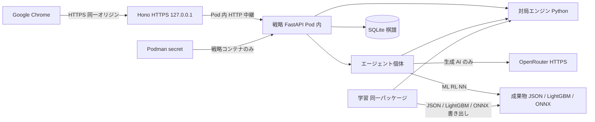

# 技術スタック

| 項目 | 内容 |
| --- | --- |
| 文書識別 | reversi-ai-tech-stack |
| 対象ソフトウェア | Reversi Agents |
| 版 | 0.2.13 |
| 状態 | 現行（設計。要求ではない） |
| 日付 | 2026-09-20 |
| 入力 | [`docs/srs.md`](srs.md) 0.1.24 |

本文書は実装言語・配置・ライブラリの**設計判断**である。ソフトウェア要求の正本は [`docs/srs.md`](srs.md) であり、本文書は shall を追加・変更・撤回しない。SRS は実装言語とフレームワークを制約しない（`docs/srs.md` 3.6 末尾）。ここに書いた版番号は採用時の目安であり、実装開始時の現行安定版に置き換えてよい。

## 1 選定の前提（SRS から動かすもの）

次を満たすことが、スタック選定の拘束である。数値や義務をここで増やさない。

| 拘束 | 要求 ID |
| --- | --- |
| 利用者向けはウェブサービス。対象ブラウザは Google Chrome。追加のネイティブアプリを必須にしない | SRS-CON-002, SRS-INT-SW-002, SRS-ATR-POR-001 |
| 利用者向け文言は日本語 | SRS-INT-UI-009 |
| 運用者の個人所有 PC で動く。既定の到達はループバック。複数拠点は不要 | SRS-CON-004, SRS-ATR-SEC-002 |
| ブラウザとの通信は HTTPS。OpenRouter との通信も HTTPS | SRS-INT-CM-001, SRS-INT-CM-002 |
| 秘密情報をクライアント成果物に埋め込まない。UI に資格情報を出さない | SRS-CON-003, SRS-ATR-SEC-001 |
| 外部モデル供給者は OpenRouter。少なくとも `typesafe/jev-1.13`。他モデルの追加を禁止しない | SRS-CON-001, SRS-INT-SW-001, SRS-FUN-021–023 |
| 対局規則・カタログ・エージェント個体（ランダム / ルールベース 4 / ML / RL / NN / 生成 AI） | SRS-FUN-001–031 |
| ML は対局時にニューラルネットワーク推論を使わない。RL は対局時に NN 推論も外部モデルも使わない | SRS-FUN-029, SRS-FUN-030 |
| NN は教師あり。データ源は WTHOR と永続化対局。専用 GPU 無し、ホスト主記憶 16 GiB。OpenRouter の重みをホストに載せない | SRS-FUN-031, SRS-PER-003 |
| 終局対局を棋譜として永続化する。WTHOR 原本は再配布しない | SRS-DAT-004, SRS-DAT-001 |
| 他オリジンからの状態変更を拒否。入力文字列をスクリプトとして実行しない。個人識別子を収集しない | SRS-ATR-SEC-003–005 |
| 同時対局は 1 で足りる。着手のミリ秒上限は合格条件にしない | SRS-PER-001, SRS-PER-002 |
| 対局エンジンとエージェントは自動試験の対象が多い | 第 4 章（T が付く要求） |

## 2 提案するスタック

関心の分け方は次である。**ブラウザが話す相手は TypeScript。着手と学習の中身は Python。**

### 2.1 要約

| 層 | 採用 | 役割 |
| --- | --- | --- |
| UI | React + Vite + TypeScript | カタログ画面と盤面画面。対象は Chrome |
| 利用者向け API | Hono + `@hono/node-server`（HTTPS、ループバック） | 静的ファイル、Origin 照合、SSE、Python 戦略プロセスへの中継。ブラウザはここ以外に接続しない |
| パッケージ管理（JS） | pnpm（リポジトリ既存） | 依存の固定。`pnpm-lock.yaml` |
| 戦略プロセス | Python 3.12 + uv + FastAPI（ループバックのみ） | 対局規則、全エージェントの着手、進行中の 1 局、終局の永続化、OpenRouter |
| 対局エンジン | Python の純関数（戦略プロセス内） | 合法手・裏返し・パス・終局・公式スコア。対局と学習で同一実装 |
| 学習 | 同じ Python パッケージ。学習用イメージ | ML・RL・NN。対局時エンジンを自己対局と棋譜再生に使う。torch は学習イメージだけ |
| 永続化 | SQLite（Python の `sqlite3`） | 終局棋譜。アカウント表は作らない |
| 生成 AI | OpenRouter 公式 Python SDK（戦略プロセスのみ） | Jev は Decisions API。追加のテキスト生成モデルは Chat Completions の構造化出力 |
| ML の学習と対局時 | Ridge は scikit-learn で学習し係数 JSON の積和。LightGBM はネイティブテキストを対局時に読む（NN ランタイムを使わない） | WTHOR + 永続化対局 |
| RL の学習と対局時 | NumPy の線形 TD 等。対局時も同じ重み。NN も OpenRouter も使わない | 自己対局 |
| NN の学習と対局時 | PyTorch（CPU）で学習し ONNX へ。対局時は onnxruntime（CPU、Python） | 教師あり |
| 検証 | pytest（規則・エージェント） / Playwright（Chrome E2E） / Vitest（Hono の Origin 等） | SRS の T と D |
| 品質 | 下記 | 書式・層の import・複雑度。秘密の混入は既存の gitleaks |
| ローカル証明書 | mkcert | 利用者向け HTTPS（Hono）。コンテナへはファイルとして渡す |
| コンテナ | Podman（compose） | `web` と `strategy` を同一 Pod。学習は `train`（待ち受けしない）。公開は `127.0.0.1` のみ |
| 資格情報 | Podman secret | `OPENROUTER_API_KEY` は戦略コンテナだけが読む。リポジトリと `.env` には置かない |

品質ツールの対応:

| 目的 | Python | TypeScript |
| --- | --- | --- |
| 書式と一般 lint | Ruff | Biome（既存） |
| 層をまたぐ import の禁止 | import-linter | dependency-cruiser |
| 複雑度の報告 | radon（循環的複雑度など） | Biome の診断（認知的複雑度） |
| 複雑度の上限で失敗させる | xenon（radon のランク） | Biome の `noExcessiveCognitiveComplexity` を error にする |

対局時は Podman の同一 Pod で `web` と `strategy` の 2 コンテナを動かす。ブラウザは Hono の HTTPS にだけ接続する。戦略コンテナの待ち受けは Pod 内に限り、ホストへは公開しない。対局用 `strategy` に torch は入れない（対局時 NN は onnxruntime）。学習は `train` イメージを待ち受けせず一発起動する。学習済みの小さい成果物はリポジトリに含め、再学習なしで初版カタログが揃うようにする。

### 2.2 実行時の論理配置



上図はプロセス分割の設計である。SRS の論理図（1.3.2）を置き換えない。

既定の待ち受けはホストへ出す口だけ `127.0.0.1` とする（SRS-ATR-SEC-002）。LAN 公開は初版の合格条件ではない。戦略コンテナのポートをホストや LAN に出さない。

### 2.3 リポジトリ配置

ディレクトリ名は言語ではなく、プロセスの責務にする。ルートの `package.json` はウェブアプリ用。戦略プロセスは `strategy/pyproject.toml`。pnpm workspace は初版では使わない。ファイル単位の置き場と目的は [`docs/ARCHITECTURE.md`](ARCHITECTURE.md) を正とする。

```
web/                 利用者向けウェブアプリ（ブラウザが話す相手）
  ui/                React（カタログ / 盤面）
  server/            Hono。Origin 照合、SSE、戦略プロセスへの中継
  Containerfile
strategy/            戦略プロセス（着手と学習）
  src/reversi/engine/    対局規則
  src/reversi/agents/    カタログ個体の着手
  src/reversi/api/       内部 FastAPI
  src/reversi/train/     学習。対局経路からは import しない
  Containerfile
compose.yaml         Podman Compose。secret の中身は書かない
compose.dev.yaml     開発用オーバーレイ。bind mount と reload だけ
models/              学習成果物（小さい JSON / LightGBM テキスト / ONNX。原本棋譜は置かない）
prompts/             生成 AI の固定指示（Markdown。戦略プロセスが対局時に読む）
data/                運用者ローカル。WTHOR 原本と SQLite、追加生成 AI の config.toml。Git 管理外
```

画面実装は別 URL でよい（SRS-INT-UI-011 の設計事項）。Vite では `/` をカタログ、`/game` を盤面とする。

Hono と戦略プロセスのあいだの JSON（対局状態、着手、カタログ）は、TypeScript では Zod、Python では Pydantic で同じ形を検証する。規則の実装は `strategy/` に一つだけ置く。

## 3 層ごとの根拠

### 3.1 TypeScript は殻、Python は中身

利用者向けはウェブサービスである。HTTPS、同一オリジン、Chrome、Origin 照合は TypeScript のウェブスタックが担う。既存の pnpm / Biome もここに載る。

着手の中身（規則、ミニマックス、乱択、学習済み方針、生成 AI）と学習は Python に揃える。根拠は次である。

- 対局と学習が同じエンジンを使う。言語をまたいだ規則の二重実装と、特徴量のずれが消える
- ルールベースも線形モデルも NN も、同じ盤表現の上に載る
- scikit-learn / NumPy / PyTorch / OpenRouter 公式 Python SDK が一つのプロセス系にある

トレードオフは、対局のたびにウェブコンテナと戦略コンテナの両方が要ることである。着手のミリ秒上限は合格条件ではなく（SRS-PER-002）、同時対局は 1 である。プロセス間は同一 Pod 内の HTTP で足りる。対局中に Python を起動しない案（戦略を TypeScript に残す）は、エンジンの二重化か、学習と対局で方針実装が割れるコストの方が大きいと判断して採用しない。

ブラウザから Python を直接呼ばない。鍵も棋譜原本もクライアントに渡さない。Hono が失敗した戦略呼出しを、部分適用せず利用者へ返す（SRS-FUN-020 は戦略側で検知し、Hono が提示する）。

### 3.2 UI: React + Vite

カタログ一覧から盤面へ移る 2 画面、8×8 のクリック着手、合法手と直前着手の印があれば足りる。SSR・SEO・多ページ認証は要求に無い。Vite は SPA として薄く、開発時も本番時も「ブラウザが話す相手」を HTTPS の同一オリジンに揃えやすい。

React を選ぶ理由は、状態（手番、盤、印、終局）の再描画がコンポーネントに載ることと、実装・レビューの共通言語になりやすいことである。WCAG 適合証明は初版の要求ではない。見た目のライブラリ（コンポーネントキット）は導入しない。盤は CSS で描く。アニメーションは要求しない。

クライアントは OpenRouter の鍵も WTHOR 原本も持たない。表示は Hono が返した対局状態と、カタログの表示名・説明文に限る。React の既定のエスケープを使い、`dangerouslySetInnerHTML` を置かない（SRS-ATR-SEC-004）。

### 3.3 利用者向け API: Hono（Node HTTPS）

Hono は利用者オリジンである。Fetch API の `Request` / `Response` をそのまま扱い、`Origin` 照合（SRS-ATR-SEC-003）を読みやすい。公式の `@hono/node-server` は `node:https` の `createServer` に PEM を渡せる。

本番は Hono がビルド済み UI と API を同じオリジンで出す。対局サービスの既定起動は Podman である。公開ポートはホストの `127.0.0.1` だけに付ける。Hono は同一 Pod 内の戦略コンテナへ HTTP で中継する。開発中のホットリロードはコンテナ外でもよいが、OpenRouter の鍵は `.env` に置かない。

Hono は盤の合法手計算を持たない。人間の着手指定は戦略プロセスへ渡し、違法なら盤面を変えず再指定できる応答をそのまま返す（SRS-FUN-007）。

エージェント対エージェントは、開始後に戦略プロセスが終局まで進行する（SRS-FUN-009）。Hono は Server-Sent Events で盤面をブラウザへ流す。更新の源は戦略プロセスである。WebSocket は双方向が不要なので使わない。人間対エージェントでは、人間の着手を中継し、エージェント手番は戦略プロセスが進める。進行中の 1 局は戦略プロセスのメモリ上（SRS-DAT-002）とし、終局で SQLite へ書く。

### 3.4 戦略プロセスと対局エンジン

内部 API は FastAPI とする。Pydantic で中継 JSON を検証し、Hono の Zod と対応させる。待ち受けは Pod 内のみ。TLS は利用者向け Hono が担う。内部は Pod ネットワークに閉じるため、初版は平文 HTTP でよい。

エンジンは 8×8 の配列（または同等の明示的な 64 マス）で石状態を持つ。ビットボードは初版で採用しない。規則の一意性（SRS-ATR-REL-001）は pytest で担保する。対局の正しさの正本はここである。学習（自己対局・WTHOR 再生）も同じ関数を呼ぶ。

ミニマックス、最多取り、位置評価、定石、ランダムはカタログ個体であり、戦略プロセスに置く。ミニマックス深さ 4 は、同一の葉評価になる省略（アルファベータ）を設計として許す（SRS-FUN-026）。選ぶ手が座標順の tie-break 込みで一致することを pytest で試験する。

### 3.5 エージェントと学習成果物

| 個体 | 対局時（戦略プロセス） | 学習 |
| --- | --- | --- |
| ランダム (一様) | 合法手の一様乱択 | なし |
| ルールベース 4 個体 | 最多取り・位置評価・ミニマックス（深さ 4）・定石。外部モデルも学習済み重みも読まない | なし |
| 機械学習 (棋譜) | 線形モデルの係数の積和。NN ランタイムを使わない | scikit-learn。WTHOR + 永続化対局 |
| 機械学習 (LightGBM) | LightGBM ネイティブテキストの推論。NN ランタイムも joblib / pickle も使わない | LightGBM。WTHOR + 永続化対局 |
| 強化学習 (自己対局) | 線形関数近似の重み。NN 推論も OpenRouter も使わない | NumPy。同じエンジンで自己対局。WTHOR を使わない |
| ニューラルネットワーク (棋譜) | ONNX の順伝播のみ（CPU、onnxruntime） | PyTorch CPU。WTHOR + 永続化対局 |
| 生成 AI (Jev) | OpenRouter Decisions API。`typesafe/jev-1.13` | なし。WTHOR を見ない |
| 生成 AI (呼称) の追加 | Chat Completions の構造化出力。運用者が与えたテキスト生成モデル ID | なし |

線形モデルと NN をファイル種別で分ける（JSON 対 ONNX）。LightGBM 個体はネイティブテキスト（`models/lgbm.txt`）とし、ONNX 経由にしない。ML / RL の対局経路に onnxruntime も PyTorch も載せない。これが SRS-FUN-029 / 030 の検査で見える担保である。scikit-learn の公式 persistence は pickle / joblib / ONNX であり、係数 JSON は公式形式ではない。対局用成果物のスキーマは本ソフトウェアが定義し、学習スクリプトが `coef_` 等を書き出す。チェックポイントに joblib を使ってよいが、対局の ML / RL / LightGBM 個体は joblib を読まない。

NN の層数・ユニット数は要求ではない。16 GiB・GPU 無しに収まる小さい全結合（盤の 3 値 64 マスを入力し、合法手へマスクした政策）を初期値とする。精度の数値目標は置かない。

特徴量の切り方は要求ではない。ML（Ridge と LightGBM）と RL は同じ入力符号化を使う。NN は隠れ層を持つネットに盤を渡して、カテゴリの差が成果物とコードの両方に残るようにする。符号化は Python 内に一つだけ置く。

WTHOR の `.wtb` は Python で読み、8×8 以外は捨てる（SRS-DAT-003）。原本ファイルを静的配信しない。運用者は `data/` に置く。対局サービスは WTHOR 原本を HTTP で出さない。

生成 AI 個体の追加（SRS-FUN-023）は、初版では Git 管理外の `config.toml`（モデル名・呼称・パラメータ）とする。プロンプト本文は `prompts/` の独立ファイルから読む。対局者向けウィザードは要求ではない。表示名は `生成 AI (〈呼称〉)` でカタログ内一意。応答は JSON Schema を Pydantic で検証し、自由文の先頭トークン抽出を既定にしない。

### 3.6 永続化: SQLite

終局棋譜があれば足りる。同時書き込みは 1 対局、アカウントは無い。別プロセスの DB サーバは個人 PC の運用を厚くするだけなので採用しない。

自対局の保存形式は `.wtb` にしない。SRS-DAT-004 が求めるのは対局モード、黒と白の主体、着手列、終局面、公式スコア、勝敗であり、ファイル形式は設計事項である（SRS 3.7 も、棋譜を実行時公開するときの WTHOR 適合は将来候補とし、初版では課さない）。`.wtb` は大会識別と選手番号と黒のスコアを持つ WTHOR 原本のレコード形式であり、カタログ個体の識別や公式スコア（空マスの勝者加算、引き分け 32–32）をそのまま載せられない。内部の座標表現も設計事項である（SRS-DAT-001）。

WTHOR 原本（`.wtb` 等）は学習の入力として `data/` に置き、読み取り専用とする。再配布しない（SRS-DAT-001）。自対局と原本を同じファイル種に混ぜない。

戦略プロセスが標準ライブラリの `sqlite3` で書く。スキーマは SRS-DAT-004 の項目に限る。利用者 ID・氏名・メールの列は作らない（SRS-ATR-SEC-005）。学習は同じファイルを読む。

保持年限と削除 UI は要求ではない。ファイルは `data/` に置き、バックアップは運用者の任意とする。

### 3.7 OpenRouter

公式 Python SDK `openrouter` を戦略コンテナだけで使う。認証は Bearer 相当を SDK に渡す。鍵は Podman secret としてホストに作り、戦略コンテナの `/run/secrets/openrouter-api-key` から読む。環境変数へコピーして `podman inspect` に出さない。Hono のコンテナには secret を渡さない。レスポンスにも UI にもバンドルにも出さない。

Jev はテキスト生成モデルではない。呼出しは Decisions API（`POST /api/alpha/decisions`、モデル ID `typesafe/jev-1.13`）。入力は局面と質問、出力は構造化決定である。失敗時は部分適用せず、利用者に継続不能を提示する（SRS-FUN-020）。合法手集合の外を採用しない。

追加の生成 AI 個体（SRS-FUN-023）の既定経路は Chat Completions（`POST https://openrouter.ai/api/v1/chat/completions`）とする。OpenRouter 公式 Quickstart / API Reference は、テキスト生成の入口をこのエンドポイントとし、プロバイダ差を正規化している。Claude・GPT・Gemini など新しいテキスト生成モデルは、カタログに載っている slug を `model` に入れるだけで足りる。Chat Completions を legacy とする公式記述は、調査日 2026-09-19 時点ではない。応答は `response_format` の JSON Schema とし、Pydantic で検証する。自由文の先頭トークン抽出を既定にしない。

Responses API（`POST /api/v1/responses`）と Anthropic Messages 形式（`POST /api/v1/messages`）も併存する。着手選択（局面を渡し、合法手の識別子を返す）には Chat Completions で足りる。Responses が要るのは apply_patch や shell などサーバツール側であり、初版の対局には使わない。画像生成・埋め込み・動画・TTS/STT は別 API であり、合法手選択の生成 AI 個体の対象外とする。Jev と同様の構造化決定モデルを追加する場合は Decisions API を使う（Chat Completions を既定にしない）。

Opus と Astra を予めカタログに置かない。追加モデルの実呼出し適合は、その採用時に計画する（SRS 第 4 章）。

CI に鍵が無いときは呼出し境界を試験ダブルに置き換える。Jev の実呼出し適合はリリース前に 1 回以上、実サービスで実証する（SRS 第 4 章）。

### 3.8 セキュリティ要求の実現方法

| 要求 | 実現方法 |
| --- | --- |
| SRS-CON-003 / SRS-ATR-SEC-001 | 鍵は Podman secret。戦略コンテナだけがファイルとして読む。Hono は受け取らない・転送しない・表示しない |
| SRS-ATR-SEC-002 | ホストへ公開するポートは `127.0.0.1` のみ。既定設定に `0.0.0.0` を置かない。戦略コンテナはホストに公開しない |
| SRS-ATR-SEC-003 | 状態変更は利用者向け POST のみ。`Origin` が Hono のオリジンと一致しない要求は 403。Cookie セッションは初版で使わない。戦略プロセスはブラウザから到達させない |
| SRS-ATR-SEC-004 | React のテキスト挿入。棋譜もラベルも HTML として埋め込まない |
| SRS-ATR-SEC-005 | アカウント機能を作らない。棋譜行に個人識別子を付けない |
| SRS-INT-CM-001 | mkcert の証明書で Hono が HTTPS。平文 HTTP を利用者向けの既定にしない |
| SRS-INT-CM-002 | 戦略コンテナと OpenRouter のあいだは SDK の HTTPS |

### 3.9 試験

| 対象 | ツール | SRS との対応 |
| --- | --- | --- |
| エンジン・ルールベース・乱択の分布・永続化・合法手制約 | pytest | 第 4 章の T。規則の正本 |
| Hono の Origin 拒否、中継が部分適用しないこと | Vitest | SRS-ATR-SEC-003、SRS-FUN-020 の提示側 |
| カタログ → 盤面、日本語 UI、手番表示、Chrome | Playwright（`channel: 'chrome'`） | D、SRS-ATR-POR-001 |
| ML / RL が NN 推論経路を持たないこと、Jev のモデル ID、学習が sklearn / NumPy / PyTorch のどれか | 検査（ソースと成果物） | I、A |
| OpenRouter 障害 | 試験ダブルでタイムアウト / 4xx / 5xx | SRS-FUN-020 |

Playwright の既定 Chromium ではなく、マシン上の Google Chrome を使う。対象ブラウザの要求が Chrome だからである。

### 3.10 開発ツール（既存との整合）

リポジトリはすでに pnpm、Biome、lefthook（Biome / osv-scanner / gitleaks）、VS Code の Ruff 推奨を持つ。UI / 利用者向け API を TypeScript、戦略 / 学習を Python にする判断は、この土台と矛盾しない。

- Node.js は 24 LTS（調査日 2026-09-19、nodejs.org の案内）。エンジンフィールドで固定する
- Python は 3.12。パッケージ管理は uv。lint は Ruff。試験は pytest
- フロントと Hono の TS は Biome（既存の `biome.json`）
- 依存の脆弱性は既存の osv-scanner 対象（`package.json` / `pyproject.toml` / `uv.lock`）

#### 3.10.1 Python の層と複雑度

次を開発依存に入れ、lefthook と CI で走らせる。

- **import-linter**: 対局の層を `reversi.api` → `reversi.agents` → `reversi.engine` の一方向にする。`reversi.api` / `reversi.agents` / `reversi.engine` から `reversi.train` を import してはならない。学習は `engine`（と自己対局に必要な範囲の `agents`）を import してよい。
- **radon**: 循環的複雑度などの報告。ゲートには使わない。
- **xenon**: radon のランクで失敗させる。初版の上限は絶対 C（単一関数の循環的複雑度 20 以下）、モジュール平均 A、最悪モジュール B とする。ミニマックスは関数を分けてこの上限に収める。

設定は `strategy/pyproject.toml` に置く。xenon の閾値は CLI（専用設定ファイルは公式に無い）。

#### 3.10.2 TypeScript の層と複雑度

同じ役割を、Biome を二系統にしない範囲で置く。

- **dependency-cruiser**: import-linter に相当する。`web/ui` と `web/server` の相互 import を禁止する。循環依存は error。ESLint は足さない。
- **Biome `noImportCycles`**: 循環の補助。error にする。
- **Biome `noExcessiveCognitiveComplexity`**: xenon に相当するゲート。McCabe の循環的複雑度ではなく認知的複雑度である。閾値 15、severity は error（既定は information のため、上げないと CI は落ちない）。

Biome に McCabe 循環的複雑度の規則は無い。ESLint の `complexity` だけのために ESLint を足すことはしない。

### 3.11 コンテナと秘密情報

対局と学習の実行は Podman とする。`web` と `strategy` を同一 Pod に置き、Python の `podman-compose` で起動する。プラグインの `podman compose` は `secrets.external` を扱えないので使わない。イメージは各ディレクトリの Containerfile から作る。`data/` はボリュームとして戦略コンテナと学習コンテナへ渡す。学習は `strategy/Containerfile` の `train` ターゲットに `train` グループを焼き、待ち受けせず `podman-compose run --rm train` する。`up` の常時起動対象にしない。ホストの `pnpm dev` や `uv run python -m reversi.api` を対局の正にしない。ホストの `uv run python -m reversi.train.*` を学習の正にしない。ホットリロードは `compose.dev.yaml` のオーバーレイだけを足す。

OpenRouter の API キーは `podman secret create` でホストに置く。名前は `openrouter-api-key`。compose から戦略コンテナへだけ secret として渡し、`/run/secrets/openrouter-api-key` を読む。リポジトリ、イメージ、`.env`、ウェブコンテナには入れない。

単体試験（pytest、Vitest）と lint（Biome、Ruff、lefthook）はホストで走る。実行時ではない。資格情報が無い CI では生成 AI を試験ダブルに置き換える。コマンドの列は [`docs/ARCHITECTURE.md`](ARCHITECTURE.md) の「起動とコマンド」を正とする。

## 4 検討した案

各表の「結果」は初版の採用判断である。要求が変われば再評価する。

### 4.1 言語構成

| 案 | 内容 | 結果 | 理由 |
| --- | --- | --- | --- |
| A. TS は UI と利用者向け API。Python は戦略（エンジン・全エージェント）と学習 | 本提案 | 採用 | 関心が分かれる。エンジンが一つ。学習ライブラリと着手が同じ言語 |
| B. TS 対局（エンジンとルールベース含む）+ Python は学習と学習済み推論のみ | 戦略が言語をまたぐ | 見送り | 対局時に Python を増やさない利点はある。ミニマックスと線形モデルでエンジンが二重になる |
| C. TS 対局 + 学習も TypeScript（NN だけ Python または TF.js） | ML/RL を自前実装 | 見送り | エンジンは一つで済むが、sklearn / NumPy / PyTorch を捨てる |
| D. すべて TypeScript（NN も TF.js） | 学習も含め Node | 見送り | 単一言語の利点は大きいが、NN 学習の中心は PyTorch 側にある |
| E. Python が利用者向け API も担う（FastAPI + React） | Hono を置かない | 見送り | 戦略との一体は最大。HTTPS・Origin・同一オリジン配信を Python に寄せ、既存の pnpm / Biome が従になる。利用者向けの殻は TS に残す |
| F. Rust / Go エンジン + TS UI | 高速化 | 見送り | 着手時間の数値上限が無い |
| G. ブラウザだけで完結（鍵も学習もクライアント） | 静的ホスト | 不採用 | SRS-CON-003 に反する。WTHOR 原本をブラウザへ渡すリスクも増える |

### 4.2 UI フレームワーク

| 案 | 結果 | 理由 |
| --- | --- | --- |
| React + Vite | 採用 | SPA で足りる。画面は 2 つ。文字列をスクリプトとして実行しない要求に、既定のエスケープが合う |
| Next.js（App Router） | 見送り | SSR とファイル規約が過剰。Origin が「誰が HTML を返すか」で揺れやすい。SEO は要求に無い |
| SvelteKit / Vue / Solid | 見送り | 要件は満たせる。チームと生成コードの共通言語で React を選ぶ |
| 素の HTML + 小さな JS | 見送り | 盤とカタログだけなら足りるが、手番・印・終局の状態更新を試験可能な部品に分けにくい |
| Streamlit / Gradio | 不採用 | カタログ → 盤面の遷移、座標ラベル、印の制御が要求に対して弱い。ウェブサービスとしての Origin / HTTPS の置き場も曖昧になる |

### 4.3 HTTP サーバとプロセス間

| 案 | 結果 | 理由 |
| --- | --- | --- |
| 利用者向け Hono HTTPS + 内部 FastAPI（ループバック HTTP） | 採用 | ブラウザのオリジンを一つに固定できる。内部 API は型付き JSON |
| Fastify / Express を利用者向けにする | 見送り | 要件は満たせる。プラグイン資産は余る |
| Next.js Route Handlers | 見送り | UI 案とセット。サーバだけ切出せない |
| bun serve / Deno | 見送り | 既存が Node / pnpm |
| 戦略を stdio / 子プロセスの 1 手ごと起動 | 見送り | エージェント対エージェントの連続着手に向かない |
| 戦略を Unix ソケットのみ | 次点 | ループバック HTTP より露出は小さい。デバッグと OpenAPI のしやすさで HTTP を選ぶ |

エージェント対エージェントのブラウザ更新は SSE を採用する。検討した WebSocket は、クライアントから手を送る必要がモードによってしか無く、接続管理が増える。

### 4.3.1 OpenRouter の呼出し API（追加モデル）

| 案 | 結果 | 理由 |
| --- | --- | --- |
| 追加のテキスト生成は Chat Completions。Jev は Decisions | 採用 | 公式のテキスト生成入口。新しいチャットモデルは slug 差し替え |
| 追加モデルの応答は JSON Schema + Pydantic | 採用 | 合法手の識別子を検証できる。自由文の先頭トークン抽出を既定にしない |
| 追加モデルもすべて Decisions API | 不採用 | Decisions は Jev 系の構造化決定向け。Claude / GPT のモデルページは Chat Completions を第一に案内する |
| 追加モデルの既定を Responses API にする | 見送り | OpenAI Responses 互換として併記されるが、Chat Completions の後継ではない。着手選択に必須の機能は無い |
| 追加モデルの既定を Messages API にする | 見送り | Anthropic 形式の別口。正規化済みの Chat Completions で足りる |

### 4.4 永続化

| 案 | 結果 | 理由 |
| --- | --- | --- |
| SQLite + Python `sqlite3`（自対局。`.wtb` ではない） | 採用 | SRS-DAT-004 の項目をそのまま持てる。学習と同じプロセス系が読む |
| 自対局も `.wtb` で書く | 見送り | WTHOR 原本の形式で、対局モード・個体識別・公式スコアを足す場所が無い。原本と区別しにくい |
| Drizzle + `node:sqlite`（Hono が書く） | 見送り | 棋譜の書き手と学習の読み手が言語をまたぐ |
| better-sqlite3 / libsql / SQLAlchemy | 次点 | 初版の表は少なく、標準ライブラリで足りる |
| PostgreSQL / MySQL | 見送り | 別プロセス。個人 PC・対局 1 本に対して過剰 |
| JSONL / 棋譜ファイルのみ | 見送り | 実装は短いが、終局面と公式スコアの照会・学習用読み出しが都度パースになる |
| 永続化なし（メモリのみ） | 不採用 | SRS-DAT-004 に反する |
| IndexedDB（ブラウザ） | 不採用 | 学習データ源を戦略プロセスが読めない |

### 4.5 ML / RL / NN の実行系

| 案 | 結果 | 理由 |
| --- | --- | --- |
| ML: sklearn → 係数 JSON、RL: NumPy 線形 TD → 重み JSON、NN: PyTorch CPU → ONNX。対局時も Python。ML/RL は積和のみ | 採用 | 学習と対局が同じ言語。ML/RL の対局経路に NN ランタイムが無い |
| LightGBM: 学習も対局も lightgbm。成果物はネイティブテキスト。ONNX / pickle / joblib は使わない | 採用（機械学習の追加個体） | Ridge 個体と学習器・ファイル種別で区別する。NN ランタイムを対局経路に載せない |
| 対局時の ML/RL/NN 推論だけ TypeScript | 見送り | 符号化とエンジンを二重に持つことになる |
| すべて PyTorch（ML/RL も MLP） | 不採用 | SRS-FUN-029 / 030 の「対局時 NN 推論禁止」に反しうる |
| すべて scikit-learn | 見送り | ML には適する。NN カテゴリと RL 自己対局の本体にはならない |
| stable-baselines3 / DQN | 見送り | 典型経路が NN であり、SRS-FUN-030 の検査が難しい |
| TensorFlow.js / onnxruntime-node | 見送り | 推論を Node に戻すと戦略分割が崩れる |
| ML / RL も ONNX にして対局時はすべて onnxruntime | 見送り | 推論は一つになるが、ML/RL が NN 推論経路とファイル種別で区別しにくくなる |

### 4.6 スタイリングと状態管理

| 案 | 結果 | 理由 |
| --- | --- | --- |
| CSS（盤面は Grid） | 採用 | 8×8 と座標ラベルが主役。デザインシステムは要求に無い |
| Tailwind CSS | 次点 | レイアウトには速い。盤のマス目は結局カスタム CSS になる |
| Redux / Zustand / TanStack Query | 見送り | 同時対局 1、画面 2。`useState` / `useReducer` で足りる |

### 4.7 証明書と起動

| 案 | 結果 | 理由 |
| --- | --- | --- |
| mkcert + Hono が HTTPS。戦略プロセスはループバック HTTP | 採用 | 利用者向けだけ SRS-INT-CM-001 を満たせばよい |
| `@vitejs/plugin-basic-ssl` のみ | 見送り | 開発専用。本番相当の Hono HTTPS と証明書が分かれる |
| Caddy / nginx を前段に置く | 見送り | プロセスが増える。個人 PC の既定にしない |
| 平文 HTTP を利用者向けの既定 | 不採用 | SRS-INT-CM-001 |
| 戦略プロセスにも TLS | 見送り | 同じホストのループバックに対して過剰 |

### 4.8 コンテナと秘密情報

| 案 | 結果 | 理由 |
| --- | --- | --- |
| Podman Compose。同一 Pod に `web` と `strategy`。API キーは Podman secret | 採用 | 個人 PC で root 無しに動かせる。鍵をリポジトリとイメージに置かない |
| Docker Engine / Docker Compose | 見送り | 実行系は Podman に揃える |
| Kubernetes / Swarm | 見送り | 複数拠点は要求に無い |
| `.env` に `OPENROUTER_API_KEY` を書く | 見送り | ファイルに残る。secret の置き場を一つにする |
| secret を環境変数としてコンテナに渡す | 見送り | `inspect` に出やすい。ファイルマウントにする |
| コンテナを使わずホストで `pnpm start` / `python -m reversi.api` | 見送り | 対局と学習の起動経路が二つになり、証明書・Origin・secret が割れる。試験と lint はホストのままにする |
| 対局用 `strategy` に `train` グループ（torch）を焼く | 見送り | 対局時 NN は onnxruntime。torch は対局に不要 |
| 学習のたびにコンテナ内で `uv sync --group train` | 見送り | 起動のたびに数百 MB を引く |
| 学習専用ターゲット / `train` サービス（待ち受けしない） | 採用 | 対局イメージは本体依存だけ。ML / RL / NN は同じ学習イメージ |
| ホストの `uv run python -m reversi.train.*` を学習の正にする | 見送り | 対局と経路が割れる |

公開 URL とマネージド DB は初版に採用しない。実行環境は個人所有 PC、既定到達はループバックである。

### 4.9 品質ツール（層と複雑度）

| 案 | 結果 | 理由 |
| --- | --- | --- |
| Python: import-linter + radon + xenon | 採用 | 層契約と複雑度の報告・ゲートが分かれている |
| TypeScript: dependency-cruiser + Biome の認知的複雑度を error | 採用 | import-linter / xenon に相当。Biome をフォーマッタと二重にしない |
| TypeScript に ESLint `complexity`（McCabe）を足す | 見送り | radon と同じ指標にはなる。Biome と ESLint が並ぶ |
| eslint-plugin-import の `no-restricted-paths` | 見送り | ESLint 必須。dependency-cruiser は独立 CLI |
| madge | 見送り | 循環の可視化はできる。層の契約は持たない |
| 複雑度ゲートを置かない | 見送り | 検査の閾値を CODEOWNERS で守る対象にする |

### 4.10 ディレクトリ名

| 案 | 結果 | 理由 |
| --- | --- | --- |
| `web/`（`ui` + `server`）と `strategy/` | 採用 | ブラウザ向けと着手・学習で分ける。言語名を出さない |
| `python/` と `src/web` | 見送り | 言語名は配置の理由にならない。ウェブ側だけ汎用の `src` に寄る |
| `apps/web` と `apps/strategy` | 見送り | デプロイ単位が二つ以上あるときの型。初版はルート直下が足りる |
| `frontend/` と `backend/` | 見送り | 利用者向け API と戦略プロセスがどちらも backend になる |
| `client/` / `server/` / `engine/` | 見送り | `engine` はエージェントと学習を表さない |

## 5 採用しないもの（明示）

初版の実装対象に含めない。SRS の適用範囲外と揃える。

- 利用者アカウント、OAuth、セッション Cookie
- PostgreSQL / Redis / オブジェクトストレージ
- 公開インターネット向けのリバースプロキシ設定を既定値にすること
- GPU 前提の学習（CUDA ビルドを必須にすること）
- 人間どうし対戦、観戦配信、レーティング
- i18n フレームワーク（文言は日本語で固定）
- コンポーネントキット、アニメーションライブラリ
- ブラウザから戦略プロセスへの直接接続

## 6 運用者から見た起動

コマンドの列と開発用オーバーレイは [`docs/ARCHITECTURE.md`](ARCHITECTURE.md) の「起動とコマンド」を正とする。方針だけをここに書く。

1. Podman がある個人 PC
2. mkcert で `127.0.0.1` 用の証明書を `data/certs/` に置く
3. 生成 AI を使うときだけ `podman secret create openrouter-api-key -` で API キーを渡す（標準入力。ファイルをリポジトリに置かない）
4. `podman-compose up --build` で `https://127.0.0.1:<port>/` を出す
5. （任意）WTHOR を `data/` に置き、学習用サービスで `podman-compose run --rm train python -m reversi.train.*` する。対局には再学習は不要

資格情報が無い環境でも、生成 AI 以外の個体と対局エンジンは試験できる。pytest / Vitest / lint はホストでよい。ホストの `pnpm dev` を対局サービスの第二の正にしない。

## 7 SRS への追跡（設計が覆う範囲）

本文書は要求を増やさない。各要求をどの層で実装するかの対応だけを示す。

| 要求の束 | 実装する層 |
| --- | --- |
| SRS-INT-UI-001–014, SRS-USE-001–002, SRS-INT-SW-002 | `web/ui` |
| SRS-INT-CM-001, SRS-ATR-SEC-002–003, SRS-CON-002–004 | `web/server`（Hono） |
| SRS-FUN-001–007, SRS-FUN-018–019, SRS-ATR-REL-001, SRS-DAT-002 | `strategy/` のエンジン |
| SRS-FUN-008–014, SRS-FUN-021–028 | `strategy/` のエージェント。開始と提示の中継は `web/server` |
| SRS-FUN-015–017, SRS-FUN-029–031, SRS-DAT-001, SRS-DAT-003 | `strategy/` + `models/` |
| SRS-FUN-020, SRS-INT-SW-001, SRS-INT-CM-002, SRS-CON-001 | `strategy/` の OpenRouter 境界。提示は Hono |
| SRS-DAT-004, SRS-ATR-SEC-005 | SQLite スキーマ（戦略プロセス） |
| SRS-PER-001–003 | 同一 Pod の 2 コンテナ、CPU ONNX、外部重み非搭載 |
| 第 4 章 T / D | pytest / Vitest / Playwright Chrome |

## 8 改訂履歴

| 版 | 日付 | 内容 |
| --- | --- | --- |
| 0.2.13 | 2026-09-20 | 機械学習 (LightGBM) を対局時ネイティブテキストで載せる（ONNX / pickle は使わない） |
| 0.2.12 | 2026-09-20 | 追加の生成 AI を `config.toml` と Chat Completions の構造化出力（Pydantic）とする |
| 0.2.11 | 2026-09-20 | 学習を `train` イメージに分け、対局用 strategy から torch を外す |
| 0.2.10 | 2026-09-20 | 生成 AI の固定指示を置く `prompts/` をリポジトリ配置に足す |
| 0.2.9 | 2026-09-20 | 起動の正を Python の `podman-compose` とする（プラグインの `podman compose` は使わない） |
| 0.2.8 | 2026-09-19 | 対局と学習の起動を Podman に揃え、ホストの pnpm/uv は試験と lint に限る |
| 0.2.7 | 2026-09-19 | ファイル単位の配置は `docs/ARCHITECTURE.md` を正とする |
| 0.2.6 | 2026-09-19 | 対局の既定起動を Podman とし、OpenRouter の API キーを Podman secret で渡す |
| 0.2.5 | 2026-09-19 | ディレクトリを責務名に改め、ウェブアプリを `web/`、戦略プロセスを `strategy/` とする |
| 0.2.4 | 2026-09-19 | Python に import-linter / radon / xenon、TypeScript に dependency-cruiser と Biome の複雑度ゲートを加える |
| 0.2.3 | 2026-09-19 | セキュリティ節の見出しを「実現方法」に直し、要求と層の対応の言い回しも揃える |
| 0.2.2 | 2026-09-19 | 「床」を最低条件の意味で使っていた箇所を、通常の日本語に直す |
| 0.2.1 | 2026-09-19 | 自対局の棋譜は `.wtb` にせず SQLite とすること、WTHOR 原本は入力専用であることを明示 |
| 0.2.0 | 2026-09-19 | UI と利用者向け API を TypeScript、戦略（エンジン・全エージェント）と学習を Python に分ける |
| 0.1.3 | 2026-09-19 | ミニマックス等のルールベースは対局時 TypeScript であること、学習用 Python エンジンは規則再生に限ることを明示 |
| 0.1.2 | 2026-09-19 | ML / RL / NN の学習を Python に揃え、対局時の線形推論だけ TypeScript に残す |
| 0.1.1 | 2026-09-19 | 追加モデルの既定をテキスト生成の Chat Completions に限定し、Responses / Decisions との役割を書く |
| 0.1.0 | 2026-09-19 | SRS 0.1.21 を入力に、対局時 TypeScript / NN 学習のみ Python とする初稿 |
